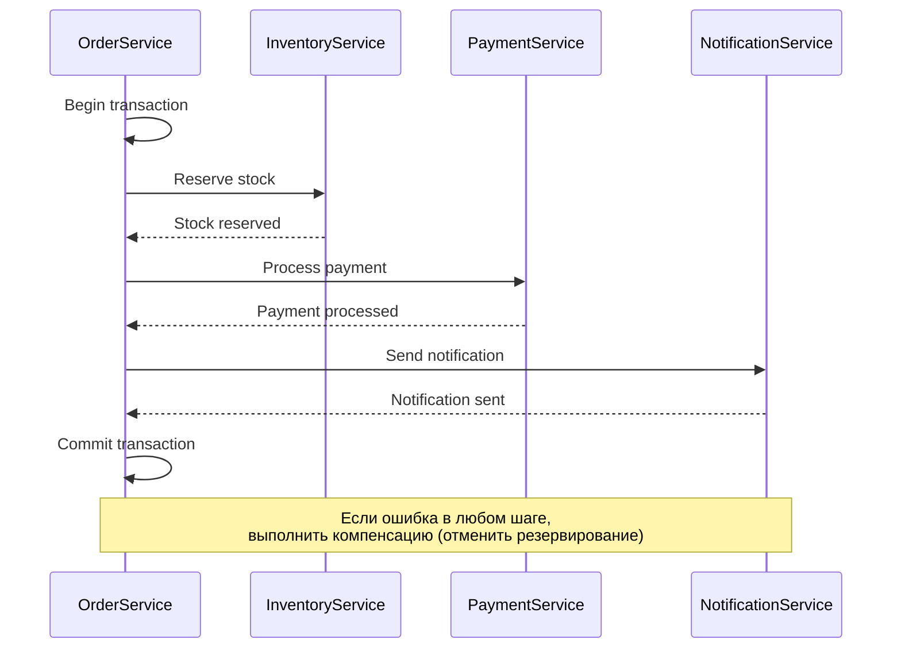

# AutoDev Marketplace — Политика взаимодействия сервисов

**Версия документа:** 1.3  
**Дата создания:** 2026-06-03  
**Последнее обновление:** 2026-06-14

---

## 1. Безопасность взаимодействия

### 1.1 Аутентификация сервисов

Каждый микросервис AutoDev Marketplace имеет уникальный service account в Keycloak и использует JWT токены для аутентификации при межсервисных вызовах.

#### JWT токен пользователя
```json
{
  "sub": "user@example.com",
  "iss": "https://keycloak.autodev.local",
  "aud": ["api-gateway", "auth-service", "catalog-service"],
  "realm_access": {
    "roles": ["BUYER", "SELLER"]
  },
  "exp": 1720000000,
  "iat": 1719996400
}
```

**ВАЖНО:**
- Роли пользователя (BUYER, SELLER, MODERATOR, ADMIN) хранятся только в Keycloak
- При аутентификации Keycloak выдаёт JWT токен с ролями
- Все сервисы проверяют роли из JWT токена
- В PostgreSQL нет таблиц для хранения ролей (`auth.roles`, `auth.permissions`, `auth.role_permissions`)

#### JWT токен сервиса
```
{
  "sub": "auth-service",
  "iss": "https://keycloak.autodev.local",
  "aud": ["api-gateway", "catalog-service", "order-service"],
  "exp": 1720000000,
  "iat": 1719996400
}
```

**Примечание:** Service tokens не содержат ролей. Роли пользователей хранятся в Keycloak и попадают в JWT токен при аутентификации. В PostgreSQL нет таблиц для хранения ролей.

#### Генерация токена (Java)
```java
@Service
public class ServiceTokenService {
    
    private final RestTemplate restTemplate;
    
    public String getServiceToken(String serviceName) {
        String tokenEndpoint = "https://keycloak.autodev.local/realms/autodev/protocol/openid-connect/token";
        
        HttpHeaders headers = new HttpHeaders();
        headers.setContentType(MediaType.APPLICATION_FORM_URLENCODED);
        
        MultiValueMap<String, String> body = new LinkedMultiValueMap<>();
        body.add("grant_type", "client_credentials");
        body.add("client_id", serviceName + "-service");
        body.add("client_secret", "${" + serviceName.toUpperCase() + "_CLIENT_SECRET}");
        
        HttpEntity<MultiValueMap<String, String>> request = new HttpEntity<>(body, headers);
        
        TokenResponse response = restTemplate.postForObject(
            tokenEndpoint,
            request,
            TokenResponse.class
        );
        
        return response.getAccessToken();
    }
}
```

### 1.2 Синхронное взаимодействие с аутентификацией

#### Заголовки для межсервисных вызовов
| Header | Описание | Обязательный |
|--------|----------|-------------|
| `Authorization` | Service account JWT токен | Да |
| `X-Request-ID` | ID запроса для трассировки | Да |
| `X-Correlation-ID` | Correlation ID для логирования | Да |
| `X-Service-Name` | Имя отправляющего сервиса | Да |

#### Пример использования (Feign Client с токеном)
```java
@Service
public class AuthClientService {
    
    private final AuthClient authClient;
    private final ServiceTokenService tokenService;
    
    public UserDto getCurrentUser(String requestId) {
        String token = tokenService.getServiceToken("catalog-service");
        return authClient.getCurrentUser(token, requestId);
    }
}

@FeignClient(
    name = "auth-service",
    url = "${auth.service.url:http://auth-service:8082}",
    configuration = FeignConfig.class
)
public interface AuthClient {
    
    @GetMapping("/api/v1/auth/me")
    UserDto getCurrentUser(
        @RequestHeader("Authorization") String token,
        @RequestHeader("X-Request-ID") String requestId
    );
}
```

### 1.3 Асинхронное взаимодействие (Kafka)

Каждое сообщение Kafka подписывается сервисом-издателем:

```json
{
  "id": "uuid",
  "type": "user.profile_updated",
  "timestamp": "2026-06-03T10:30:00Z",
  "version": "1.0",
  "payload": {
    "user_id": 123,
    "email": "user@example.com"
  },
  "metadata": {
    "source_service": "platform-service",
    "source_host": "platform-service-1",
    "correlation_id": "abc-123",
    "signature": "JWT-signature-of-message"
  }
}
```

### 1.4 Проверка токена сервиса

```java
@Component
public class ServiceTokenFilter extends OncePerRequestFilter {
    
    private final KeycloakService keycloakService;
    
    @Override
    protected void doFilterInternal(HttpServletRequest request,
                                    HttpServletResponse response,
                                    FilterChain chain) {
        String authHeader = request.getHeader("Authorization");
        
        if (authHeader != null && authHeader.startsWith("Bearer ")) {
            String token = authHeader.substring(7);
            
            if (keycloakService.validateServiceToken(token)) {
                chain.doFilter(request, response);
                return;
            }
        }
        
        response.setStatus(HttpServletResponse.SC_UNAUTHORIZED);
    }
}
```

---

## Обзор

Документ описывает правила и паттерны взаимодействия между микросервисами AutoDev Marketplace, включая синхронные вызовы, асинхронные сообщения, Service Discovery, Circuit Breaker и стратегии обработки ошибок.

---

## Межсервисная аутентификация

### Общие принципы

Каждый микросервис AutoDev Marketplace имеет уникальный service account в Keycloak и использует JWT токены для аутентификации при межсервисных вызовах.

### Токены сервисов

#### Service Account Token
```
{
  "sub": "auth-service",
  "iss": "https://keycloak.autodev.local",
  "aud": ["api-gateway", "catalog-service", "order-service"],
  "roles": ["SERVICE_AUTH", "SERVICE_PLATFORM"],
  "exp": 1720000000,
  "iat": 1719996400
}
```

**Примечание:** Роли сервисов (SERVICE_AUTH, SERVICE_PLATFORM) отличаются от ролей пользователей (BUYER, SELLER, MODERATOR, ADMIN). Роли пользователей хранятся в Keycloak и попадают в JWT токен при аутентификации. В PostgreSQL нет таблиц для хранения ролей.

#### Генерация токена (Java)
```java
@Service
public class ServiceTokenService {
    
    private final RestTemplate restTemplate;
    
    public String getServiceToken(String serviceName) {
        String tokenEndpoint = "https://keycloak.autodev.local/realms/autodev/protocol/openid-connect/token";
        
        HttpHeaders headers = new HttpHeaders();
        headers.setContentType(MediaType.APPLICATION_FORM_URLENCODED);
        
        MultiValueMap<String, String> body = new LinkedMultiValueMap<>();
        body.add("grant_type", "client_credentials");
        body.add("client_id", serviceName + "-service");
        body.add("client_secret", "${" + serviceName.toUpperCase() + "_CLIENT_SECRET}");
        
        HttpEntity<MultiValueMap<String, String>> request = new HttpEntity<>(body, headers);
        
        TokenResponse response = restTemplate.postForObject(
            tokenEndpoint,
            request,
            TokenResponse.class
        );
        
        return response.getAccessToken();
    }
}
```

### Синхронное взаимодействие с аутентификацией

#### Заголовки для межсервисных вызовов
| Header | Описание | Обязательный |
|--------|----------|-------------|
| `Authorization` | Service account JWT токен | Да |
| `X-Request-ID` | ID запроса для трассировки | Да |
| `X-Correlation-ID` | Correlation ID для логирования | Да |
| `X-Service-Name` | Имя отправляющего сервиса | Да |

#### Пример использования (Feign Client с токеном)
```java
@Service
public class AuthClientService {
    
    private final AuthClient authClient;
    private final ServiceTokenService tokenService;
    
    public UserDto getCurrentUser(String requestId) {
        String token = tokenService.getServiceToken("catalog-service");
        return authClient.getCurrentUser(token, requestId);
    }
}

@FeignClient(
    name = "auth-service",
    url = "${auth.service.url:http://auth-service:8082}",
    configuration = FeignConfig.class
)
public interface AuthClient {
    
    @GetMapping("/api/v1/auth/me")
    UserDto getCurrentUser(
        @RequestHeader("Authorization") String token,
        @RequestHeader("X-Request-ID") String requestId
    );
}
```

### Асинхронное взаимодействие (Kafka)

Каждое сообщение Kafka подписывается сервисом-издателем:

```json
{
  "id": "uuid",
  "type": "user.profile_updated",
  "timestamp": "2026-06-03T10:30:00Z",
  "version": "1.0",
  "payload": {
    "user_id": 123,
    "email": "user@example.com"
  },
  "metadata": {
    "source_service": "platform-service",
    "source_host": "platform-service-1",
    "correlation_id": "abc-123",
    "signature": "JWT-signature-of-message"
  }
}
```

### Проверка токена сервиса

```java
@Component
public class ServiceTokenFilter extends OncePerRequestFilter {
    
    private final KeycloakService keycloakService;
    
    @Override
    protected void doFilterInternal(HttpServletRequest request,
                                    HttpServletResponse response,
                                    FilterChain chain) {
        String authHeader = request.getHeader("Authorization");
        
        if (authHeader != null && authHeader.startsWith("Bearer ")) {
            String token = authHeader.substring(7);
            
            if (keycloakService.validateServiceToken(token)) {
                chain.doFilter(request, response);
                return;
            }
        }
        
        response.setStatus(HttpServletResponse.SC_UNAUTHORIZED);
    }
}
```

---

## Общие принципы

### Синхронное взаимодействие
- **Использование:** Для прямых запросов с ожиданием ответа
- **Протокол:** HTTP/REST
- **Формат:** JSON
- **Библиотека:** Spring Cloud OpenFeign

### Асинхронное взаимодействие
- **Использование:** Для событийной архитектуры и слабой связанности
- **Протокол:** Kafka
- **Формат:** JSON (Avro для продакшена)
- **Библиотека:** Spring Kafka

### Service Discovery
- **Использование:** Динамическое обнаружение сервисов
- **Инструмент:** Consul
- **Health Check:** `/actuator/health`

---

## Синхронное взаимодействие (REST API)

### Когда использовать
| Сценарий | Метод |
|----------|-------|
| Прямой запрос с ожиданием ответа | REST API |
| Межсервисный вызов в рамках одного запроса | REST API |
| Запрос данных без side effects | REST API (GET) |

### Когда НЕ использовать
| Сценарий | Причина | Альтернатива |
|----------|---------|--------------|
| Уведомление о событии | Нет необходимости в ответе | Kafka |
| Асинхронная обработка | Тяжёлая операция | Kafka |
| Слабая связанность | Высокая доступность нужна | Kafka |

### REST API стандарты

#### Base URL
```
http://{service-name}.{namespace}.svc.cluster.local:8080
http://localhost:8080  # локально
```

#### Headers
| Header | Описание | Обязательный |
|--------|----------|-------------|
| `Authorization` | JWT токен | Да (для защищённых endpoints) |
| `X-Request-ID` | ID запроса для трассировки | Да |
| `X-Correlation-ID` | Correlation ID для логирования | Да |
| `Content-Type` | MIME type | Да (для POST/PUT/PATCH) |
| `Accept` | Ожидаемый формат ответа | Нет |

#### Ошибки API
```json
{
  "error": {
    "code": "VALIDATION_ERROR",
    "message": "Неверный формат email",
    "timestamp": "2026-06-03T10:30:00Z",
    "details": {
      "field": "email",
      "value": "invalid-email"
    }
  }
}
```

#### Коды HTTP
| Код | Описание |
|-----|----------|
| `200` | OK (GET, PUT, PATCH) |
| `201` | Created (POST) |
| `204` | No Content (DELETE) |
| `400` | Bad Request |
| `401` | Unauthorized |
| `403` | Forbidden |
| `404` | Not Found |
| `409` | Conflict |
| `429` | Too Many Requests |
| `500` | Internal Server Error |
| `503` | Service Unavailable |

### Пример использования (Feign Client)

```java
@FeignClient(
    name = "auth-service",
    url = "${auth.service.url:http://auth-service:8082}",
    configuration = FeignConfig.class
)
public interface AuthClient {
    
    @GetMapping("/api/v1/auth/me")
    UserDto getCurrentUser(@RequestHeader("Authorization") String token);
    
    @GetMapping("/api/v1/auth/users/{id}")
    UserDto getUserById(@RequestHeader("Authorization") String token, @PathVariable("id") Long id);
}
```

---

## Асинхронное взаимодействие (Kafka)

### Когда использовать
| Сценарий | Паттерн |
|----------|---------|
| Уведомление о событии | Event Publishing |
| Асинхронная обработка | Event Consumption |
| Слабая связанность | Event Collaboration |
| Event Sourcing | Event Sourcing |

### Kafka стандарты

#### Топики
```
<service>.<event-type>
```

**Примеры:**
- `auth.user.registered` — новый пользователь (создание в Keycloak)
- `auth.user.updated` — обновление аутентификационных данных
- `auth.user.deleted` — удаление пользователя (из Keycloak)
- `auth.user.enabled` — пользователь активирован (из Keycloak)
- `auth.user.disabled` — пользователь деактивирован (из Keycloak)
- `platform.user_profile_updated` — обновление профиля
- `catalog.product.created` — новый товар
- `order.order.created` — новый заказ
- `payment.payment.completed` — оплата завершена

#### Структура события для синхронизации enabled статуса
```json
{
  "id": "uuid",
  "type": "auth.user.enabled" или "auth.user.disabled",
  "timestamp": "2026-06-03T10:30:00Z",
  "version": "1.0",
  "payload": {
    "user_id": 123,
    "keycloak_user_id": "123e4567-e89b-12d3-a456-426614174000",
    "enabled": true
  },
  "metadata": {
    "source_service": "auth-service",
    "source_host": "auth-service-1",
    "correlation_id": "abc-123"
  }
}
```

### ⚠️ ВАЖНО: Правило отсутствия поля role

**Поле `role` НЕ ДОЛЖНО и НЕ БУДЕТ присутствовать в payload любого Kafka события!**

**Почему?**
- Роли пользователей хранятся ТОЛЬКО в Keycloak
- При аутентификации JWT токен содержит список ролей
- В PostgreSQL нет таблиц `auth.roles`, `auth.permissions`, `auth.role_permissions`
- В `platform_service.user_profiles` нет поля `role` (удалено в миграции v0.9.0)

**Что должно содержаться в payload событий:**
- ✅ Только аутентификационные данные (email, enabled status, keycloak_user_id, created_at)
- ✅ Только бизнес-данные профиля (first_name, last_name, phone, verified, avatar_url и т.д.)

**Что НЕ должно содержаться в payload событий:**
- ❌ Поле `role` или `roles` — оно никогда не передается между сервисами через Kafka
- ❌ Структура `realm_access.roles` — это только для JWT токенов Keycloak

#### Key для сообщений
```
<entity-type>:<entity-id>
```

**Примеры:**
- `user:123`
- `order:456`
- `product:789`

### Пример использования

#### Publisher
```java
@Service
public class UserEventPublisher {
    
    private final KafkaTemplate<String, String> kafkaTemplate;
    
    public void publishUserRegistered(Long userId, String email) {
        String topic = "platform.user_registered";
        String key = "user:" + userId;
        
        UserRegisteredEvent event = new UserRegisteredEvent(
            UUID.randomUUID().toString(),
            userId,
            email,
            LocalDateTime.now()
        );
        
        String payload = objectMapper.writeValueAsString(event);
        
        kafkaTemplate.send(topic, key, payload);
    }
}
```

#### Consumer
```java
@Service
public class UserRegisteredEventHandler {
    
    private final UserService userService;
    
    @KafkaListener(
        topics = "platform.user_registered",
        groupId = "platform-service-group"
    )
    public void handleUserRegistered(String payload) {
        UserRegisteredEvent event = objectMapper.readValue(payload, UserRegisteredEvent.class);
        
        userService.createUserProfile(event.getUserId(), event.getEmail());
    }
}
```

---

## Service Discovery (Consul)

### Регистрация сервиса
```yaml
spring:
  cloud:
    consul:
      host: ${CONSUL_HOST:localhost}
      port: ${CONSUL_PORT:8500}
      discovery:
        service-name: "user-service"
        health-check-path: "/actuator/health"
        health-check-interval: 15s
        health-check-timeout: 10s
        prefer-ip-address: true
        instance-id: ${spring.application.name}:${random.uuid}
```

### Обнаружение сервиса
```java
@Service
public class ServiceDiscoveryService {
    
    private final DiscoveryClient discoveryClient;
    
    public String getServiceUrl(String serviceName) {
        ServiceInstance instance = discoveryClient.getInstances(serviceName)
            .stream()
            .findFirst()
            .orElseThrow(() -> new ServiceNotFoundException(serviceName));
        
        return instance.getUri().toString();
    }
}
```

---

## Circuit Breaker (Resilience4j)

### Когда использовать
- Вызов внешних HTTP сервисов
- Вызов сервисов через Kafka (для dead letter handling)
- Любые операции с внешними зависимостями

### Настройки
```yaml
resilience4j:
  circuit-breaker:
    instances:
      auth-service:
        failure-rate-threshold: 50
        wait-duration-in-open-state: 5s
        ring-buffer-size-in-closed-state: 5
        ring-buffer-size-in-half-open-state: 3
        automatic-transition-from-open-to-half-open-enabled: true
      catalog-service:
        failure-rate-threshold: 50
        wait-duration-in-open-state: 10s
        ring-buffer-size-in-closed-state: 10
        ring-buffer-size-in-half-open-state: 5
```

### Пример использования
```java
@Service
public class AuthClientService {
    
    private final CircuitBreaker circuitBreaker;
    
    public AuthClientService() {
        CircuitBreakerConfig config = CircuitBreakerConfig.custom()
            .failureRateThreshold(50)
            .waitDurationInOpenState(Duration.ofSeconds(5))
            .ringBufferSizeInClosedState(5)
            .ringBufferSizeInHalfOpenState(3)
            .build();
        
        circuitBreaker = CircuitBreaker.of("auth-service", config);
    }
    
    @CircuitBreaker(name = "auth-service", fallbackMethod = "fallback")
    public UserDto getCurrentUser(String token) {
        return authClient.getCurrentUser(token);
    }
    
    private UserDto fallback(String token, Throwable throwable) {
        log.error("Auth service is down", throwable);
        return new UserDto(null, "Service unavailable", null, null);
    }
}
```

---

## Retry Pattern

### Когда использовать
- Временные сбои (network issues, service restart)
- Kafka message delivery
- HTTP call timeouts

### Когда НЕ использовать
- Дублирующиеся операции (оплата, создание заказа)
- Операции без idempotency

### Настройки
```yaml
spring:
  retry:
    max-attempts: 3
    initial-interval: 1000
    multiplier: 2.0
    max-interval: 10000
```

### Пример использования
```java
@Service
public class UserService {
    
    @Retryable(
        value = {RemoteAccessException.class},
        maxAttempts = 3,
        backoff = @Backoff(delay = 1000, multiplier = 2.0)
    )
    public UserDto createUser(UserDto userDto) {
        return restTemplate.postForObject(
            "http://auth-service/api/v1/auth/users",
            userDto,
            UserDto.class
        );
    }
    
    @Recover
    public UserDto recover(RemoteAccessException e, UserDto userDto) {
        log.error("Failed to create user after 3 attempts", e);
        throw new UserCreationException("User creation failed", e);
    }
}
```

---

## Idempotency

### Когда требуется
- Оплата
- Создание заказа
- Изменение статуса заказа

### Реализация

#### Идемпотентный ключ
```java
@RestController
public class OrderController {
    
    @PostMapping("/api/v1/orders")
    public ResponseEntity<OrderDto> createOrder(
        @RequestBody CreateOrderRequest request,
        @RequestHeader("X-Idempotency-Key") String idempotencyKey
    ) {
        // Проверка существующего заказа с этим ключом
        Order existingOrder = orderService.findByIdempotencyKey(idempotencyKey);
        if (existingOrder != null) {
            return ResponseEntity.ok(mapToDto(existingOrder));
        }
        
        // Создание нового заказа
        Order order = orderService.createOrder(request);
        orderService.saveIdempotencyKey(idempotencyKey, order.getId());
        
        return ResponseEntity.status(HttpStatus.CREATED).body(mapToDto(order));
    }
}
```

#### Redis для хранения
```redis
KEY: order:idempotency:{key}
VALUE: order_id
TTL: 1 hour
```

---

## Стратегия обработки ошибок

### Сетевые ошибки
| Код | Действие |
|-----|----------|
| `400` | Показать ошибку клиенту |
| `401` | Перенаправить на login |
| `403` | Показать ошибку доступа |
| `404` | Показать ошибку не найдено |
| `429` | Показать ошибку rate limit |
| `500` | Логировать, показать generic error |
| `503` | Использовать Circuit Breaker, Retry |

### Kafka ошибки
| Сценарий | Действие |
|----------|----------|
| Message deserialization error | Send to DLQ |
| Business validation error | Log and acknowledge |
| Transient error | Retry with exponential backoff |
| Persistent error | Send to DLQ after max retries |

---

## Transactional Outbox Pattern

### Когда использовать
- Гарантированная доставка событий Kafka при записи в БД

### Реализация
```sql
CREATE TABLE order_service.outbox (
    id                  BIGSERIAL      PRIMARY KEY,
    aggregate_type      VARCHAR(255)   NOT NULL,
    aggregate_id        VARCHAR(255)   NOT NULL,
    event_type          VARCHAR(255)   NOT NULL,
    payload             JSONB          NOT NULL,
    created_at          TIMESTAMP      NOT NULL   DEFAULT CURRENT_TIMESTAMP,
    published           BOOLEAN        NOT NULL   DEFAULT FALSE
);
```

```java
@Service
public class OrderService {
    
    @Transactional
    public Order createOrder(CreateOrderRequest request) {
        Order order = new Order(...);
        orderRepository.save(order);
        
        outboxRepository.save(new Outbox(
            "order",
            order.getId().toString(),
            "order.created",
            objectMapper.writeValueAsString(order)
        ));
        
        return order;
    }
}
```

---

## Saga Pattern

### Когда использовать
- Распределённые транзакции (оформление заказа)

### Реализация (compensation-based)


---

## Health Check & Readiness

### Health Check
```yaml
management:
  endpoints:
    web:
      exposure:
        include: health
  endpoint:
    health:
      show-details: when_authorized
      probes:
        enabled: true
```

### Readiness Probe
- База данных доступна
- Redis доступен
- Kafka доступен
- Consul зарегистрировал сервис

---

## Monitoring & Observability

### Metriки
| Метрика | Описание |
|---------|----------|
| `http_client_requests_seconds_count` | Количество HTTP запросов |
| `http_client_requests_seconds_sum` | Суммарное время |
| `kafka_producer_records_success_total` | Успешные сообщения |
| `kafka_consumer_records_consumed_total` | Прочитанные сообщения |
| `circuit_breaker_state` | Состояние Circuit Breaker |

### Трассировка
- Корреляционный ID передаётся через заголовки
- Логирование всех вызовов
- Tracing через Tempo

---

## Заключение

Политика взаимодействия сервисов:
- **REST API** для прямых вызовов с ожиданием ответа
- **Kafka** для событийной архитектуры
- **Consul** для Service Discovery
- **Resilience4j** для отказоустойчивости
- **Retry Pattern** для временных сбоев
- **Idempotency** для критичных операций
- **Transactional Outbox** для надёжной доставки событий
- **Saga Pattern** для распределённых транзакций

---

## Синхронизация статуса enabled

### Проблема

Статус `enabled` пользователя может быть изменен:
1. В Keycloak через Admin Console или API
2. В PostgreSQL через auth-service endpoints

Требуется синхронизация статуса между Keycloak и PostgreSQL.

### Решение

Использование Kafka событий `auth.user.enabled` и `auth.user.disabled`:

```
Keycloak (enabled=true/false)
    |
    v (Webhook/Event)
    |
auth-service
    |
    v (publish event)
    |
Kafka topic: auth.user.enabled / auth.user.disabled
    |
    v (subscribe)
    |
Platform Service
    |
    v
PostgreSQL (auth.users.enabled updated)
```

**Примечание:** Kafka события являются приоритетной стратегией для MVP. Periodic sync job используется как backup механизм (опционально).

### Событие

```json
{
  "id": "uuid",
  "type": "auth.user.enabled" или "auth.user.disabled",
  "timestamp": "2026-06-03T10:30:00Z",
  "version": "1.0",
  "payload": {
    "user_id": 123,
    "keycloak_user_id": "123e4567-e89b-12d3-a456-426614174000",
    "enabled": true
  },
  "metadata": {
    "source_service": "auth-service",
    "source_host": "auth-service-1",
    "correlation_id": "abc-123"
  }
}
```

### Обработка в Platform Service

```java
@Service
public class UserStatusSyncService {
    
    @KafkaListener(
        topics = "auth.user.enabled",
        groupId = "platform-service-group"
    )
    public void handleUserEnabled(String payload) {
        UserStatusEvent event = objectMapper.readValue(payload, UserStatusEvent.class);
        
        authRepository.updateEnabled(event.getUserId(), true);
        
        log.info("User {} enabled via Keycloak event", event.getUserId());
    }
    
    @KafkaListener(
        topics = "auth.user.disabled",
        groupId = "platform-service-group"
    )
    public void handleUserDisabled(String payload) {
        UserStatusEvent event = objectMapper.readValue(payload, UserStatusEvent.class);
        
        authRepository.updateEnabled(event.getUserId(), false);
        
        log.info("User {} disabled via Keycloak event", event.getUserId());
    }
}
```

### Альтернативный подход: Periodic Sync Job

Periodic sync job используется как backup механизм (опционально) в случае сбоя Kafka:

```java
@Service
public class UserStatusSyncService {
    
    @Scheduled(cron = "0 */10 * * * ?") // Каждые 10 минут
    public void syncEnabledStatus() {
        List<User> users = keycloakService.getAllUsers();
        
        for (User user : users) {
            authRepository.findByKeycloakUserId(user.getId())
                .ifPresent(authUser -> {
                    if (authUser.isEnabled() != user.isEnabled()) {
                        authUser.setEnabled(user.isEnabled());
                        authRepository.save(authUser);
                        
                        log.info("Synchronized enabled status for user: {} (keycloak: {}, db: {})",
                            authUser.getEmail(), user.isEnabled(), authUser.isEnabled());
                    }
                });
        }
    }
}
```

### Метрики

| Метрика | Описание | Тип |
|---------|----------|-----|
| `user_status_sync_total` | Количество синхронизаций | Counter |
| `user_status_sync_enabled` | Активированные пользователи | Counter |
| `user_status_sync_disabled` | Деактивированные пользователи | Counter |
| `user_status_sync_errors` | Ошибки синхронизации | Counter |

### Рекомендация

Для MVP использовать **Kafka события** (стратегичнее и менее нагрузочно). Для production добавить **periodic sync job** как backup механизм.

---

## Webhook события от Keycloak

Keycloak отправляет webhook события в Auth Service со следующими названиями:

| Название события | Описание |
|------------------|----------|
| `user_created` | Создание нового пользователя |
| `user_updated` | Обновление данных пользователя |
| `user_enabled` | Активация пользователя (изменение статуса enabled=true) |
| `user_disabled` | Деактивация пользователя (изменение статуса enabled=false) |
| `user_deleted` | Удаление пользователя |

**Важно:** Все названия webhook событий пишутся в формате snake_case с маленькими буквами.

Эти события настраиваются в Keycloak через **Events Provider** → **HTTP Events Provider** в разделе **Enabled Events**.

Kafka события (внутри системы) используют другой формат названий:
- `auth.user.registered` (соответствует `user_created`)
- `auth.user.updated` (соответствует `user_updated`)
- `auth.user.enabled` (соответствует `user_enabled`)
- `auth.user.disabled` (соответствует `user_disabled`)
- `auth.user.deleted` (соответствует `user_deleted`)
