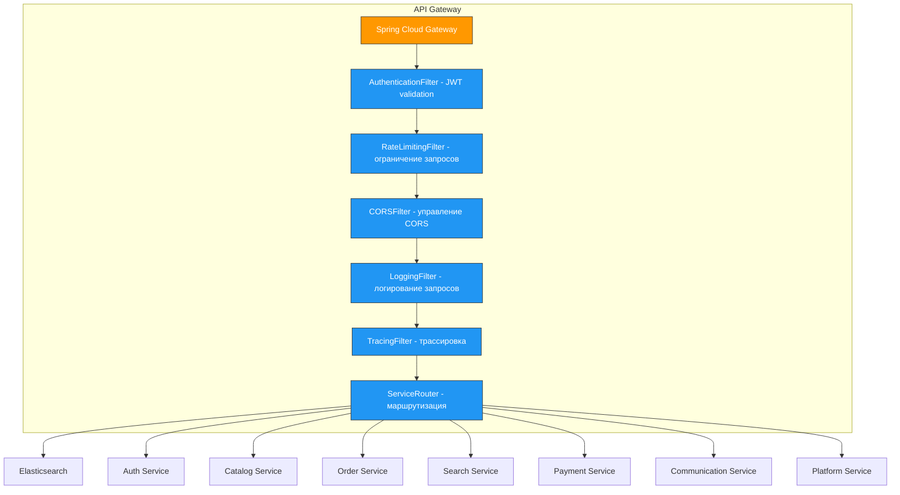
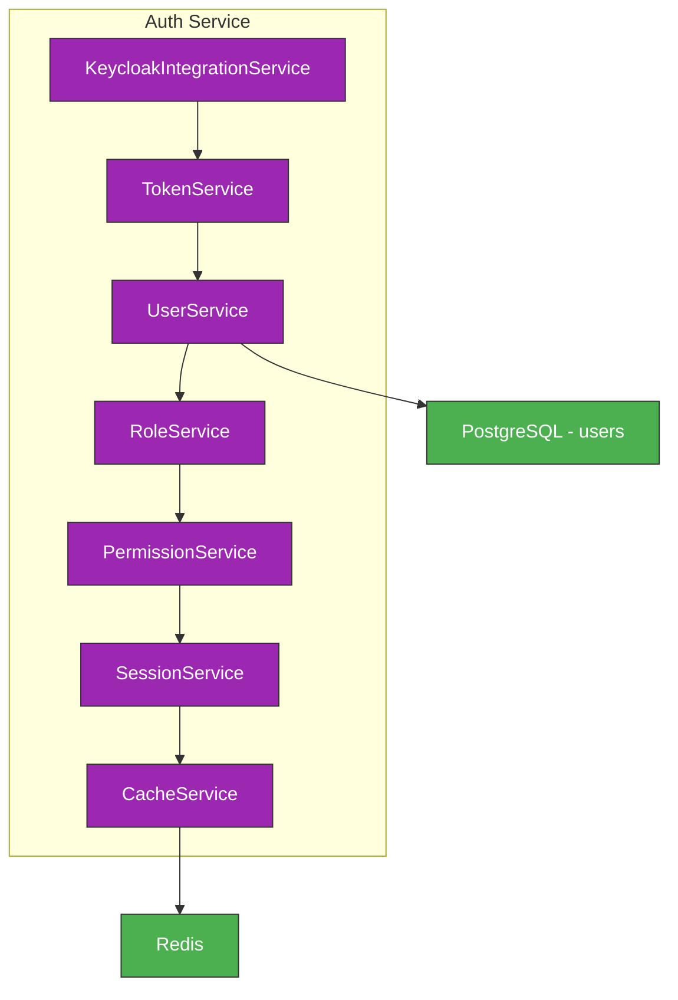
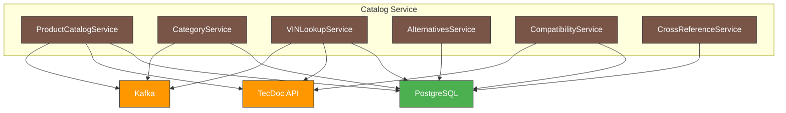
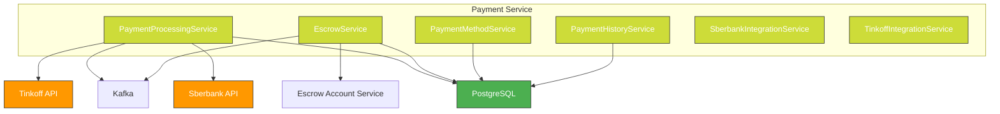

# AutoDev Marketplace — Диаграмма компонентов (C4 Level 2-3)

**Версия документа:** 1.1  
**Дата создания:** 2026-06-03  
**Последнее обновление:** 2026-06-04

---

## Обзор

Диаграмма компонентов (C4 Level 2-3) показывает внутреннюю структуру AutoDev Marketplace: микросервисы, базы данных, брокеры сообщений и их взаимосвязи.

**MVP Architecture (8 сервисов):**
- **api-gateway** — единая точка входа
- **auth-service** — аутентификация и авторизация
- **catalog-service** — каталог, цены, наличие (Products+Prices+Availability)
- **order-service** — заказы, доставка, возвраты (Orders+Delivery+Returns)
- **search-service** — полнотекстовый поиск
- **payment-service** — обработка платежей
- **communication-service** — уведомления и сообщения (Notifications+Messaging)
- **platform-service** — платформенные функции (Users+Moderation+Reviews+Analytics+Admin)

---

## Диаграмма компонентов (C4 Level 2)

```mermaid
graph TD
    subgraph "Клиенты"
        A[Web SPA React]
        B[Admin SPA React]
        C[Mobile App (в будущем)]
    end
    
    subgraph "MVP Сервисы (8)"
        D[API Gateway]
        E[Auth Service]
        F[Catalog Service]
        G[Order Service]
        H[Search Service]
        I[Payment Service]
        J[Communication Service]
        K[Platform Service]
    end
    
    subgraph "Хранилища"
        L[PostgreSQL - services-database]
        M[Redis]
        N[Elasticsearch]
        O[Kafka]
        P[MinIO]
    end
    
    A --> D
    B --> D
    C --> D
    
    D --> E
    D --> F
    D --> G
    D --> H
    D --> I
    D --> J
    D --> K
    
    F --> L
    G --> L
    I --> L
    K --> L
    
    M --> D
    M --> E
    M --> F
    M --> G
    M --> H
    M --> J
    M --> K
    
    H --> N
    
    F --> O
    G --> O
    I --> O
    J --> O
    K --> O
    
    P --> F
    P --> K
    
    classDef client fill:#4CAF50,stroke:#333,stroke-width:1px,color:white;
    classDef service fill:#2196F3,stroke:#333,stroke-width:1px,color:white;
    classDef storage fill:#9C27B0,stroke:#333,stroke-width:1px,color:white;
    
    class A,B,C client
    class D,E,F,G,H,I,J,K service
    class L,M,N,O,P storage
```

---

## Диаграмма компонентов (C4 Level 3) - API Gateway



---

## Диаграмма компонентов (C4 Level 3) - Auth Service



---

## Диаграмма компонентов (C4 Level 3) - Platform Service

```mermaid
graph TD
    subgraph "Platform Service"
        A[UserProfileService]
        B[VerificationService]
        C[StoreSettingsService]
        D[ModerationService]
        E[ReviewService]
        F[AnalyticsService]
        G[AdminService]
        H[MarketingService]
        I[LoyaltyService]
        J[FavoriteListService]
        K[SearchHistoryService]
        L[ViewHistoryService]
    end
    
    A --> PostgreSQL[PostgreSQL]
    B --> PostgreSQL
    C --> PostgreSQL
    D --> PostgreSQL
    E --> PostgreSQL
    F --> PostgreSQL
    G --> PostgreSQL
    H --> PostgreSQL
    I --> PostgreSQL
    J --> PostgreSQL
    K --> PostgreSQL
    L --> PostgreSQL
    
    A --> Redis[Redis]
    D --> Redis
    E --> Redis
    F --> Redis
    I --> Redis
    J --> Redis
    K --> Redis
    L --> Redis
    
    A --> Kafka[Kafka]
    B --> Kafka
    D --> Kafka
    E --> Kafka
    
    classDef platform fill:#3F51B5,stroke:#333,stroke-width:1px,color:white;
    classDef component fill:#2196F3,stroke:#333,stroke-width:1px,color:white;
    classDef storage fill:#4CAF50,stroke:#333,stroke-width:1px,color:white;
    classDef messaging fill:#FF9800,stroke:#333,stroke-width:1px,color:white;
    
    class A,B,C,D,E,F,G,H,I,J,K,L platform
    class PostgreSQL storage
    class Redis,Kafka messaging
```



---

## Диаграмма компонентов (C4 Level 3) - Catalog Service



---

## Диаграмма компонентов (C4 Level 3) - Order Service

```mermaid
graph TD
    subgraph "Order Service"
        A[OrderService]
        B[CartService]
        C[BookingService]
        D[DeliveryService]
        E[TrackingService]
        F[DocumentService]
        G[DeliveryCostService]
        H[ReturnService]
    end
    
    A --> PostgreSQL[PostgreSQL]
    B --> PostgreSQL
    C --> PostgreSQL
    D --> PostgreSQL
    E --> PostgreSQL
    F --> MinIO[MinIO]
    G --> PostgreSQL
    H --> PostgreSQL
    
    A --> Inventory[Catalog Service - reserving]
    D --> Logistics[Catalog Service - carriers]
    F --> Media[MinIO]
    
    A --> Kafka
    B --> Kafka
    C --> Kafka
    
    classDef order fill:#673AB7,stroke:#333,stroke-width:1px,color:white;
    classDef component fill:#2196F3,stroke:#333,stroke-width:1px,color:white;
    classDef storage fill:#4CAF50,stroke:#333,stroke-width:1px,color:white;
    classDef other fill:#FF9800,stroke:#333,stroke-width:1px,color:white;
    
    class A,B,C,D,E,F,G,H order
    class PostgreSQL,MinIO storage
    class Inventory,Logistics,Media other
    class Kafka messaging
```



---

## Диаграмма компонентов (C4 Level 3) - Payment Service



---

## Паттерны проектирования

### API Gateway
| Компонент | Паттерн | Описание |
|-----------|---------|----------|
| AuthenticationFilter | Filter Pattern | Валидация JWT токенов |
| RateLimitingFilter | Rate Limiting | Ограничение запросов |
| ServiceRouter | Router Pattern | Маршрутизация к микросервисам |

### Auth Service
| Компонент | Паттерн | Описание |
|-----------|---------|----------|
| KeycloakIntegrationService | Adapter Pattern | Адаптация к Keycloak API |
| TokenService | Service Layer Pattern | Управление JWT токенами |
| CacheService | Caching Pattern | Кэширование токенов в Redis |

### Order Service
| Компонент | Паттерн | Описание |
|-----------|---------|----------|
| OrderService | Domain Model Pattern | Управление заказами |
| BookingService | Domain Model Pattern | Бронирование товара |
| EscrowService | Domain Model Pattern | Управление эскроу-счётом |

---

## Стратегия разделения данных

### PostgreSQL (services-database)
Каждый сервис использует свою схему:

| Схема | Сервис | Описание |
|-------|--------|----------|
| `auth` | Auth Service | Пользователи и роли |
| `catalog` | Catalog Service | Товары, категории, цены, наличие |
| `order_service` | Order Service | Заказы, корзины, доставка, возвраты |
| `payment` | Payment Service | Платежи, эскроу |
| `communication_service` | Communication Service | Уведомления, чат |
| `platform_service` | Platform Service | Пользователи, модерация, отзывы, аналитика, админ |

### Redis
| Использование | Ключи |
|---------------|--------|
| Сессии | `session:*` |
| Кэш данных | `cache:*` |
| Очереди | `queue:*` |
| Блокировки | `lock:*` |

### Elasticsearch
| Индекс | Сервис | Описание |
|--------|--------|----------|
| `products` | Catalog Service | Поиск товаров |
| `users` | Platform Service | Поиск пользователей |
| `orders` | Order Service | Поиск заказов |

---

## Межсервисное взаимодействие

### Синхронное (REST API)
- **Использование:** Прямые запросы с ожиданием ответа
- **Примеры:**
  - API Gateway → Microservices
  - Order Service → Inventory Service (резервирование)
  - Payment Service → Sberbank API

### Асинхронное (Kafka)
- **Использование:** Событийная архитектура
- **Примеры:**
  - Auth Service → Kafka (user_registered)
  - Order Service → Kafka (order_created)
  - Payment Service → Kafka (payment_completed)

### Стратегия выбора
| Сценарий | Метод |
|----------|-------|
| Необходимость мгновенного ответа | REST API |
| Надёжность доставки сообщений | Kafka |
| Слабая связанность сервисов | Kafka |
| Высокая производительность | Kafka |
| Простая интеграция | REST API |

---

## Балансировка нагрузки

### Клиентская балансировка (Ribbon)
- Используется внутри микросервисов для вызова других сервисов
- Round-robin стратегия по умолчанию

### Серверная балансировка (Consul)
- Используется API Gateway для распределения запросов
- Health checks для обнаружения недоступных узлов

---

## Глоссарий терминов

| Термин | Описание |
|--------|----------|
| C4 Model | Модель описания архитектуры на 4 уровнях |
| Microservice | Небольшой независимый сервис |
| Service Discovery | Механизм обнаружения сервисов |
| Circuit Breaker | Паттерн предотвращения каскадных сбоев |
| Event Sourcing | Хранение событий для восстановления состояния |
| CQRS | Разделение команд и запросов |

---

## Заключение

Диаграмма компонентов показывает:
- **8 микросервисов MVP** с чёткими границами ответственности
- **Единый API Gateway** как точку входа
- **Единая PostgreSQL** с изоляцией по схемам
- **Redis** для кэширования и сессий
- **Elasticsearch** для поиска
- **Apache Kafka** для асинхронной коммуникации
- **MinIO** для хранения медиафайлов

Каждый сервис использует паттерны проектирования, соответствующие его бизнес-функции и требованиям к надёжности.
