# AutoDev Marketplace — Модель данных

**Версия документа:** 1.0  
**Дата создания:** 2026-06-03  
**Последнее обновление:** 2026-06-03

---

## Обзор

Документ описывает логическую и физическую модель данных AutoDev Marketplace, включая основные сущности, их связи, стратегии синхронизации между сервисами и план миграций.

---

## Логическая модель данных (ER-диаграмма)

```mermaid
erDiagram
    auth__users ||--o{ platform_service__users : "1:1"
    auth__users ||--o{ platform_service__store_settings : "1:1"
    auth__users ||--o{ platform_service__loyalty_accounts : "1:1"
    auth__users ||--o{ platform_service__search_history : "1:N"
    auth__users ||--o{ platform_service__view_history : "1:N"
    auth__users ||--o{ platform_service__favorite_items : "1:N"
    auth__users ||--o{ platform_service__favorite_folders : "1:N"
    
    auth__users }|--|| catalog__products : "owner"
    catalog__categories }|--|| catalog__products : "has"
    catalog__brands }|--|| catalog__products : "has"
    
    catalog__products ||--o{ catalog__product_characteristics : "1:N"
    catalog__products ||--o{ catalog__vin_compatibility : "1:N"
    catalog__products ||--o{ catalog__alternatives : "1:N"
    catalog__products ||--o{ catalog__cross_references : "1:N"
    
    catalog__products ||--o{ order_service__order_items : "1:N"
    catalog__products ||--o{ catalog__inventory : "1:N"
    
    order_service__orders ||--o{ order_service__order_items : "1:N"
    order_service__orders ||--o{ order_service__deliveries : "1:N"
    order_service__orders ||--o{ payment_service__payments : "1:N"
    
    payment_service__payments ||--|| order_service__orders : "belongs_to"
    
    communication_service__notifications }|--|| auth__users : "to_user"
    communication_service__messages }|--|| auth__users : "from_user"
    communication_service__messages }|--|| auth__users : "to_user"
```



---

## Физическая модель данных

### Схема: `auth`

#### Таблица: `users`
| Поле | Тип | Описание | Индекс | Ограничения |
|------|-----|----------|--------|-------------|
| id | BIGSERIAL | Первичный ключ | PRIMARY KEY | NOT NULL |
| keycloak_user_id | VARCHAR(255) | ID пользователя в Keycloak | UNIQUE | NOT NULL |
| email | VARCHAR(255) | Email пользователя | UNIQUE | NOT NULL |
| first_name | VARCHAR(255) | Имя пользователя | | NULL |
| last_name | VARCHAR(255) | Фамилия пользователя | | NULL |
| phone | VARCHAR(50) | Телефон | | NULL |
| role | VARCHAR(50) | Роль пользователя | | NOT NULL |
| enabled | BOOLEAN | Активен ли пользователь | | NOT NULL |
| created_at | TIMESTAMP | Дата создания | | NOT NULL |
| updated_at | TIMESTAMP | Дата обновления | | NOT NULL |

#### Таблица: `roles`
| Поле | Тип | Описание | Индекс | Ограничения |
|------|-----|----------|--------|-------------|
| id | BIGSERIAL | Первичный ключ | PRIMARY KEY | NOT NULL |
| name | VARCHAR(50) | Название роли | UNIQUE | NOT NULL |
| description | VARCHAR(255) | Описание роли | | NULL |
| created_at | TIMESTAMP | Дата создания | | NOT NULL |

---

### Схема: `platform_service`

#### Таблица: `users`
| Поле | Тип | Описание | Индекс | Ограничения |
|------|-----|----------|--------|-------------|
| id | BIGSERIAL | Первичный ключ | PRIMARY KEY | NOT NULL |
| user_id | BIGINT | ID пользователя | UNIQUE | NOT NULL |
| keycloak_user_id | VARCHAR(255) | ID пользователя в Keycloak | | NOT NULL |
| first_name | VARCHAR(255) | Имя | | NULL |
| last_name | VARCHAR(255) | Фамилия | | NULL |
| phone | VARCHAR(50) | Телефон | | NULL |
| email | VARCHAR(255) | Email | | NOT NULL |
| avatar_url | VARCHAR(255) | URL аватара | | NULL |
| verified | BOOLEAN | Верифицирован ли пользователь | | NOT NULL |
| created_at | TIMESTAMP | Дата создания | | NOT NULL |
| updated_at | TIMESTAMP | Дата обновления | | NOT NULL |

#### Таблица: `store_settings`
| Поле | Тип | Описание | Индекс | Ограничения |
|------|-----|----------|--------|-------------|
| id | BIGSERIAL | Первичный ключ | PRIMARY KEY | NOT NULL |
| user_id | BIGINT | ID пользователя | UNIQUE | NOT NULL |
| store_name | VARCHAR(255) | Название магазина | | NULL |
| store_description | TEXT | Описание магазина | | NULL |
| store_logo_url | VARCHAR(255) | URL логотипа | | NULL |
| verification_status | VARCHAR(50) | Статус верификации | | NOT NULL |
| created_at | TIMESTAMP | Дата создания | | NOT NULL |
| updated_at | TIMESTAMP | Дата обновления | | NOT NULL |

#### Таблица: `loyalty_accounts`
| Поле | Тип | Описание | Индекс | Ограничения |
|------|-----|----------|--------|-------------|
| id | BIGSERIAL | Первичный ключ | PRIMARY KEY | NOT NULL |
| user_id | BIGINT | ID пользователя | UNIQUE | NOT NULL |
| balance | NUMERIC(10,2) | Баланс лояльности | | NOT NULL |
| total_spent | NUMERIC(10,2) | Всего потрачено | | NOT NULL |
| tier | VARCHAR(50) | TIER: bronze/silver/gold | | NOT NULL |
| created_at | TIMESTAMP | Дата создания | | NOT NULL |
| updated_at | TIMESTAMP | Дата обновления | | NOT NULL |

---

### Схема: `catalog`

#### Таблица: `products`
| Поле | Тип | Описание | Индекс | Ограничения |
|------|-----|----------|--------|-------------|
| id | BIGSERIAL | Первичный ключ | PRIMARY KEY | NOT NULL |
| sku | VARCHAR(255) | Артикул | UNIQUE | NOT NULL |
| name | VARCHAR(255) | Название | | NOT NULL |
| description | TEXT | Описание | | NULL |
| brand_id | BIGINT | ID бренда | | NULL |
| category_id | BIGINT | ID категории | | NOT NULL |
| price | NUMERIC(10,2) | Цена | | NOT NULL |
| currency | VARCHAR(3) | Валюта | | NOT NULL |
| condition | VARCHAR(50) | Состояние: new/used | | NOT NULL |
| vin_compatibility | JSONB | Совместимость по VIN | | NULL |
| created_at | TIMESTAMP | Дата создания | | NOT NULL |
| updated_at | TIMESTAMP | Дата обновления | | NOT NULL |

**Индексы:**
- `idx_products_category` ON (category_id)
- `idx_products_brand` ON (brand_id)
- `idx_products_price` ON (price)
- `idx_products_condition` ON (condition)
- `idx_products_created_at` ON (created_at)

#### Таблица: `categories`
| Поле | Тип | Описание | Индекс | Ограничения |
|------|-----|----------|--------|-------------|
| id | BIGSERIAL | Первичный ключ | PRIMARY KEY | NOT NULL |
| name | VARCHAR(255) | Название | | NOT NULL |
| slug | VARCHAR(255) | URL-_slug | UNIQUE | NOT NULL |
| description | TEXT | Описание | | NULL |
| parent_id | BIGINT | ID родительской категории | | NULL |
| created_at | TIMESTAMP | Дата создания | | NOT NULL |

**Индексы:**
- `idx_categories_parent` ON (parent_id)

#### Таблица: `brands`
| Поле | Тип | Описание | Индекс | Ограничения |
|------|-----|----------|--------|-------------|
| id | BIGSERIAL | Первичный ключ | PRIMARY KEY | NOT NULL |
| name | VARCHAR(255) | Название | UNIQUE | NOT NULL |
| logo_url | VARCHAR(255) | URL логотипа | | NULL |
| created_at | TIMESTAMP | Дата создания | | NOT NULL |

---

### Схема: `order_service`

#### Таблица: `orders`
| Поле | Тип | Описание | Индекс | Ограничения |
|------|-----|----------|--------|-------------|
| id | BIGSERIAL | Первичный ключ | PRIMARY KEY | NOT NULL |
| order_number | VARCHAR(255) | Номер заказа | UNIQUE | NOT NULL |
| user_id | BIGINT | ID пользователя | | NOT NULL |
| status | VARCHAR(50) | Статус заказа | | NOT NULL |
| total_amount | NUMERIC(10,2) | Итоговая сумма | | NOT NULL |
| currency | VARCHAR(3) | Валюта | | NOT NULL |
| created_at | TIMESTAMP | Дата создания | | NOT NULL |
| updated_at | TIMESTAMP | Дата обновления | | NOT NULL |

**Индексы:**
- `idx_orders_user` ON (user_id)
- `idx_orders_status` ON (status)
- `idx_orders_created_at` ON (created_at)

#### Таблица: `order_items`
| Поле | Тип | Описание | Индекс | Ограничения |
|------|-----|----------|--------|-------------|
| id | BIGSERIAL | Первичный ключ | PRIMARY KEY | NOT NULL |
| order_id | BIGINT | ID заказа | | NOT NULL |
| product_id | BIGINT | ID товара | | NOT NULL |
| quantity | INTEGER | Количество | | NOT NULL |
| price | NUMERIC(10,2) | Цена на момент покупки | | NOT NULL |
| created_at | TIMESTAMP | Дата создания | | NOT NULL |

**Индексы:**
- `idx_order_items_order` ON (order_id)
- `idx_order_items_product` ON (product_id)

---

## Стратегии синхронизации данных

### Синхронизация между сервисами

#### Auth Service → Platform Service
**Событие:** `auth.user_registered` (Kafka)
**Действие:** Создание профиля пользователя в `platform_service.users`
**Стратегия:** Event-driven, eventual consistency

#### Platform Service → Communication Service
**Событие:** `platform.user.registered` (Kafka)
**Действие:** Отправка welcome email
**Стратегия:** Event-driven, at-least-once delivery

#### Catalog Service → Elasticsearch
**Событие:** `product.created`, `product.updated`, `product.deleted` (Kafka)
**Действие:** Индексация товара в Elasticsearch
**Стратегия:** Event-driven, eventual consistency

#### Order Service → Payment Service
**Событие:** `order.created` (Kafka)
**Действие:** Создание платежа
**Стратегия:** Event-driven, saga pattern

#### Order Service → Catalog Service (Inventory)
**Событие:** `order.confirmed` (Kafka)
**Действие:** Резервирование наличия
**Стратегия:** Event-driven, with compensation

### CDC (Change Data Capture)
**Использование:** Для интеграции с внешними системами (1С, ERP)
**Инструмент:** Debezium (в будущем)

### Репликация данных
**PostgreSQL:** Primary-Replica ( synchronisation)
**Redis:** Cluster replication
**Kafka:** Replica factor 3

---

## Кэширование

### Redis стратегия

#### Кэш профилей пользователей
```redis
KEY: user:profile:{user_id}
TTL: 1 hour
TYPE: JSON
```

#### Кэш токенов
```redis
KEY: auth:token:{token_hash}
TTL: 12 hours
TYPE: String
```

#### Кэш истории поиска
```redis
KEY: user:search_history:{user_id}
TTL: 1 day
TYPE: List
```

#### Кэш популярных товаров
```redis
KEY: catalog:popular_products
TTL: 1 hour
TYPE: Sorted Set
```

#### Кэш категорий
```redis
KEY: catalog:categories_tree
TTL: 1 day
TYPE: JSON
```

### Локальное кэширование (Caffeine)
- Метаданные категорий
- Список ролей
- Конфигурация магазина

---

## Миграции схемы БД

### План миграций

| Версия | Описание | Скрипт |
|--------|----------|--------|
| `v1.0.0` | Первичная схема | `v1.0.0/03-06-2026-create-tables.sql` |
| `v1.1.0` | Добавление индексов | `v1.1.0/10-06-2026-add-indexes.sql` |
| `v1.2.0` | Обновление структуры | `v1.2.0/15-06-2026-update-schema.sql` |

### Пример миграции
```sql
--liquibase formatted sql
--changeset Aleksey Shvariov:03-06-2026-create-table-users

CREATE TABLE auth.users (
    id                  BIGSERIAL      PRIMARY KEY,
    keycloak_user_id    VARCHAR(255)   NOT NULL   UNIQUE,
    email               VARCHAR(255)   NOT NULL   UNIQUE,
    first_name          VARCHAR(255)   NULL,
    last_name           VARCHAR(255)   NULL,
    phone               VARCHAR(50)    NULL,
    role                VARCHAR(50)    NOT NULL,
    enabled             BOOLEAN        NOT NULL   DEFAULT TRUE,
    created_at          TIMESTAMP      NOT NULL   DEFAULT CURRENT_TIMESTAMP,
    updated_at        	TIMESTAMP      NOT NULL   DEFAULT CURRENT_TIMESTAMP
);

--rollback DROP TABLE auth.users;
```

### Backward compatibility
- Все изменения схемы обратно совместимы
- Новые колонки добавляются с NULL по умолчанию
- Удаление колонок только в новых мажорных версиях

---

## Миграция данных

### Миграция из старой системы
1. Экспорт данных → CSV/JSON
2. Валидация и трансформация
3. Импорт через API или batch-процесс
4. Проверка целостности

### М��грация между БД
- Используется debezium для CDC
- Параллельный запуск старой и новой БД
- Постепенное переключение трафика

---

## Резервное копирование

### Регулярные бэкапы
- **Полный бэкап:** Ежедневно в 02:00
- **Дифференциальный бэкап:** Каждые 6 часов
- **Логи транзакций:** Непрерывно

### Хранение бэкапов
- **MinIO:** 30 дней
- **S3:** 1 год
- **DR Site:** 5 лет

### RPO/RTO
| Метрика | Значение |
|---------|----------|
| RPO (Recovery Point Objective) | 1 час |
| RTO (Recovery Time Objective) | 4 часа |

---

## Мониторинг БД

### Метрики
| Метрика | Целевое значение |
|---------|-----------------|
| Connection pool usage | <80% |
| Query execution time (p95) | <100ms |
| Replication lag | <1s |
| Deadlocks | <1/day |

### Алерты
- `HighConnectionUsage`: Connection pool >80%
- `SlowQuery`: Query time >500ms
- `ReplicationLag`: Replication lag >5s
- `DeadlockDetected`: Deadlock detected

---

## Заключение

Модель данных AutoDev Marketplace:
- **8 схем** PostgreSQL с чётким разделением по сервисам (для MVP)
- **Event-driven синхронизация** через Kafka
- **Кэширование** в Redis для ускорения доступа
- **Elasticsearch** для полнотекстового поиска
- **Migrations** через Liquibase для управления схемой
- **Backward compatibility** для плавного обновления

### Структура схем (MVP: 8 сервисов)

| Сервис | Схема PostgreSQL | Описание |
|--------|-----------------|----------|
| auth-service | `auth` | Пользователи, роли, токены |
| catalog-service | `catalog` | Товары, категории, бренды, цены, наличие |
| order-service | `order_service` | Заказы, доставка, возвраты |
| payment-service | `payment_service` | Платежи, эскроу |
| communication-service | `communication_service` | Уведомления, сообщения |
| platform-service | `platform_service` | Пользователи, модерация, отзывы, аналитика |
| search-service | — | Elasticsearch индексы |
| api-gateway | — | No DB — только маршрутизация |
