# AutoDev Marketplace — Модель данных

**Версия документа:** 1.0  
**Дата создания:** 2026-06-03  
**Последнее обновление:** 2026-06-03

---

## Обзор

Документ описывает логическую и физическую модель данных AutoDev Marketplace, включая основные сущности, их связи, стратегии синхронизации между сервисами и план миграций.

---

## Логическая модель данных (ER-диаграмма)

```mermaid
erDiagram
    auth__users ||--|| platform_service__users : "1:1"
    auth__users ||--|| platform_service__loyalty_accounts : "1:1"
    auth__users ||--o{ platform_service__search_history : "1:N"
    auth__users ||--o{ platform_service__view_history : "1:N"
    auth__users ||--o{ platform_service__favorite_items : "1:N"
    auth__users ||--o{ platform_service__favorite_folders : "1:N"
    auth__users ||--o{ platform_service__moderation_items : "1:N"
    auth__users ||--o{ platform_service__reviews : "1:N"
    auth__users ||--o{ communication_service__notifications : "1:N"
    auth__users ||--o{ communication_service__messages : "1:N"
    auth__users }|--|| order_service__orders : "1:N"
    auth__users }|--|| order_service__carts : "1:1"
    
    auth__users }|--|| catalog__products : "owner"
    catalog__categories }|--|| catalog__products : "has"
    catalog__brands }|--|| catalog__products : "has"
    
    catalog__products ||--o{ catalog__product_characteristics : "1:N"
    catalog__products ||--o{ catalog__vin_compatibility : "1:N"
    catalog__products ||--o{ catalog__alternatives : "1:N"
    catalog__products ||--o{ catalog__cross_references : "1:N"
    catalog__products ||--o{ catalog__prices : "1:1"
    catalog__products ||--o{ catalog__inventory : "1:1"
    
    catalog__products ||--o{ order_service__order_items : "1:N"
    catalog__products ||--o{ order_service__cart_items : "1:N"
    
    order_service__orders ||--o{ order_service__order_items : "1:N"
    order_service__orders }|--|| order_service__deliveries : "1:1"
    order_service__orders ||--o{ order_service__returns : "1:N"
    order_service__orders }|--|| payment_service__payments : "1:1"
    order_service__orders }|--|| communication_service__conversations : "1:1"
    
    payment_service__payments }|--|| order_service__orders : "belongs_to"
    
    communication_service__conversations ||--o{ communication_service__messages : "1:N"
    communication_service__messages }|--|| auth__users : "from_user"
    communication_service__messages }|--|| auth__users : "to_user"
```



---

## Физическая модель данных

### Схема: `auth`

#### Таблица: `users`
| Поле | Тип | Описание | Индекс | Ограничения |
|------|-----|----------|--------|-------------|
| id | BIGSERIAL | Первичный ключ | PRIMARY KEY | NOT NULL |
| keycloak_user_id | VARCHAR(255) | ID пользователя в Keycloak | UNIQUE | NOT NULL |
| email | VARCHAR(255) | Email пользователя (для аутентификации) | UNIQUE | NOT NULL |
| enabled | BOOLEAN | Активен ли пользователь | | NOT NULL |
| created_at | TIMESTAMP | Дата создания | | NOT NULL |

**Индексы:**
- `idx_auth_users_keycloak` ON (keycloak_user_id)

**Ограничения:**

**Примечание:** Эта таблица содержит только аутентификационные данные. Все бизнес-данные пользователя хранятся в `platform_service.users`. Связь 1:1 обеспечивается через внешний ключ `platform_service.users.user_id` → `auth.users.id`.

#### Таблица: `roles`
| Поле | Тип | Описание | Индекс | Ограничения |
|------|-----|----------|--------|-------------|
| id | BIGSERIAL | Первичный ключ | PRIMARY KEY | NOT NULL |
| name | VARCHAR(50) | Название роли | UNIQUE | NOT NULL |
| description | VARCHAR(255) | Описание роли | | NULL |
| created_at | TIMESTAMP | Дата создания | | NOT NULL |

---

### Схема: `platform_service`

#### Таблица: `users`
| Поле | Тип | Описание | Индекс | Ограничения |
|------|-----|----------|--------|-------------|
| user_id | BIGSERIAL | Первичный ключ (ссылка на auth.users.id) | PRIMARY KEY | NOT NULL |
| keycloak_user_id | VARCHAR(255) | ID пользователя в Keycloak | UNIQUE | NOT NULL |
| email | VARCHAR(255) | Email пользователя | | NOT NULL |
| first_name | VARCHAR(255) | Имя пользователя | | NULL |
| last_name | VARCHAR(255) | Фамилия пользователя | | NULL |
| phone | VARCHAR(50) | Телефон | | NULL |
| role | VARCHAR(50) | Роль: BUYER, SELLER | | NOT NULL |
| verified | BOOLEAN | Верифицирован ли пользователь | | NOT NULL |
| avatar_url | VARCHAR(255) | URL аватара | | NULL |
| store_name | VARCHAR(255) | Название магазина (для продавцов) | | NULL |
| store_description | TEXT | Описание магазина | | NULL |
| store_logo_url | VARCHAR(255) | URL логотипа магазина | | NULL |
| verification_status | VARCHAR(50) | Статус верификации магазина | | NOT NULL |
| created_at | TIMESTAMP | Дата создания | | NOT NULL |
| updated_at | TIMESTAMP | Дата обновления | | NOT NULL |

**Индексы:**
- `idx_platform_users_keycloak_user_id` ON (keycloak_user_id)
- `idx_platform_users_email` ON (email)
- `idx_platform_users_role` ON (role)
- `idx_platform_users_store` ON (store_name)
- `idx_platform_users_verified` ON (verified)
- `idx_platform_users_verification_status` ON (verification_status)

**Ограничения:**
- `fk_platform_users_user_id` FOREIGN KEY (user_id) REFERENCES auth.users(id)

**Примечание:** Эта таблица содержит все бизнес-данные пользователя. Ссылка `user_id` связывает её с `auth.users.id` для аутентификации.

#### Таблица: `moderation_items`
| Поле | Тип | Описание | Индекс | Ограничения |
|------|-----|----------|--------|-------------|
| id | BIGSERIAL | Первичный ключ | PRIMARY KEY | NOT NULL |
| item_type | VARCHAR(50) | Тип элемента (product, review, comment) | | NOT NULL |
| item_id | BIGINT | ID элемента | | NOT NULL |
| status | VARCHAR(50) | Статус модерации (pending, approved, rejected) | | NOT NULL |
| moderator_id | BIGINT | ID модератора | | NULL |
| rejection_reason | TEXT | Причина отклонения | | NULL |
| created_at | TIMESTAMP | Дата создания | | NOT NULL |
| reviewed_at | TIMESTAMP | Дата рассмотрения | | NULL |

**Индексы:**
- `idx_moderation_items_item` ON (item_type, item_id)
- `idx_moderation_items_status` ON (status)

**Ограничения:**
- `fk_moderation_items_moderator` FOREIGN KEY (moderator_id) REFERENCES platform_service.users(id)

#### Таблица: `reviews`
| Поле | Тип | Описание | Индекс | Ограничения |
|------|-----|----------|--------|-------------|
| id | BIGSERIAL | Первичный ключ | PRIMARY KEY | NOT NULL |
| product_id | BIGINT | ID товара | | NOT NULL |
| user_id | BIGINT | ID пользователя | | NOT NULL |
| order_id | BIGINT | ID заказа | | NULL |
| rating | INTEGER | Оценка (1-5) | | NOT NULL |
| title | VARCHAR(255) | Заголовок отзыва | | NULL |
| content | TEXT | Текст отзыва | | NULL |
| images | JSONB | URL изображений | | NULL |
| is_verified_purchase | BOOLEAN | Проверенная покупка | | NOT NULL |
| created_at | TIMESTAMP | Дата создания | | NOT NULL |
| updated_at | TIMESTAMP | Дата обновления | | NOT NULL |

**Индексы:**
- `idx_reviews_product` ON (product_id)
- `idx_reviews_user` ON (user_id)
- `idx_reviews_order` ON (order_id)

**Ограничения:**
- `fk_reviews_product` FOREIGN KEY (product_id) REFERENCES catalog.products(id)
- `fk_reviews_user` FOREIGN KEY (user_id) REFERENCES platform_service.users(id)
- `fk_reviews_order` FOREIGN KEY (order_id) REFERENCES order_service.orders(id)

#### Таблица: `analytics`
| Поле | Тип | Описание | Индекс | Ограничения |
|------|-----|----------|--------|-------------|
| id | BIGSERIAL | Первичный ключ | PRIMARY KEY | NOT NULL |
| metric_name | VARCHAR(100) | Название метрики | | NOT NULL |
| metric_value | NUMERIC(15,2) | Значение метрики | | NOT NULL |
| dimension | VARCHAR(100) | Измерение (category, region, etc) | | NULL |
| date | DATE | Дата | | NOT NULL |
| created_at | TIMESTAMP | Дата создания | | NOT NULL |

**Индексы:**
- `idx_analytics_metric` ON (metric_name, date)
- `idx_analytics_dimension` ON (dimension)

#### Таблица: `loyalty_accounts`
| Поле | Тип | Описание | Индекс | Ограничения |
|------|-----|----------|--------|-------------|
| id | BIGSERIAL | Первичный ключ | PRIMARY KEY | NOT NULL |
| user_id | BIGINT | ID пользователя | UNIQUE | NOT NULL |
| balance | NUMERIC(10,2) | Баланс лояльности | | NOT NULL |
| total_spent | NUMERIC(10,2) | Всего потрачено | | NOT NULL |
| tier | VARCHAR(50) | Уровень лояльности (bronze, silver, gold) | | NOT NULL |
| created_at | TIMESTAMP | Дата создания | | NOT NULL |
| updated_at | TIMESTAMP | Дата обновления | | NOT NULL |

**Индексы:**
- `idx_loyalty_accounts_user` ON (user_id)
- `idx_loyalty_accounts_tier` ON (tier)

**Ограничения:**
- `fk_loyalty_accounts_user` FOREIGN KEY (user_id) REFERENCES platform_service.users(id)

#### Таблица: `search_history`
| Поле | Тип | Описание | Индекс | Ограничения |
|------|-----|----------|--------|-------------|
| id | BIGSERIAL | Первичный ключ | PRIMARY KEY | NOT NULL |
| user_id | BIGINT | ID пользователя | | NOT NULL |
| query | TEXT | Поисковый запрос | | NOT NULL |
| results_count | INTEGER | Количество результатов | | NULL |
| created_at | TIMESTAMP | Дата создания | | NOT NULL |

**Индексы:**
- `idx_search_history_user` ON (user_id)
- `idx_search_history_query` ON (query)

**Ограничения:**
- `fk_search_history_user` FOREIGN KEY (user_id) REFERENCES platform_service.users(id)

#### Таблица: `view_history`
| Поле | Тип | Описание | Индекс | Ограничения |
|------|-----|----------|--------|-------------|
| id | BIGSERIAL | Первичный ключ | PRIMARY KEY | NOT NULL |
| user_id | BIGINT | ID пользователя | | NOT NULL |
| product_id | BIGINT | ID товара | | NOT NULL |
| viewed_at | TIMESTAMP | Время просмотра | | NOT NULL |

**Индексы:**
- `idx_view_history_user` ON (user_id)
- `idx_view_history_product` ON (product_id)

**Ограничения:**
- `fk_view_history_user` FOREIGN KEY (user_id) REFERENCES platform_service.users(id)
- `fk_view_history_product` FOREIGN KEY (product_id) REFERENCES catalog.products(id)

#### Таблица: `favorite_folders`
| Поле | Тип | Описание | Индекс | Ограничения |
|------|-----|----------|--------|-------------|
| id | BIGSERIAL | Первичный ключ | PRIMARY KEY | NOT NULL |
| user_id | BIGINT | ID пользователя | | NOT NULL |
| name | VARCHAR(255) | Название папки | | NOT NULL |
| description | VARCHAR(255) | Описание папки | | NULL |
| created_at | TIMESTAMP | Дата создания | | NOT NULL |
| updated_at | TIMESTAMP | Дата обновления | | NOT NULL |

**Индексы:**
- `idx_favorite_folders_user` ON (user_id)

**Ограничения:**
- `fk_favorite_folders_user` FOREIGN KEY (user_id) REFERENCES platform_service.users(id)

#### Таблица: `favorite_items`
| Поле | Тип | Описание | Индекс | Ограничения |
|------|-----|----------|--------|-------------|
| id | BIGSERIAL | Первичный ключ | PRIMARY KEY | NOT NULL |
| user_id | BIGINT | ID пользователя | | NOT NULL |
| folder_id | BIGINT | ID папки | | NULL |
| product_id | BIGINT | ID товара | | NOT NULL |
| created_at | TIMESTAMP | Дата создания | | NOT NULL |

**Индексы:**
- `idx_favorite_items_user` ON (user_id)
- `idx_favorite_items_folder` ON (folder_id)
- `idx_favorite_items_product` ON (product_id)

**Ограничения:**
- `fk_favorite_items_user` FOREIGN KEY (user_id) REFERENCES platform_service.users(id)
- `fk_favorite_items_folder` FOREIGN KEY (folder_id) REFERENCES platform_service.favorite_folders(id)
- `fk_favorite_items_product` FOREIGN KEY (product_id) REFERENCES catalog.products(id)

---

### Схема: `catalog`

#### Таблица: `products`
| Поле | Тип | Описание | Индекс | Ограничения |
|------|-----|----------|--------|-------------|
| id | BIGSERIAL | Первичный ключ | PRIMARY KEY | NOT NULL |
| sku | VARCHAR(255) | Артикул | UNIQUE | NOT NULL |
| name | VARCHAR(255) | Название | | NOT NULL |
| description | TEXT | Описание | | NULL |
| brand_id | BIGINT | ID бренда | | NULL |
| category_id | BIGINT | ID категории | | NOT NULL |
| price | NUMERIC(10,2) | Цена | | NOT NULL |
| currency | VARCHAR(3) | Валюта | | NOT NULL |
| condition | VARCHAR(50) | Состояние: new/used | | NOT NULL |
| vin_compatibility | JSONB | Совместимость по VIN | | NULL |
| created_at | TIMESTAMP | Дата создания | | NOT NULL |
| updated_at | TIMESTAMP | Дата обновления | | NOT NULL |

**Индексы:**
- `idx_products_category` ON (category_id)
- `idx_products_brand` ON (brand_id)
- `idx_products_price` ON (price)
- `idx_products_condition` ON (condition)
- `idx_products_created_at` ON (created_at)

#### Таблица: `categories`
| Поле | Тип | Описание | Индекс | Ограничения |
|------|-----|----------|--------|-------------|
| id | BIGSERIAL | Первичный ключ | PRIMARY KEY | NOT NULL |
| name | VARCHAR(255) | Название | | NOT NULL |
| slug | VARCHAR(255) | URL-_slug | UNIQUE | NOT NULL |
| description | TEXT | Описание | | NULL |
| parent_id | BIGINT | ID родительской категории | | NULL |
| created_at | TIMESTAMP | Дата создания | | NOT NULL |

**Индексы:**
- `idx_categories_parent` ON (parent_id)

#### Таблица: `brands`
| Поле | Тип | Описание | Индекс | Ограничения |
|------|-----|----------|--------|-------------|
| id | BIGSERIAL | Первичный ключ | PRIMARY KEY | NOT NULL |
| name | VARCHAR(255) | Название | UNIQUE | NOT NULL |
| logo_url | VARCHAR(255) | URL логотипа | | NULL |
| created_at | TIMESTAMP | Дата создания | | NOT NULL |

#### Таблица: `product_characteristics`
| Поле | Тип | Описание | Индекс | Ограничения |
|------|-----|----------|--------|-------------|
| id | BIGSERIAL | Первичный ключ | PRIMARY KEY | NOT NULL |
| product_id | BIGINT | ID товара | | NOT NULL |
| name | VARCHAR(255) | Название характеристики | | NOT NULL |
| value | VARCHAR(255) | Значение характеристики | | NOT NULL |

**Индексы:**
- `idx_product_characteristics_product` ON (product_id)

**Ограничения:**
- `fk_product_characteristics_product` FOREIGN KEY (product_id) REFERENCES catalog.products(id)

#### Таблица: `vin_compatibility`
| Поле | Тип | Описание | Индекс | Ограничения |
|------|-----|----------|--------|-------------|
| id | BIGSERIAL | Первичный ключ | PRIMARY KEY | NOT NULL |
| product_id | BIGINT | ID товара | | NOT NULL |
| vin | VARCHAR(17) | VIN-код | | NOT NULL |
| vehicle_name | VARCHAR(255) | Название автомобиля | | NOT NULL |
| created_at | TIMESTAMP | Дата создания | | NOT NULL |

**Индексы:**
- `idx_vin_compatibility_product` ON (product_id)
- `idx_vin_compatibility_vin` ON (vin)

**Ограничения:**
- `fk_vin_compatibility_product` FOREIGN KEY (product_id) REFERENCES catalog.products(id)

#### Таблица: `alternatives`
| Поле | Тип | Описание | Индекс | Ограничения |
|------|-----|----------|--------|-------------|
| id | BIGSERIAL | Первичный ключ | PRIMARY KEY | NOT NULL |
| product_id | BIGINT | ID товара | | NOT NULL |
| alternative_id | BIGINT | ID альтернативного товара | | NOT NULL |
| created_at | TIMESTAMP | Дата создания | | NOT NULL |

**Индексы:**
- `idx_alternatives_product` ON (product_id)
- `idx_alternatives_alternative` ON (alternative_id)

**Ограничения:**
- `fk_alternatives_product` FOREIGN KEY (product_id) REFERENCES catalog.products(id)
- `fk_alternatives_alternative` FOREIGN KEY (alternative_id) REFERENCES catalog.products(id)

#### Таблица: `cross_references`
| Поле | Тип | Описание | Индекс | Ограничения |
|------|-----|----------|--------|-------------|
| id | BIGSERIAL | Первичный ключ | PRIMARY KEY | NOT NULL |
| product_id | BIGINT | ID товара | | NOT NULL |
| cross_reference | VARCHAR(255) | Кросс-номер | | NOT NULL |
| manufacturer | VARCHAR(255) | Производитель | | NULL |
| created_at | TIMESTAMP | Дата создания | | NOT NULL |

**Индексы:**
- `idx_cross_references_product` ON (product_id)
- `idx_cross_references_reference` ON (cross_reference)

**Ограничения:**
- `fk_cross_references_product` FOREIGN KEY (product_id) REFERENCES catalog.products(id)

#### Таблица: `prices`
| Поле | Тип | Описание | Индекс | Ограничения |
|------|-----|----------|--------|-------------|
| id | BIGSERIAL | Первичный ключ | PRIMARY KEY | NOT NULL |
| product_id | BIGINT | ID товара | UNIQUE | NOT NULL |
| price | NUMERIC(10,2) | Цена | | NOT NULL |
| currency | VARCHAR(3) | Валюта | | NOT NULL |
| discount_price | NUMERIC(10,2) | Цена со скидкой | | NULL |
| started_at | TIMESTAMP | Дата начала действия цены | | NOT NULL |
| ended_at | TIMESTAMP | Дата окончания действия цены | | NULL |
| created_at | TIMESTAMP | Дата создания | | NOT NULL |
| updated_at | TIMESTAMP | Дата обновления | | NOT NULL |

**Индексы:**
- `idx_prices_product` ON (product_id)
- `idx_prices_active` ON (ended_at) WHERE ended_at IS NULL

**Ограничения:**
- `fk_prices_product` FOREIGN KEY (product_id) REFERENCES catalog.products(id)

#### Таблица: `inventory`
| Поле | Тип | Описание | Индекс | Ограничения |
|------|-----|----------|--------|-------------|
| id | BIGSERIAL | Первичный ключ | PRIMARY KEY | NOT NULL |
| product_id | BIGINT | ID товара | UNIQUE | NOT NULL |
| quantity | INTEGER | Общее количество | | NOT NULL |
| reserved | INTEGER | Зарезервировано | | NOT NULL |
| available | INTEGER | Доступно для продажи | | NOT NULL |
| warehouse_id | VARCHAR(255) | ID склада | | NULL |
| updated_at | TIMESTAMP | Дата обновления | | NOT NULL |

**Индексы:**
- `idx_inventory_product` ON (product_id)
- `idx_inventory_available` ON (available)

**Ограничения:**
- `fk_inventory_product` FOREIGN KEY (product_id) REFERENCES catalog.products(id)

---

### Схема: `communication_service`

#### Таблица: `notifications`
| Поле | Тип | Описание | Индекс | Ограничения |
|------|-----|----------|--------|-------------|
| id | BIGSERIAL | Первичный ключ | PRIMARY KEY | NOT NULL |
| user_id | BIGINT | ID получателя | | NOT NULL |
| type | VARCHAR(50) | Тип уведомления (email, sms, push) | | NOT NULL |
| template_id | BIGINT | ID шаблона | | NULL |
| subject | VARCHAR(255) | Тема уведомления | | NULL |
| body | TEXT | Тело уведомления | | NULL |
| status | VARCHAR(50) | Статус (sent, delivered, failed) | | NOT NULL |
| sent_at | TIMESTAMP | Время отправки | | NULL |
| delivered_at | TIMESTAMP | Время доставки | | NULL |
| created_at | TIMESTAMP | Дата создания | | NOT NULL |

**Индексы:**
- `idx_notifications_user` ON (user_id)
- `idx_notifications_status` ON (status)
- `idx_notifications_sent` ON (sent_at)

**Ограничения:**
- `fk_notifications_user` FOREIGN KEY (user_id) REFERENCES auth.users(id)

#### Таблица: `messages`
| Поле | Тип | Описание | Индекс | Ограничения |
|------|-----|----------|--------|-------------|
| id | BIGSERIAL | Первичный ключ | PRIMARY KEY | NOT NULL |
| conversation_id | BIGINT | ID диалога | | NOT NULL |
| from_user_id | BIGINT | ID отправителя | | NOT NULL |
| to_user_id | BIGINT | ID получателя | | NOT NULL |
| content | TEXT | Текст сообщения | | NOT NULL |
| is_read | BOOLEAN | Прочитано ли сообщение | | NOT NULL |
| read_at | TIMESTAMP | Время прочтения | | NULL |
| deleted_at | TIMESTAMP | Время удаления | | NULL |
| created_at | TIMESTAMP | Дата создания | | NOT NULL |

**Индексы:**
- `idx_messages_conversation` ON (conversation_id)
- `idx_messages_from_user` ON (from_user_id)
- `idx_messages_to_user` ON (to_user_id)

**Ограничения:**
- `fk_messages_from_user` FOREIGN KEY (from_user_id) REFERENCES auth.users(id)
- `fk_messages_to_user` FOREIGN KEY (to_user_id) REFERENCES auth.users(id)

#### Таблица: `conversations`
| Поле | Тип | Описание | Индекс | Ограничения |
|------|-----|----------|--------|-------------|
| id | BIGSERIAL | Первичный ключ | PRIMARY KEY | NOT NULL |
| product_id | BIGINT | ID товара | | NULL |
| order_id | BIGINT | ID заказа | | NULL |
| last_message_at | TIMESTAMP | Время последнего сообщения | | NULL |
| created_at | TIMESTAMP | Дата создания | | NOT NULL |
| updated_at | TIMESTAMP | Дата обновления | | NOT NULL |

**Индексы:**
- `idx_conversations_product` ON (product_id)
- `idx_conversations_order` ON (order_id)

**Ограничения:**
- `fk_conversations_product` FOREIGN KEY (product_id) REFERENCES catalog.products(id)
- `fk_conversations_order` FOREIGN KEY (order_id) REFERENCES order_service.orders(id)

#### Таблица: `subscriptions`
| Поле | Тип | Описание | Индекс | Ограничения |
|------|-----|----------|--------|-------------|
| id | BIGSERIAL | Первичный ключ | PRIMARY KEY | NOT NULL |
| user_id | BIGINT | ID пользователя | | NOT NULL |
| type | VARCHAR(50) | Тип подписки (email, sms, push) | | NOT NULL |
| enabled | BOOLEAN | Включена ли подписка | | NOT NULL |
| created_at | TIMESTAMP | Дата создания | | NOT NULL |
| updated_at | TIMESTAMP | Дата обновления | | NOT NULL |

**Индексы:**
- `idx_subscriptions_user` ON (user_id)
- `idx_subscriptions_type` ON (type)

**Ограничения:**
- `fk_subscriptions_user` FOREIGN KEY (user_id) REFERENCES auth.users(id)

#### Таблица: `templates`
| Поле | Тип | Описание | Индекс | Ограничения |
|------|-----|----------|--------|-------------|
| id | BIGSERIAL | Первичный ключ | PRIMARY KEY | NOT NULL |
| name | VARCHAR(255) | Название шаблона | UNIQUE | NOT NULL |
| type | VARCHAR(50) | Тип шаблона (email, sms, push) | | NOT NULL |
| subject | VARCHAR(255) | Тема (для email) | | NULL |
| body | TEXT | Тело шаблона | | NOT NULL |
| is_active | BOOLEAN | Активен ли шаблон | | NOT NULL |
| created_at | TIMESTAMP | Дата создания | | NOT NULL |
| updated_at | TIMESTAMP | Дата обновления | | NOT NULL |

**Индексы:**
- `idx_templates_name` ON (name)
- `idx_templates_type` ON (type)

---

### Схема: `order_service`

#### Таблица: `orders`
| Поле | Тип | Описание | Индекс | Ограничения |
|------|-----|----------|--------|-------------|
| id | BIGSERIAL | Первичный ключ | PRIMARY KEY | NOT NULL |
| order_number | VARCHAR(255) | Номер заказа | UNIQUE | NOT NULL |
| user_id | BIGINT | ID пользователя | | NOT NULL |
| status | VARCHAR(50) | Статус заказа | | NOT NULL |
| total_amount | NUMERIC(10,2) | Итоговая сумма | | NOT NULL |
| currency | VARCHAR(3) | Валюта | | NOT NULL |
| created_at | TIMESTAMP | Дата создания | | NOT NULL |
| updated_at | TIMESTAMP | Дата обновления | | NOT NULL |

**Индексы:**
- `idx_orders_user` ON (user_id)
- `idx_orders_status` ON (status)
- `idx_orders_created_at` ON (created_at)

#### Таблица: `order_items`
| Поле | Тип | Описание | Индекс | Ограничения |
|------|-----|----------|--------|-------------|
| id | BIGSERIAL | Первичный ключ | PRIMARY KEY | NOT NULL |
| order_id | BIGINT | ID заказа | | NOT NULL |
| product_id | BIGINT | ID товара | | NOT NULL |
| quantity | INTEGER | Количество | | NOT NULL |
| price | NUMERIC(10,2) | Цена на момент покупки | | NOT NULL |
| created_at | TIMESTAMP | Дата создания | | NOT NULL |

**Индексы:**
- `idx_order_items_order` ON (order_id)
- `idx_order_items_product` ON (product_id)

#### Таблица: `deliveries`
| Поле | Тип | Описание | Индекс | Ограничения |
|------|-----|----------|--------|-------------|
| id | BIGSERIAL | Первичный ключ | PRIMARY KEY | NOT NULL |
| order_id | BIGINT | ID заказа | UNIQUE | NOT NULL |
| address | TEXT | Адрес доставки | | NOT NULL |
| recipient_name | VARCHAR(255) | Имя получателя | | NULL |
| phone | VARCHAR(50) | Телефон получателя | | NULL |
| delivery_type | VARCHAR(50) | Тип доставки (courier, pickup, postal) | | NOT NULL |
| status | VARCHAR(50) | Статус доставки (pending, in_transit, delivered, cancelled) | | NOT NULL |
| tracking_number | VARCHAR(255) | Номер отслеживания | | NULL |
| estimated_delivery | DATE | Ожидаемая дата доставки | | NULL |
| actual_delivery | TIMESTAMP | Фактическая дата доставки | | NULL |
| created_at | TIMESTAMP | Дата создания | | NOT NULL |
| updated_at | TIMESTAMP | Дата обновления | | NOT NULL |

**Индексы:**
- `idx_deliveries_order` ON (order_id)
- `idx_deliveries_status` ON (status)

**Ограничения:**
- `fk_deliveries_order` FOREIGN KEY (order_id) REFERENCES order_service.orders(id)

#### Таблица: `returns`
| Поле | Тип | Описание | Индекс | Ограничения |
|------|-----|----------|--------|-------------|
| id | BIGSERIAL | Первичный ключ | PRIMARY KEY | NOT NULL |
| order_id | BIGINT | ID заказа | | NOT NULL |
| order_item_id | BIGINT | ID позиции заказа | | NOT NULL |
| reason | TEXT | Причина возврата | | NULL |
| status | VARCHAR(50) | Статус возврата (requested, approved, rejected, completed) | | NOT NULL |
| return_amount | NUMERIC(10,2) | Сумма возврата | | NOT NULL |
| returned_quantity | INTEGER | Количество возвращённого товара | | NOT NULL |
| approved_at | TIMESTAMP | Дата одобрения | | NULL |
| completed_at | TIMESTAMP | Дата завершения | | NULL |
| created_at | TIMESTAMP | Дата создания | | NOT NULL |
| updated_at | TIMESTAMP | Дата обновления | | NOT NULL |

**Индексы:**
- `idx_returns_order` ON (order_id)
- `idx_returns_item` ON (order_item_id)
- `idx_returns_status` ON (status)

**Ограничения:**
- `fk_returns_order` FOREIGN KEY (order_id) REFERENCES order_service.orders(id)
- `fk_returns_item` FOREIGN KEY (order_item_id) REFERENCES order_service.order_items(id)

#### Таблица: `carts`
| Поле | Тип | Описание | Индекс | Ограничения |
|------|-----|----------|--------|-------------|
| id | BIGSERIAL | Первичный ключ | PRIMARY KEY | NOT NULL |
| user_id | BIGINT | ID пользователя | UNIQUE | NOT NULL |
| status | VARCHAR(50) | Статус корзины (active, abandoned, converted) | | NOT NULL |
| created_at | TIMESTAMP | Дата создания | | NOT NULL |
| updated_at | TIMESTAMP | Дата обновления | | NOT NULL |

**Индексы:**
- `idx_carts_user` ON (user_id)
- `idx_carts_status` ON (status)

**Ограничения:**
- `fk_carts_user` FOREIGN KEY (user_id) REFERENCES auth.users(id)

#### Таблица: `cart_items`
| Поле | Тип | Описание | Индекс | Ограничения |
|------|-----|----------|--------|-------------|
| id | BIGSERIAL | Первичный ключ | PRIMARY KEY | NOT NULL |
| cart_id | BIGINT | ID корзины | | NOT NULL |
| product_id | BIGINT | ID товара | | NOT NULL |
| quantity | INTEGER | Количество | | NOT NULL |
| added_at | TIMESTAMP | Дата добавления | | NOT NULL |

**Индексы:**
- `idx_cart_items_cart` ON (cart_id)
- `idx_cart_items_product` ON (product_id)

**Ограничения:**
- `fk_cart_items_cart` FOREIGN KEY (cart_id) REFERENCES order_service.carts(id)
- `fk_cart_items_product` FOREIGN KEY (product_id) REFERENCES catalog.products(id)

---

### Схема: `payment_service`

#### Таблица: `payments`
| Поле | Тип | Описание | Индекс | Ограничения |
|------|-----|----------|--------|-------------|
| id | BIGSERIAL | Первичный ключ | PRIMARY KEY | NOT NULL |
| order_id | BIGINT | ID заказа | UNIQUE | NOT NULL |
| amount | NUMERIC(10,2) | Сумма платежа | | NOT NULL |
| currency | VARCHAR(3) | Валюта | | NOT NULL |
| status | VARCHAR(50) | Статус платежа (pending, completed, failed, refunded) | | NOT NULL |
| payment_method | VARCHAR(50) | Метод оплаты (card, online, cod) | | NOT NULL |
| transaction_id | VARCHAR(255) | ID транзакции в платёжной системе | | NULL |
| card_last_four | VARCHAR(4) | Последние 4 цифры карты | | NULL |
| escrow_status | VARCHAR(50) | Статус эскроу (pending, released, returned) | | NULL |
| paid_at | TIMESTAMP | Время оплаты | | NULL |
| refunded_at | TIMESTAMP | Время возврата | | NULL |
| created_at | TIMESTAMP | Дата создания | | NOT NULL |
| updated_at | TIMESTAMP | Дата обновления | | NOT NULL |

**Индексы:**
- `idx_payments_order` ON (order_id)
- `idx_payments_status` ON (status)
- `idx_payments_transaction` ON (transaction_id)

**Ограничения:**
- `fk_payments_order` FOREIGN KEY (order_id) REFERENCES order_service.orders(id)

---

## Стратегии синхронизации данных

### Синхронизация между сервисами

#### Auth Service → Platform Service
**Событие:** `auth.user_registered` (Kafka)
**Действие:** Создание профиля пользователя в `platform_service.users` (автоматически создает запись при регистрации)
**Стратегия:** Event-driven, eventual consistency

**Примечание:** Согласно новой архитектуре, `auth.users` содержит только аутентификационные данные, а `platform_service.users` содержит все бизнес-данные пользователя. При регистрации создается запись в `auth.users` с последующим созданием профиля в `platform_service.users`.

#### Platform Service → Auth Service
**Событие:** `platform.user.profile_created` (Kafka)
**Действие:** Создание аутентификационной записи в `auth.users` для новой компании/подразделения
**Стратегия:** Event-driven, eventual consistency

**Примечание:** Для служебных учетных записей (например, для компаний) может создаваться аутентификационная запись в `auth.users`.

#### Platform Service → Communication Service
**Событие:** `platform.user.registered` (Kafka)
**Действие:** Отправка welcome email
**Стратегия:** Event-driven, at-least-once delivery

#### Catalog Service → Elasticsearch
**Событие:** `product.created`, `product.updated`, `product.deleted` (Kafka)
**Действие:** Индексация товара в Elasticsearch
**Стратегия:** Event-driven, eventual consistency

#### Order Service → Payment Service
**Событие:** `order.created` (Kafka)
**Действие:** Создание платежа
**Стратегия:** Event-driven, saga pattern

#### Order Service → Catalog Service (Inventory)
**Событие:** `order.confirmed` (Kafka)
**Действие:** Резервирование наличия
**Стратегия:** Event-driven, with compensation

### CDC (Change Data Capture)
**Использование:** Для интеграции с внешними системами (1С, ERP)
**Инструмент:** Debezium (в будущем)

### Репликация данных
**PostgreSQL:** Primary-Replica ( synchronisation)
**Redis:** Cluster replication
**Kafka:** Replica factor 3

---

## Кэширование

### Redis стратегия

#### Кэш профилей пользователей
```redis
KEY: user:profile:{user_id}
TTL: 1 hour
TYPE: JSON
```

#### Кэш токенов
```redis
KEY: auth:token:{token_hash}
TTL: 12 hours
TYPE: String
```

#### Кэш истории поиска
```redis
KEY: user:search_history:{user_id}
TTL: 1 day
TYPE: List
```

#### Кэш популярных товаров
```redis
KEY: catalog:popular_products
TTL: 1 hour
TYPE: Sorted Set
```

#### Кэш категорий
```redis
KEY: catalog:categories_tree
TTL: 1 day
TYPE: JSON
```

### Локальное кэширование (Caffeine)
- Метаданные категорий
- Список ролей
- Конфигурация магазина

---

## Миграции схемы БД

### План миграций

| Версия | Описание | Скрипт |
|--------|----------|--------|
| `v1.0.0` | Первичная схема | `v1.0.0/03-06-2026-create-tables.sql` |
| `v1.1.0` | Добавление индексов | `v1.1.0/10-06-2026-add-indexes.sql` |
| `v1.2.0` | Обновление структуры | `v1.2.0/15-06-2026-update-schema.sql` |

### Пример миграции
```sql
--liquibase formatted sql
--changeset Aleksey Shvariov:03-06-2026-create-table-users

-- Схема auth: только аутентификационные данные
CREATE TABLE auth.users (
    id                  BIGSERIAL      PRIMARY KEY,
    keycloak_user_id    VARCHAR(255)   NOT NULL   UNIQUE,
    email               VARCHAR(255)   NOT NULL   UNIQUE,
    enabled             BOOLEAN        NOT NULL   DEFAULT TRUE,
    created_at          TIMESTAMP      NOT NULL   DEFAULT CURRENT_TIMESTAMP
);

CREATE INDEX idx_auth_users_keycloak ON auth.users(keycloak_user_id);

-- Схема platform_service: все бизнес-данные пользователя
CREATE TABLE platform_service.users (
    user_id             BIGSERIAL      PRIMARY KEY,
    keycloak_user_id    VARCHAR(255)   NOT NULL   UNIQUE,
    email               VARCHAR(255)   NOT NULL   UNIQUE,
    first_name          VARCHAR(255)   NULL,
    last_name           VARCHAR(255)   NULL,
    phone               VARCHAR(50)    NULL,
    role                VARCHAR(50)    NOT NULL,
    verified            BOOLEAN        NOT NULL   DEFAULT FALSE,
    avatar_url          VARCHAR(255)   NULL,
    store_name          VARCHAR(255)   NULL,
    store_description   TEXT           NULL,
    store_logo_url      VARCHAR(255)   NULL,
    verification_status VARCHAR(50)    NOT NULL   DEFAULT 'unverified',
    created_at          TIMESTAMP      NOT NULL   DEFAULT CURRENT_TIMESTAMP,
    updated_at          TIMESTAMP      NOT NULL   DEFAULT CURRENT_TIMESTAMP,
    FOREIGN KEY (user_id) REFERENCES auth.users(id)
);

CREATE INDEX idx_platform_users_keycloak_user_id ON platform_service.users(keycloak_user_id);
CREATE INDEX idx_platform_users_email ON platform_service.users(email);
CREATE INDEX idx_platform_users_role ON platform_service.users(role);
CREATE INDEX idx_platform_users_store ON platform_service.users(store_name);
CREATE INDEX idx_platform_users_verified ON platform_service.users(verified);
CREATE INDEX idx_platform_users_verification_status ON platform_service.users(verification_status);

--rollback DROP TABLE platform_service.users;
--rollback DROP TABLE auth.users;
```

### Backward compatibility
- Все изменения схемы обратно совместимы
- Новые колонки добавляются с NULL по умолчанию
- Удаление колонок только в новых мажорных версиях

---

## Миграция данных

### Миграция из старой системы
1. Экспорт данных → CSV/JSON
2. Валидация и трансформация
3. Импорт через API или batch-процесс
4. Проверка целостности

### М��грация между БД
- Используется debezium для CDC
- Параллельный запуск старой и новой БД
- Постепенное переключение трафика

---

## Резервное копирование

### Регулярные бэкапы
- **Полный бэкап:** Ежедневно в 02:00
- **Дифференциальный бэкап:** Каждые 6 часов
- **Логи транзакций:** Непрерывно

### Хранение бэкапов
- **MinIO:** 30 дней
- **S3:** 1 год
- **DR Site:** 5 лет

### RPO/RTO
| Метрика | Значение |
|---------|----------|
| RPO (Recovery Point Objective) | 1 час |
| RTO (Recovery Time Objective) | 4 часа |

---

## Мониторинг БД

### Метрики
| Метрика | Целевое значение |
|---------|-----------------|
| Connection pool usage | <80% |
| Query execution time (p95) | <100ms |
| Replication lag | <1s |
| Deadlocks | <1/day |

### Алерты
- `HighConnectionUsage`: Connection pool >80%
- `SlowQuery`: Query time >500ms
- `ReplicationLag`: Replication lag >5s
- `DeadlockDetected`: Deadlock detected

---

## Заключение

Модель данных AutoDev Marketplace:
- **8 схем** PostgreSQL с чётким разделением по сервисам (для MVP)
- **Event-driven синхронизация** через Kafka
- **Кэширование** в Redis для ускорения доступа
- **Elasticsearch** для полнотекстового поиска
- **Migrations** через Liquibase для управления схемой
- **Backward compatibility** для плавного обновления

### Структура схем (MVP: 8 сервисов)

| Сервис | Схема PostgreSQL | Описание |
|--------|-----------------|----------|
| auth-service | `auth` | Пользователи, роли, токены |
| catalog-service | `catalog` | Товары, категории, бренды, цены, наличие, характеристики, совместимость |
| order-service | `order_service` | Заказы, корзины, доставка, возвраты |
| payment-service | `payment_service` | Платежи, эскроу |
| communication-service | `communication_service` | Уведомления, сообщения, подписки, шаблоны |
| platform-service | `platform_service` | Пользователи, модерация, отзывы, аналитика, лояльность, избранное |
| search-service | — | Elasticsearch индексы (PostgreSQL не используется напрямую) |
| api-gateway | — | No DB — только маршрутизация |

**Примечание:**
- Search Service не использует PostgreSQL напрямую, только Elasticsearch для полнотекстового поиска
- Индексы Elasticsearch синхронизируются через Kafka события из других сервисов (catalog, platform, order)
- API Gateway не использует БД, только маршрутизация запросов
