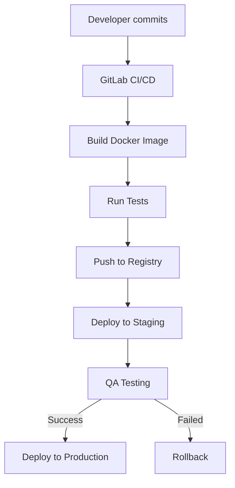
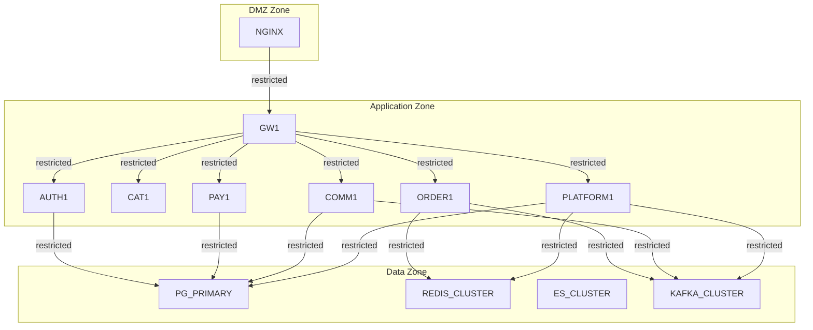

# AutoDev Marketplace — Диаграмма развёртывания (C4 Level 4)

**Версия документа:** 1.1  
**Дата создания:** 2026-06-03  
**Последнее обновление:** 2026-06-04

---

## Обзор

Диаграмма развёртывания показывает физическую инфраструктуру системы: серверы, контейнеры, поды Kubernetes, сетевые зоны и схемы репликации данных.

**MVP Architecture (8 сервисов):**
- **api-gateway** — единая точка входа
- **auth-service** — аутентификация и авторизация
- **catalog-service** — каталог, цены, наличие ( Products+Prices+Availability)
- **order-service** — заказы, доставка, возвраты (Orders+Delivery+Returns)
- **search-service** — полнотекстовый поиск
- **payment-service** — обработка платежей
- **communication-service** — уведомления и сообщения (Notifications+Messaging)
- **platform-service** — платформенные функции (Users+Moderation+Reviews+Analytics+Admin)

---

## Диаграмма развёртывания

```mermaid
graph TD
    subgraph "Интернет"
        Client[Пользователи]
    end
    
    subgraph "Kubernetes Cluster - Production"
        subgraph "Ingress Layer"
            NGINX[Nginx Ingress Controller]
            CertManager[Cert Manager - TLS certificates]
        end
        
        subgraph "Application Layer"
            subgraph "API Gateway Pods"
                GW1[api-gateway-pod-1]
                GW2[api-gateway-pod-2]
                GW3[api-gateway-pod-3]
            end
            
            subgraph "Auth Service Pods"
                AUTH1[auth-service-pod-1]
                AUTH2[auth-service-pod-2]
            end
            
            subgraph "Catalog Service Pods"
                CAT1[catalog-service-pod-1]
                CAT2[catalog-service-pod-2]
            end
            
            subgraph "Order Service Pods"
                ORDER1[order-service-pod-1]
                ORDER2[order-service-pod-2]
            end
            
            subgraph "Search Service Pods"
                SEARCH1[search-service-pod-1]
                SEARCH2[search-service-pod-2]
            end
            
            subgraph "Payment Service Pods"
                PAY1[payment-service-pod-1]
                PAY2[payment-service-pod-2]
            end
            
            subgraph "Communication Service Pods"
                COMM1[communication-service-pod-1]
                COMM2[communication-service-pod-2]
            end
            
            subgraph "Platform Service Pods"
                PLATFORM1[platform-service-pod-1]
                PLATFORM2[platform-service-pod-2]
            end
        end
        
        subgraph "Database Layer"
            PG_PRIMARY[PostgreSQL Primary]
            PG_REPLICA[PostgreSQL Replica]
            REDIS_CLUSTER[Redis Cluster]
            ES_CLUSTER[Elasticsearch Cluster]
            KAFKA_CLUSTER[Kafka Cluster]
        end
        
        subgraph "Storage Layer"
            MINIO[MinIO - Object Storage]
        end
        
        subgraph "Observability Layer"
            PROMETHEUS[Prometheus]
            GRAFANA[Grafana]
            LOKI[Loki]
            TEMPO[Tempo]
        end
    end
    
    subgraph "Backup & DR"
        BACKUP_S3[Backup to S3 - MinIO]
        DR_SITE[Disaster Recovery Site]
    end
    
    Client -->|HTTPS| NGINX
    NGINX -->|http://api-gateway:8080| GW1
    NGINX -->|http://api-gateway:8080| GW2
    NGINX -->|http://api-gateway:8080| GW3
    
    GW1 --> AUTH1
    GW1 --> AUTH2
    GW1 --> CAT1
    GW1 --> CAT2
    GW1 --> ORDER1
    GW1 --> ORDER2
    GW1 --> SEARCH1
    GW1 --> SEARCH2
    GW1 --> PAY1
    GW1 --> PAY2
    GW1 --> COMM1
    GW1 --> COMM2
    GW1 --> PLATFORM1
    GW1 --> PLATFORM2
    
    AUTH1 --> PG_PRIMARY
    AUTH2 --> PG_PRIMARY
    
    CAT1 --> PG_PRIMARY
    CAT2 --> PG_PRIMARY
    
    ORDER1 --> PG_PRIMARY
    ORDER2 --> PG_PRIMARY
    ORDER1 --> REDIS_CLUSTER
    ORDER2 --> REDIS_CLUSTER
    
    SEARCH1 --> ES_CLUSTER
    SEARCH2 --> ES_CLUSTER
    
    PAY1 --> PG_PRIMARY
    PAY2 --> PG_PRIMARY
    
    COMM1 --> PG_PRIMARY
    COMM2 --> PG_PRIMARY
    COMM1 --> KAFKA_CLUSTER
    COMM2 --> KAFKA_CLUSTER
    
    PLATFORM1 --> PG_PRIMARY
    PLATFORM2 --> PG_PRIMARY
    PLATFORM1 --> REDIS_CLUSTER
    PLATFORM2 --> REDIS_CLUSTER
    PLATFORM1 --> KAFKA_CLUSTER
    PLATFORM2 --> KAFKA_CLUSTER
    
    PG_PRIMARY -->| replication | PG_REPLICA
    PG_PRIMARY -->| sync | MINIO
    PG_PRIMARY -->| sync | BACKUP_S3
    PG_REPLICA -->| async | DR_SITE
    
    REDIS_CLUSTER -->| cluster sync | DR_SITE
    
    CERTMANAGER -->| TLS certs | NGINX
    
    classDef client fill:#009688,stroke:#333,stroke-width:1px,color:white;
    classDef ingress fill:#FF9800,stroke:#333,stroke-width:1px,color:white;
    classDef app fill:#2196F3,stroke:#333,stroke-width:1px,color:white;
    classDef db fill:#9C27B0,stroke:#333,stroke-width:1px,color:white;
    classDef storage fill:#4CAF50,stroke:#333,stroke-width:1px,color:white;
    classDef observability fill:#673AB7,stroke:#333,stroke-width:1px,color:white;
    classDef backup fill:#795548,stroke:#333,stroke-width:1px,color:white;
    
    class Client client
    class NGINX,CertManager ingress
    class GW1,GW2,GW3,AUTH1,AUTH2,CAT1,CAT2,ORDER1,ORDER2,SEARCH1,SEARCH2,PAY1,PAY2,COMM1,COMM2,PLATFORM1,PLATFORM2 app
    class PG_PRIMARY,PG_REPLICA,REDIS_CLUSTER,ES_CLUSTER,KAFKA_CLUSTER db
    class MINIO storage
    class PROMETHEUS,GRAFANA,LOKI,TEMPO observability
    class BACKUP_S3,DR_SITE backup
```



---

## Физическая инфраструктура

### Kubernetes Clusters

#### Production Cluster (主集群)
- **Количество узлов:** 5
- **Конфигурация узла:**
  - CPU: 8 cores
  - RAM: 16 GB
  - Storage: 100 GB SSD
- **Зоны доступности:** 3 (eu-west-1a, eu-west-1b, eu-west-1c)

#### Staging Cluster
- **Количество узлов:** 3
- **Конфигурация узла:**
  - CPU: 4 cores
  - RAM: 8 GB
  - Storage: 50 GB SSD
- **Зоны доступности:** 2

---

## Контейнеры и поды

### API Gateway
```yaml
apiVersion: apps/v1
kind: Deployment
metadata:
  name: api-gateway
spec:
  replicas: 3
  template:
    spec:
      containers:
      - name: api-gateway
        image: autodev/api-gateway:latest
        ports:
        - containerPort: 8080
        resources:
          requests:
            memory: "256Mi"
            cpu: "250m"
          limits:
            memory: "512Mi"
            cpu: "500m"
```

### Auth Service
```yaml
apiVersion: apps/v1
kind: Deployment
metadata:
  name: auth-service
spec:
  replicas: 2
  template:
    spec:
      containers:
      - name: auth-service
        image: autodev/auth-service:latest
        ports:
        - containerPort: 8082
        env:
        - name: AUTH_DB_HOST
          value: "services-database"
        - name: REDIS_HOST
          value: "redis"
        - name: CONSUL_HOST
          value: "consul"
```

### Catalog Service
```yaml
apiVersion: apps/v1
kind: Deployment
metadata:
  name: catalog-service
spec:
  replicas: 2
  template:
    spec:
      containers:
      - name: catalog-service
        image: autodev/catalog-service:latest
        ports:
        - containerPort: 8084
        env:
        - name: CATALOG_DB_HOST
          value: "services-database"
        - name: REDIS_HOST
          value: "redis"
```

### Order Service
```yaml
apiVersion: apps/v1
kind: Deployment
metadata:
  name: order-service
spec:
  replicas: 2
  template:
    spec:
      containers:
      - name: order-service
        image: autodev/order-service:latest
        ports:
        - containerPort: 8085
        env:
        - name: ORDER_DB_HOST
          value: "services-database"
        - name: REDIS_HOST
          value: "redis"
        - name: KAFKA_HOST
          value: "kafka"
```

### Search Service
```yaml
apiVersion: apps/v1
kind: Deployment
metadata:
  name: search-service
spec:
  replicas: 2
  template:
    spec:
      containers:
      - name: search-service
        image: autodev/search-service:latest
        ports:
        - containerPort: 8086
        env:
        - name: ELASTICSEARCH_HOST
          value: "elasticsearch"
```

### Payment Service
```yaml
apiVersion: apps/v1
kind: Deployment
metadata:
  name: payment-service
spec:
  replicas: 2
  template:
    spec:
      containers:
      - name: payment-service
        image: autodev/payment-service:latest
        ports:
        - containerPort: 8087
        env:
        - name: PAYMENT_DB_HOST
          value: "services-database"
        - name: KAFKA_HOST
          value: "kafka"
```

### Communication Service
```yaml
apiVersion: apps/v1
kind: Deployment
metadata:
  name: communication-service
spec:
  replicas: 2
  template:
    spec:
      containers:
      - name: communication-service
        image: autodev/communication-service:latest
        ports:
        - containerPort: 8088
        env:
        - name: COMM_DB_HOST
          value: "services-database"
        - name: KAFKA_HOST
          value: "kafka"
        - name: SMTP_HOST
          value: "smtp"
        - name: WS_HOST
          value: "websocket"
```

### Platform Service
```yaml
apiVersion: apps/v1
kind: Deployment
metadata:
  name: platform-service
spec:
  replicas: 2
  template:
    spec:
      containers:
      - name: platform-service
        image: autodev/platform-service:latest
        ports:
        - containerPort: 8089
        env:
        - name: PLATFORM_DB_HOST
          value: "services-database"
        - name: REDIS_HOST
          value: "redis"
        - name: KAFKA_HOST
          value: "kafka"
```

---

## Базы данных

### PostgreSQL (Primary-Replica)

#### Primary Node
```yaml
apiVersion: v1
kind: Service
metadata:
  name: postgresql-primary
spec:
  ports:
  - port: 5432
  selector:
    app: postgresql-primary
---
apiVersion: apps/v1
kind: StatefulSet
metadata:
  name: postgresql-primary
spec:
  serviceName: postgresql-primary
  replicas: 1
  template:
    spec:
      containers:
      - name: postgresql
        image: postgres:15
        ports:
        - containerPort: 5432
        volumeMounts:
        - name: data
          mountPath: /var/lib/postgresql/data
  volumeClaimTemplates:
  - metadata:
      name: data
    spec:
      accessModes: ["ReadWriteOnce"]
      resources:
        requests:
          storage: 100Gi
```

#### Replica Node
```yaml
apiVersion: apps/v1
kind: StatefulSet
metadata:
  name: postgresql-replica
spec:
  serviceName: postgresql-replica
  replicas: 1
  template:
    spec:
      containers:
      - name: postgresql
        image: postgres:15
        ports:
        - containerPort: 5432
        env:
        - name: POSTGRES_PASSWORD
          valueFrom:
            secretKeyRef:
              name: postgres-secrets
              key: password
        volumeMounts:
        - name: data
          mountPath: /var/lib/postgresql/data
```

#### Replication Flow
```
Primary (eu-west-1a)
    ↓ synchronous
Replica (eu-west-1b)
    ↓ asynchronous
DR Site (eu-west-2)
```

### Redis Cluster
```yaml
apiVersion: redis.redis.io/v1alpha1
kind: Redis
metadata:
  name: redis-cluster
spec:
  redis:
    replicas: 3
    resources:
      requests:
        cpu: "100m"
        memory: "256Mi"
      limits:
        cpu: "200m"
        memory: "512Mi"
```

### Elasticsearch Cluster
```yaml
apiVersion: elasticsearch.k8s.elastic.co/v1
kind: Elasticsearch
metadata:
  name: elasticsearch
spec:
  version: 8.13.0
  nodeSets:
  - name: default
    count: 3
    config:
      node.store.allow_mmap: false
    podTemplate:
      spec:
        resources:
          requests:
            memory: 2Gi
          limits:
            memory: 2Gi
```

### Kafka Cluster
```yaml
apiVersion: kafka.strimzi.io/v1beta2
kind: Kafka
metadata:
  name: kafka-cluster
spec:
  kafka:
    version: 3.6.0
    replicas: 3
    listeners:
    - name: plain
      port: 9092
      type: internal
      tls: false
    config:
      offsets.topic.replication.factor: 3
      transaction.state.log.replication.factor: 3
      transaction.state.log.min.isr: 2
    storage:
      type: ephemeral
  zookeeper:
    replicas: 3
    storage:
      type: ephemeral
```

---

## Сетевая архитектура

### Kubernetes Network Policy
```yaml
apiVersion: networking.k8s.io/v1
kind: NetworkPolicy
metadata:
  name: api-gateway-policy
spec:
  podSelector:
    matchLabels:
      app: api-gateway
  policyTypes:
  - Ingress
  - Egress
  ingress:
  - from:
    - namespaceSelector:
        matchLabels:
          name: ingress-nginx
    ports:
    - protocol: TCP
      port: 8080
  egress:
  - to:
    - namespaceSelector: {}
      podSelector:
        matchLabels:
          app: auth-service
    ports:
    - protocol: TCP
      port: 8082
  - to:
    - namespaceSelector: {}
      podSelector:
        matchLabels:
          app: catalog-service
    ports:
    - protocol: TCP
      port: 8084
  - to:
    - namespaceSelector: {}
      podSelector:
        matchLabels:
          app: order-service
    ports:
    - protocol: TCP
      port: 8085
  - to:
    - namespaceSelector: {}
      podSelector:
        matchLabels:
          app: search-service
    ports:
    - protocol: TCP
      port: 8086
  - to:
    - namespaceSelector: {}
      podSelector:
        matchLabels:
          app: payment-service
    ports:
    - protocol: TCP
      port: 8087
  - to:
    - namespaceSelector: {}
      podSelector:
        matchLabels:
          app: communication-service
    ports:
    - protocol: TCP
      port: 8088
  - to:
    - namespaceSelector: {}
      podSelector:
        matchLabels:
          app: platform-service
    ports:
    - protocol: TCP
      port: 8089
```

### Service Mesh (в будущем)
- ** Istio ** - для межсервисной коммуникации
- **Envoy** - sidecar proxies
- **mTLS** - шифрование трафика

---

## Балансировка нагрузки

### Nginx Ingress Controller
```yaml
apiVersion: networking.k8s.io/v1
kind: Ingress
metadata:
  name: api-gateway-ingress
spec:
  rules:
  - host: api.autodev.marketplace
    http:
      paths:
      - path: /api/v1
        pathType: Prefix
        backend:
          service:
            name: api-gateway
            port:
              number: 8080
```

### Service Discovery
- **Consul** для внутреннего DNS
- **CoreDNS** для Kubernetes DNS

---

## Мониторинг и наблюдаемость

### Prometheus
```yaml
apiVersion: monitoring.coreos.com/v1
kind: ServiceMonitor
metadata:
  name: api-gateway-monitor
spec:
  selector:
    matchLabels:
      app: api-gateway
  endpoints:
  - port: metrics
    interval: 15s
```

### Grafana
```yaml
apiVersion: apps/v1
kind: Deployment
metadata:
  name: grafana
spec:
  replicas: 1
```

---

## Резервное копирование и восстановление

### Schedule
```yaml
apiVersion: batch/v1
kind: CronJob
metadata:
  name: postgres-backup
spec:
  schedule: "0 2 * * *"
  jobTemplate:
    spec:
      template:
        spec:
          containers:
          - name: backup
            image: backup-agent:latest
            env:
            - name: BACKUP_S3_BUCKET
              value: "autodev-backups"
            - name: BACKUP_S3_PREFIX
              value: "postgresql/"
```

### RTO/RPO
| Метрика | Значение |
|---------|----------|
| RTO (Recovery Time Objective) | 4 часа |
| RPO (Recovery Point Objective) | 1 час |

---

## Зоны отказа

### Zonal Distribution
- **Zone 1 (eu-west-1a):** API Gateway, Auth Service, Catalog Service, Primary DB
- **Zone 2 (eu-west-1b):** Order Service, Search Service, Communication Service, Replica DB
- **Zone 3 (eu-west-1c):** Payment Service, Platform Service

### Failover Strategy
1. **Zone Failure:** Перенаправление трафика в другие зоны
2. **Database Failure:** Автоматический failover Primary → Replica
3. **Service Failure:** Kubernetes автоматически перезапускает поды

---

## CI/CD Pipeline



---

## Безопасность

### TLS Encryption
- **Ingress TLS:** Let's Encrypt
- **Internal TLS:** Mutual TLS (mTLS)
- **Database TLS:** PostgreSQL SSL

### Network Segmentation


---

## Заключение

Диаграмма развёртывания показывает MVP-архитектуру (8 сервисов):
- **3 Kubernetes кластера** (Production, Staging, DR)
- **8 микросервисов** с горизонтальным масштабированием:
  - api-gateway (3 пода)
  - auth-service (2 пода)
  - catalog-service (2 пода)
  - order-service (2 пода)
  - search-service (2 пода)
  - payment-service (2 пода)
  - communication-service (2 пода)
  - platform-service (2 пода)
- **Primary-Replica PostgreSQL** для отказоустойчивости
- **Redis Cluster** для кэширования и сессий
- **Elasticsearch Cluster** для полнотекстового поиска
- **Kafka Cluster** для асинхронной коммуникации
- **Полная система мониторинга** (Prometheus, Grafana, Loki, Tempo)
- **Резервное копирование** с RTO 4ч и RPO 1ч

Система спроектирована для высокой доступности с распределением по зонам отказа и автоматическим failover.

**Преимущества упрощённой архитектуры:**
- Уменьшенная сложность разработки и поддержки
- Сниженные требования к команде (меньше сервисов)
- Ускоренный MVP-релиз (до 3 месяцев)
- Легче в отладке и мониторинге
- Один домен данных на бизнес-область
