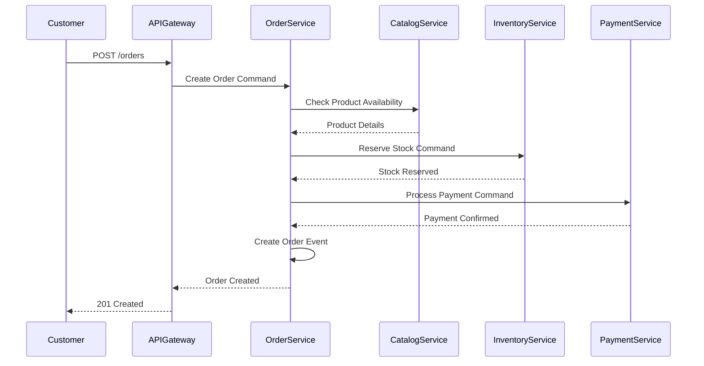
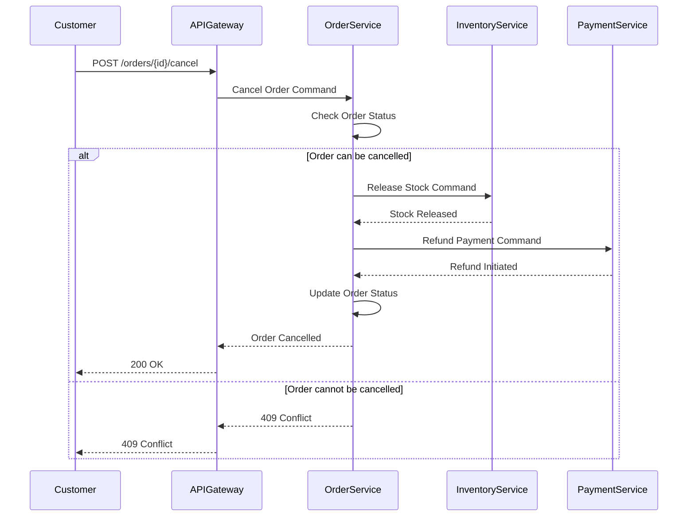
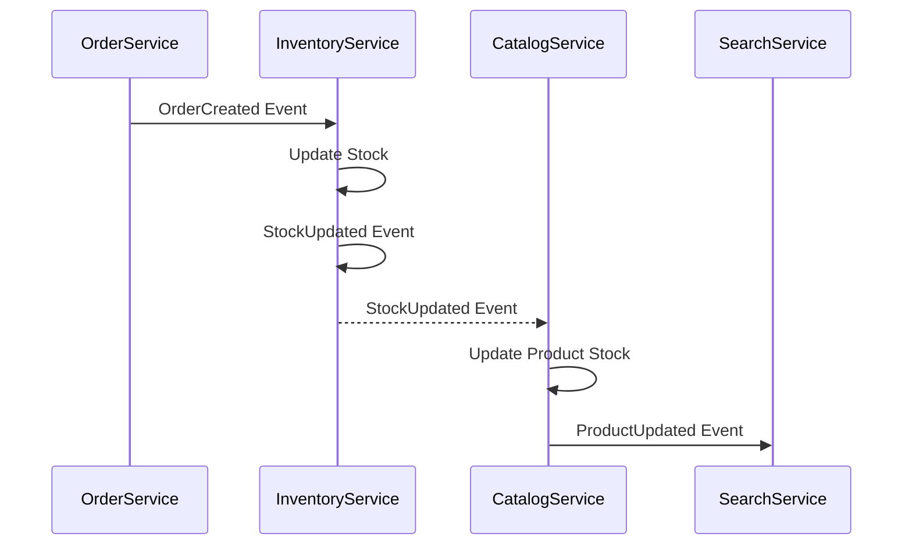

# Eventual Consistency и Saga Pattern для AutoDev Marketplace

**Версия документа:** 1.0  
**Дата создания:** 2026-06-04  
**Последнее обновление:** 2026-06-04

---

## Обзор

Этот документ описывает стратегию обеспечения согласованности данных в распределённой системе AutoDev Marketplace через Eventual Consistency и Saga Pattern.

---

## Eventual Consistency

### Принципы
1. **Event-Driven Architecture:** Все изменения состояния подписываются как события
2. **Asynchronous Processing:** Взаимодействие между сервисами через асинхронную коммуникацию
3. **Idempotency:** Все операции идемпотентны для повторной обработки
4. **Compensation:** Механизмы отката при ошибках

### Модель согласованности

```
+------------------+      +------------------+
|   Order Service  |----->|   Catalog Service |
|  (Event Source)  |      |   (Event Sink)   |
+------------------+      +------------------+
         |                        |
         |                        v
         |              +------------------+
         |              |   Inventory      |
         |              |   Service        |
         |              |   (Event Sink)   |
         |              +------------------+
         |
         v
+------------------+
|   Payment        |
|   Service        |
|   (Event Sink)   |
+------------------+
```

### События MVP

| Событие | Описание | Источник | Получатели |
|---------|----------|----------|-------------|
| `OrderCreated` | Заказ создан | Order Service | Catalog, Payment, Communication |
| `OrderConfirmed` | Заказ подтверждён | Order Service | Catalog, Payment, Communication |
| `OrderPaid` | Оплата прошла | Payment Service | Order, Communication |
| `OrderCancelled` | Заказ отменён | Order Service | Catalog, Payment, Communication |
| `InventoryReserved` | Товар зарезервирован | Catalog Service | Order, Communication |
| `InventoryReleased` | Товар освобождён | Catalog Service | Order, Communication |
| `ProductUpdated` | Товар обновлён | Catalog Service | Search, Communication |
| `StockUpdated` | Остаток обновлён | Catalog Service | Search, Catalog |

---

## Saga Pattern

### Варианты реализации

#### 1. Orchestration (Оркестрация)

**Архитектура:**
```
Order Service (Orchestrator)
    |
    v
Catalog Service
    |
    v
Inventory Service
    |
    v
Payment Service
```

**Преимущества:**
- Централизованная логика
- Легко отследить состояние
- Упрощённое тестирование

**Недостатки:**
- Order Service становится тяжёлым
- Высокая связанность

#### 2. Choreography (Хореография)

**Архитектура:**
```
Order Service ──> OrderCreated ──> Catalog Service
                                 └──> Inventory Service
                                 └──> Payment Service
```

**Преимущества:**
- Слабая связанность
- Гибкость
- Легко добавлять новые подписчики

**Недостатки:**
- Сложная логика
- Трудно отследить состояние

#### 3. Hybrid (Гибридная) - РЕКОМЕНДУЕТСЯ

**Архитектура:**
- Критичные процессы: Orchestration (Order Service как orchestrator)
- Некритичные процессы: Choreography ( Notification Service как orchestrator)

---

## Реализация Saga Pattern в MVP

### Saga 1: Создание заказа (Orchestration)



### Saga 2: Отмена заказа (Compensation)



### Saga 3: Обновление остатков (Choreography)



---

## Idempotency

### Принципы
1. **Idempotency Keys:** Все запросы содержат уникальный ключ
2. **State Tracking:** Сервис отслеживает обработанные ключи
3. **Response Caching:** Повторные запросы возвращают кэшированный ответ

### Реализация

```java
// Пример idempotent endpoint в Order Service
@RestController
@RequestMapping("/api/v1/orders")
public class OrderController {
    
    private final IdempotencyService idempotencyService;
    private final OrderService orderService;
    
    @PostMapping
    @ResponseStatus(HttpStatus.CREATED)
    public OrderResponse createOrder(
        @RequestBody @Valid CreateOrderRequest request,
        @RequestHeader("X-Idempotency-Key") String idempotencyKey
    ) {
        // Проверка на повторный запрос
        Optional<OrderResponse> cachedResponse = 
            idempotencyService.getResponse(idempotencyKey);
        
        if (cachedResponse.isPresent()) {
            return cachedResponse.get();
        }
        
        // Обработка запроса
        OrderResponse response = orderService.createOrder(request);
        
        // Кэширование ответа
        idempotencyService.cacheResponse(idempotencyKey, response, Duration.ofHours(1));
        
        return response;
    }
}
```

### Idempotency Key Storage

```sql
-- Таблица для хранения idempotency ключей
CREATE TABLE idempotency_keys (
    key VARCHAR(255) PRIMARY KEY,
    response_body TEXT NOT NULL,
    created_at TIMESTAMP DEFAULT CURRENT_TIMESTAMP,
    expires_at TIMESTAMP NOT NULL
);

-- Индекс для поиска и очистки
CREATE INDEX idx_idempotency_expires ON idempotency_keys(expires_at);
```

---

## Compensation Actions

### Сценарии отката

#### 1. Ошибка резервирования товара

```java
// При ошибке резервирования
@Component
public class OrderCompensationHandler {
    
    @KafkaListener(topics = "order-compensations")
    public void handleOrderCompensation(OrderCompensation compensation) {
        switch (compensation.getCompensationType()) {
            case INVENTORY_RELEASE -> releaseInventory(compensation);
            case PAYMENT_CANCEL -> cancelPayment(compensation);
            case NOTIFICATION_SEND -> sendNotification(compensation);
            default -> log.warn("Unknown compensation type: {}", compensation);
        }
    }
    
    private void releaseInventory(OrderCompensation compensation) {
        // Вызвать Inventory Service для освобождения резерва
        inventoryClient.releaseStock(compensation.getOrderId());
    }
    
    private void cancelPayment(OrderCompensation compensation) {
        // Вызвать Payment Service для отмены платежа
        paymentClient.cancelPayment(compensation.getPaymentId());
    }
}
```

#### 2. Ошибка оплаты

```java
// При ошибке оплаты
@EventListener
public void handlePaymentFailed(PaymentFailedEvent event) {
    // Отменить заказ
    orderService.cancelOrder(event.getOrderId(), "Payment failed");
    
    // Освободить резерв товара
    inventoryService.releaseStock(event.getOrderId());
    
    // Отправить уведомление
    notificationService.sendOrderCancelled(
        event.getOrderId(), 
        "Ошибка оплаты"
    );
}
```

---

## Retry Mechanism

### Retry Policy

| Сценарий | Retry Count | Backoff | Timeout |
|----------|-------------|---------|---------|
| Network error | 3 | Exponential (1s, 2s, 4s) | 30s |
| Database error | 3 | Exponential (1s, 2s, 4s) | 30s |
| External API error | 2 | Exponential (2s, 4s) | 60s |
| Business rule error | 0 | - | - |

### Retry Configuration

```yaml
# application.yml
retry:
  enabled: true
  max-attempts: 3
  initial-interval: 1000ms
  max-interval: 4000ms
  multiplier: 2.0
  retryable-exceptions:
    - java.net.SocketTimeoutException
    - java.net.ConnectException
    - org.springframework.dao.DataAccessResourceFailureException
  non-retryable-exceptions:
    - java.lang.IllegalArgumentException
    - com.autodev.exceptions.BusinessRuleException
```

---

## Dead Letter Queue (DLQ)

### Архитектура

```
Kafka Topic (Main)
    |
    v
Consumer Group
    |
    v
Success/Failure
    |
    +-- Success --> Next Topic
    |
    +-- Failure --> DLQ Topic
                     |
                     v
                Dead Letter Processor
                     |
                     v
                Alert + Manual Retry
```

### DLQ Configuration

```java
@Configuration
public class KafkaConfig {
    
    @Bean
    public ConcurrentKafkaListenerContainerFactory<String, String> kafkaListenerContainerFactory() {
        ConcurrentKafkaListenerContainerFactory<String, String> factory = 
            new ConcurrentKafkaListenerContainerFactory<>();
        
        // Основной consumer
        factory.setConsumerFactory(consumerFactory());
        
        // Error handling
        ErrorHandlingDeserializer<String> errorDeserializer = 
            new ErrorHandlingDeserializer<>(new StringDeserializer());
        
        // Dead letter topic
        Map<String, Object> props = factory.getContainerProperties().getConsumerProperties();
        props.put(ConsumerConfig.DEFAULT_API_TIMEOUT_MS_CONFIG, 60000);
        
        return factory;
    }
}
```

---

## Monitoring & Alerting

### Метрики

| Метрика | Описание | SLA |
|---------|----------|-----|
| Saga Duration | Время выполнения саги | < 5s (95p) |
| Compensation Rate | Процент компенсаций | < 1% |
| Retry Rate | Процент повторных попыток | < 5% |
| DLQ Messages | Сообщения в DLQ | < 10/ч |

### Alerting Rules

```yaml
# prometheus/rules.yml
groups:
  - name: saga-monitoring
    rules:
      - alert: HighSagaDuration
        expr: histogram_quantile(0.95, saga_duration_seconds_bucket) > 5
        for: 5m
        labels:
          severity: warning
        annotations:
          summary: "High saga duration detected"
          description: "95p saga duration is > 5s"
      
      - alert: HighCompensationRate
        expr: rate(compensations_total[5m]) > 0.1
        for: 10m
        labels:
          severity: critical
        annotations:
          summary: "High compensation rate detected"
          description: "Compensation rate > 10% in last 5m"
      
      - alert: DLQMessages
        expr: rate(dmq_messages_total[5m]) > 10
        for: 10m
        labels:
          severity: critical
        annotations:
          summary: "High DLQ messages rate"
          description: "DLQ messages > 10/minute"
```

---

## Eventual Consistency Checklist

### Для каждого сервиса

- [ ] Все изменения состояния публикуются как события
- [ ] Сервисы подписываются на нужные события
- [ ] Обработка событий идемпотентна
- [ ] Есть механизм компенсации при ошибках
- [ ] Есть DLQ для обработки ошибок
- [ ] Есть мониторинг состояния согласованности
- [ ] Есть alerting на отклонения

### Примеры идемпотентной обработки

```java
@KafkaListener(topics = "order-created")
public void handleOrderCreated(OrderCreatedEvent event) {
    // Идемпотентность через order_id
    if (orderRepository.existsById(event.getOrderId())) {
        log.info("Order {} already processed, skipping", event.getOrderId());
        return;
    }
    
    // Обработка события
    Order order = new Order();
    order.setId(event.getOrderId());
    order.setStatus(OrderStatus.CREATED);
    orderRepository.save(order);
}
```

---

## Заключение

Eventual Consistency и Saga Pattern обеспечивают согласованность данных в распределённой системе AutoDev Marketplace.

**Ключевые принципы:**
- Event-Driven Architecture для асинхронной коммуникации
- Idempotency для повторной обработки сообщений
- Compensation Actions для отката при ошибках
- Retry Mechanism для устойчивости к сбоям
- Dead Letter Queue для обработки некорректных сообщений
- Monitoring и Alerting для контроля состояния согласованности

---

**Ответственные:**
- **Backend Team:** Реализация Saga Pattern
- **DevOps:** Инфраструктура Kafka и мониторинг
- **QA Team:** Тестирование eventual consistency

**Обновления:**
- Еженедельное ревью saga выполняемых
- Ежемесячное обновление стратегии
