# Eventual Consistency и Saga Pattern для AutoDev Marketplace

**Версия документа:** 1.1  
**Дата создания:** 2026-06-04  
**Последнее обновление:** 2026-06-13  

---

## Обзор

Этот документ описывает стратегию обеспечения согласованности данных в распределённой системе AutoDev Marketplace через Eventual Consistency и Saga Pattern.

**Версия 1.1 обновления:**
- Добавлены сценарии конфликта данных между catalog-service и order-service
- Расширен раздел про компенсационные действия при сбоях
- Добавлен механизм reconciliation для выявления рассогласовок
- Детализированы примеры idempotency для критичных MVP операций
- Описаны настройки Kafka для MVP и production

---

## Eventual Consistency

### Принципы
1. **Event-Driven Architecture:** Все изменения состояния подписываются как события
2. **Asynchronous Processing:** Взаимодействие между сервисами через асинхронную коммуникацию
3. **Idempotency:** Все операции идемпотентны для повторной обработки
4. **Compensation:** Механизмы отката при ошибках
5. **Reconciliation:** Периодические проверки согласованности данных

### Модель согласованности

```
+------------------+      +------------------+
|   Order Service  |----->|   Catalog Service |
|  (Event Source)  |      |   (Event Sink)   |
+------------------+      +------------------+
         |                        |
         |                        v
         |              +------------------+
         |              |   Inventory      |
         |              |   Service        |
         |              |   (Event Sink)   |
         |              +------------------+
         |
         v
+------------------+
|   Payment        |
|   Service        |
|   (Event Sink)   |
+------------------+
```

### События MVP

| Событие | Описание | Источник | Получатели |
|---------|----------|----------|-------------|
| `OrderCreated` | Заказ создан | Order Service | Catalog, Payment, Communication |
| `OrderConfirmed` | Заказ подтверждён | Order Service | Catalog, Payment, Communication |
| `OrderPaid` | Оплата прошла | Payment Service | Order, Communication |
| `OrderCancelled` | Заказ отменён | Order Service | Catalog, Payment, Communication |
| `InventoryReserved` | Товар зарезервирован | Catalog Service | Order, Communication |
| `InventoryReleased` | Товар освобождён | Catalog Service | Order, Communication |
| `ProductUpdated` | Товар обновлён | Catalog Service | Search, Communication |
| `StockUpdated` | Остаток обновлён | Catalog Service | Search, Catalog |
| `PriceUpdated` | Цена обновлена | Catalog Service | Search, Order (cache invalidation) |
| `ProductDeleted` | Товар удалён | Catalog Service | Search, Order (soft delete check) |

### Сценарий 1: Обновление цены товара (Catalog → Order)

**Проблема:** Цена товара обновляется в catalog-service, но заказ уже может существовать с устаревшей ценой.

**Стратегия:**
```
1. Catalog Service публикует событие `PriceUpdated`
2. Order Service получает событие и обновляет кэш цен
3. При создании нового заказа используется актуальная цена
4. Существующие заказы с устаревшей ценой остаются без изменений (итоговая цена фиксируется на момент заказа)
```

**Конфликты:**
- **Сценарий:** Пользователь добавляет товар в корзину по цене X, затем цена меняется на Y, пользователь оформляет заказ.
- **Решение:** Фиксация цены на момент добавления в корзину (создание order_items)

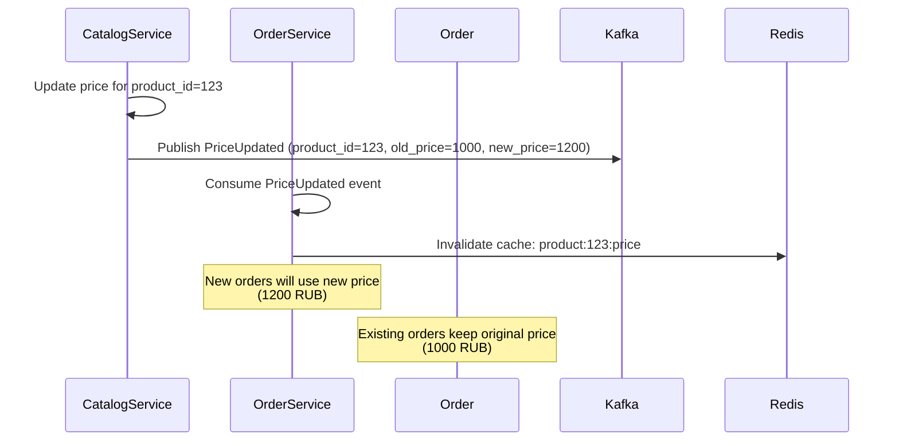

### Сценарий 2: Удаление товара (Catalog → Order)

**Проблема:** Товар удаляется из каталога, но может быть в корзине или заказе.

**Стратегия:**
```
1. Catalog Service публикует событие `ProductDeleted`
2. Order Service получает событие и помечает товар как "удалённый" (soft delete)
3. Администратор может решить, что делать с существующими заказами
```

**Варианты обработки:**
- **Вариант A (рекомендуется для MVP):** Заказы с удалённым товаром остаются, товар отображается как "недоступный"
- **Вариант B:** Автоматическая отмена заказов с удалённым товаром (требует дополнительной логики компенсации)

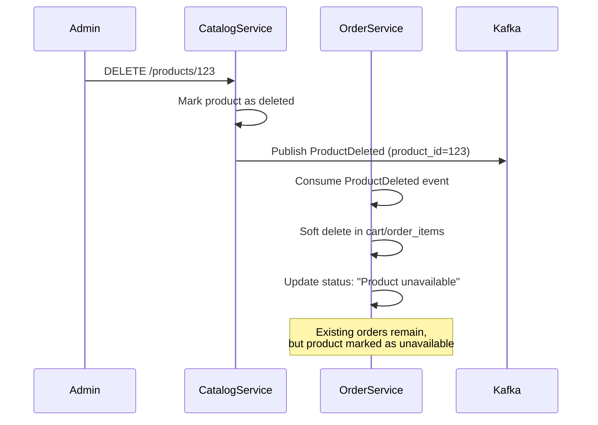

### Сценарий 3: Резервирование товара (Catalog → Order)

**Проблема:** Заказчик резервирует товар, но продавец продает его другому покупателю до оформления заказа.

**Стратегия:**
```
1. Order Service резервирует товар на 15 минут
2. Catalog Service обновляет наличие (stock_reservations table)
3. Если заказ не оформлен за 15 минут, резерв освобождается
4. Если заказ оформлен, резерв конвертируется в продажу
```

**Конфликты:**
- **Сценарий:** Два покупателя одновременно резервируют последний товар
- **Решение:** Optimistic locking через версию товара (version field)

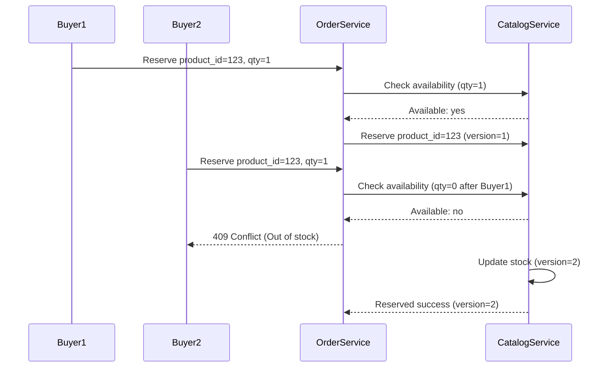

### Сценарий 4: Синхронизация Elasticsearch (Catalog → Search)

**Проблема:** Elasticsearch может отставать от PostgreSQL.

**Стратегия:**
```
1. Catalog Service публикует события product.created/updated/deleted
2. Search Service синхронизирует индекс через Kafka
3. Периодический reconciliation job выявляет рассогласовки
```

**Метрики для мониторинга:**
- `elasticsearch_sync_lag_seconds` — задержка синхронизации
- `elasticsearch_reconciliation_discrepancies` — количество рассогласовок

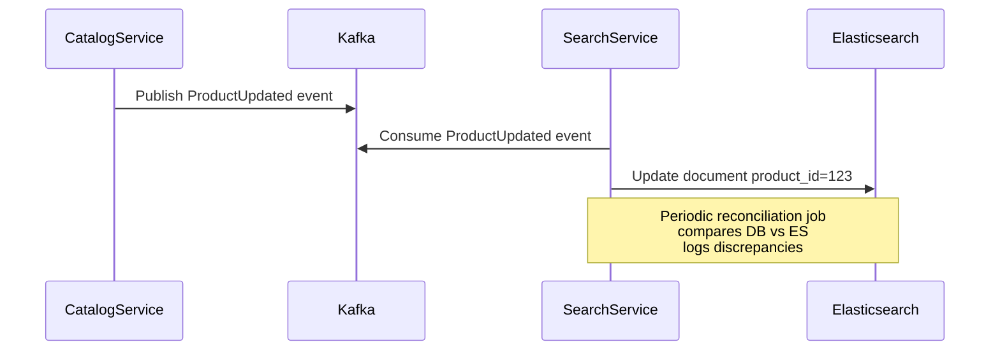

### Сценарий 5: Эскроу-счёт (Order → Payment)

**Проблема:** Средства блокируются на эскроу-счёте, но заказ может быть отменён.

**Стратегия:**
```
1. Order Service создаёт заказ и блокирует средств на эскроу
2. Payment Service подтверждает блокировку
3. При отмене заказа Payment Service возвращает средства
4. При завершении заказа Payment Service переводит средства продавцу
```

**Конфликты:**
- **Сценарий:** Пользователь отменяет заказ, но оплата уже подтверждена
- **Решение:** Возврат средств через refund operation (idempotent)

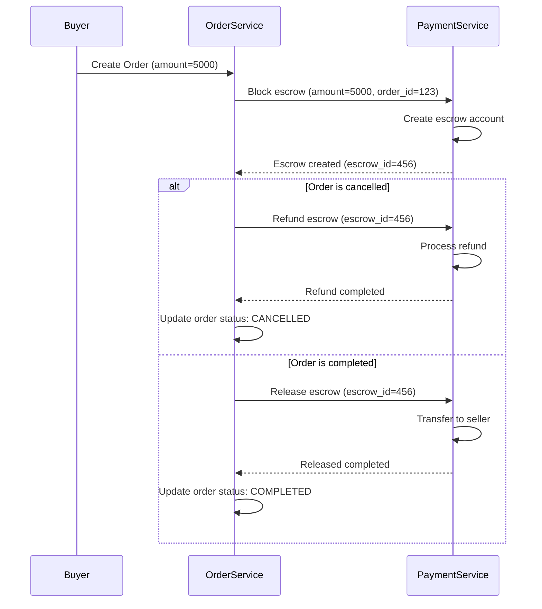

---

## Saga Pattern

### Варианты реализации

#### 1. Orchestration (Оркестрация)

**Архитектура:**
```
Order Service (Orchestrator)
    |
    v
Catalog Service
    |
    v
Inventory Service
    |
    v
Payment Service
```

**Преимущества:**
- Централизованная логика
- Легко отследить состояние
- Упрощённое тестирование

**Недостатки:**
- Order Service становится тяжёлым
- Высокая связанность

#### 2. Choreography (Хореография)

**Архитектура:**
```
Order Service ──> OrderCreated ──> Catalog Service
                                 └──> Inventory Service
                                 └──> Payment Service
```

**Преимущества:**
- Слабая связанность
- Гибкость
- Легко добавлять новые подписчики

**Недостатки:**
- Сложная логика
- Трудно отследить состояние

#### 3. Hybrid (Гибридная) - РЕКОМЕНДУЕТСЯ

**Архитектура:**
- Критичные процессы: Orchestration (Order Service как orchestrator)
- Некритичные процессы: Choreography ( Notification Service как orchestrator)

---

## Реализация Saga Pattern в MVP

### Saga 1: Создание заказа (Orchestration)

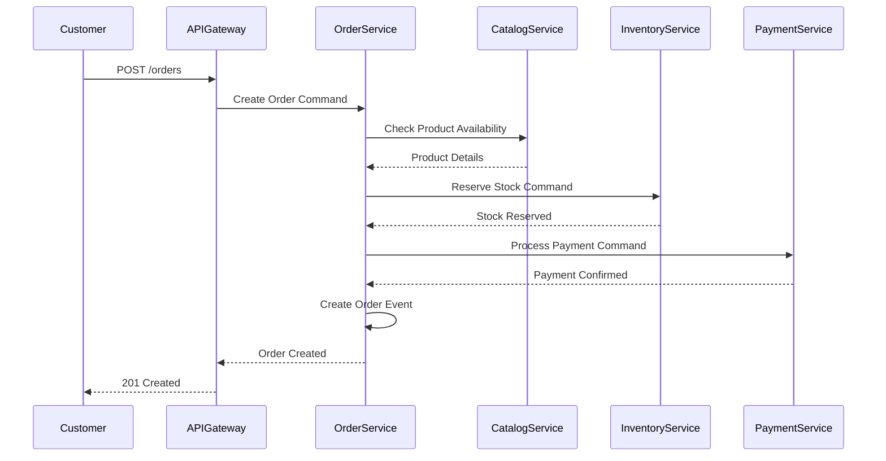

### Saga 2: Отмена заказа (Compensation)

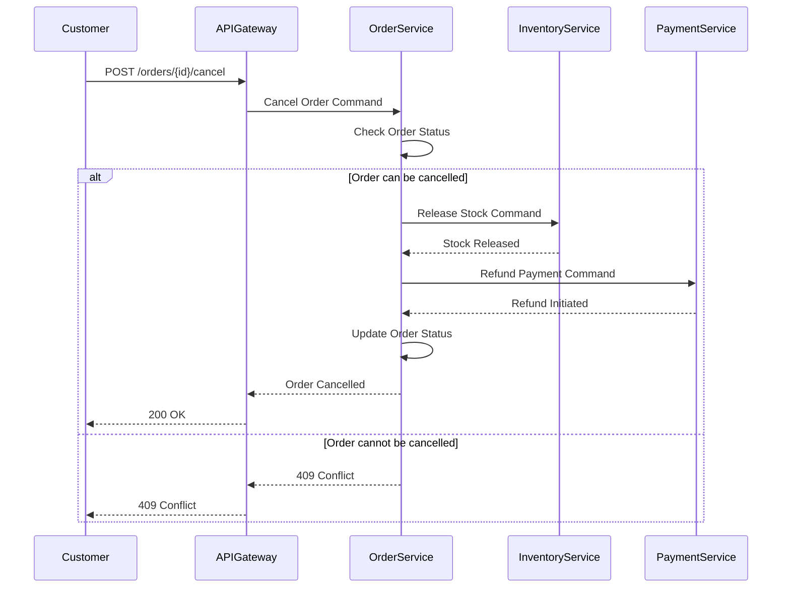

### Saga 3: Обновление остатков (Choreography)

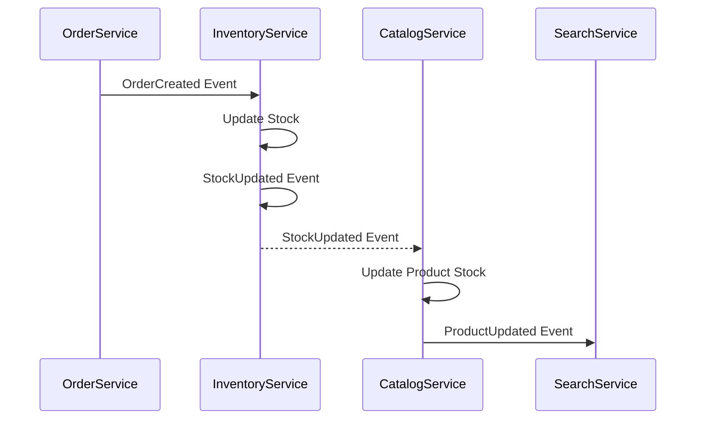

---

## Idempotency

### Принципы
1. **Idempotency Keys:** Все запросы содержат уникальный ключ
2. **State Tracking:** Сервис отслеживает обработанные ключи
3. **Response Caching:** Повторные запросы возвращают кэшированный ответ
4. **Idempotent Operations:** Все операции не меняют состояние при повторном вызове

### Реализация

```java
// Пример idempotent endpoint в Order Service
@RestController
@RequestMapping("/api/v1/orders")
public class OrderController {
    
    private final IdempotencyService idempotencyService;
    private final OrderService orderService;
    
    @PostMapping
    @ResponseStatus(HttpStatus.CREATED)
    public OrderResponse createOrder(
        @RequestBody @Valid CreateOrderRequest request,
        @RequestHeader("X-Idempotency-Key") String idempotencyKey
    ) {
        // Проверка на повторный запрос
        Optional<OrderResponse> cachedResponse = 
            idempotencyService.getResponse(idempotencyKey);
        
        if (cachedResponse.isPresent()) {
            return cachedResponse.get();
        }
        
        // Обработка запроса
        OrderResponse response = orderService.createOrder(request);
        
        // Кэширование ответа
        idempotencyService.cacheResponse(idempotencyKey, response, Duration.ofHours(1));
        
        return response;
    }
}
```

### Idempotency Key Storage

```sql
-- Таблица для хранения idempotency ключей
CREATE TABLE idempotency_keys (
    key VARCHAR(255) PRIMARY KEY,
    response_body TEXT NOT NULL,
    created_at TIMESTAMP DEFAULT CURRENT_TIMESTAMP,
    expires_at TIMESTAMP NOT NULL
);

-- Индекс для поиска и очистки
CREATE INDEX idx_idempotency_expires ON idempotency_keys(expires_at);
```

---

## Idempotency для MVP критичных операций

### 1. Payment Service: Создание платежа

**Проблема:** Повторный запрос к оплате может создать двойную оплату.

**Решение:** Idempotency key на основе order_id + payment_type.

```java
@RestController
@RequestMapping("/api/v1/payments")
public class PaymentController {
    
    @PostMapping("/process")
    public PaymentResponse processPayment(
        @RequestBody @Valid ProcessPaymentRequest request,
        @RequestHeader("X-Idempotency-Key") String idempotencyKey
    ) {
        // Проверка существующего платежа
        Optional<PaymentResponse> existingPayment = 
            paymentService.findPaymentByOrderIdAndType(
                request.getOrderId(),
                request.getPaymentType()
            );
        
        if (existingPayment.isPresent()) {
            return existingPayment.get();
        }
        
        // Создание платежа
        PaymentResponse response = paymentService.process(request);
        
        // Кэширование ответа на 24 часа
        paymentService.cachePaymentResponse(
            idempotencyKey, 
            response, 
            Duration.ofDays(1)
        );
        
        return response;
    }
}
```

**Idempotency Key:** `{order_id}:{payment_type}`

**Пример:** `order_123:ESCROW`

### 2. Order Service: Отмена заказа

**Проблема:** Повторная отмена заказа может вызвать ошибку.

**Решение:** Проверка текущего статуса заказа перед отменой.

```java
@Service
public class OrderService {
    
    @Transactional
    public void cancelOrder(Long orderId, String cancellationReason) {
        Order order = orderRepository.findById(orderId)
            .orElseThrow(() -> new OrderNotFoundException(orderId));
        
        // Проверка текущего статуса
        if (order.getStatus() == OrderStatus.CANCELLED) {
            log.info("Order {} already cancelled", orderId);
            return; // Idempotent - ничего не делаем
        }
        
        if (order.getStatus() == OrderStatus.COMPLETED) {
            throw new OrderCancellationException(
                "Cannot cancel completed order", orderId
            );
        }
        
        // Выполнение отмены
        order.setStatus(OrderStatus.CANCELLED);
        order.setCancellationReason(cancellationReason);
        orderRepository.save(order);
        
        // Публикация событий
        kafkaTemplate.send("order.order.cancelled", 
            "order:" + orderId, 
            objectMapper.writeValueAsString(order));
    }
}
```

**Idempotency Key:** `{order_id}:cancel`

### 3. Order Service: Создание заказа (с эскроу)

**Проблема:** Повторное создание заказа может создать несколько заказов.

**Решение:** Использование idempotency key с проверкой существующего заказа.

```java
@RestController
@RequestMapping("/api/v1/orders")
public class OrderController {
    
    @PostMapping
    @ResponseStatus(HttpStatus.CREATED)
    public OrderResponse createOrder(
        @RequestBody @Valid CreateOrderRequest request,
        @RequestHeader("X-Idempotency-Key") String idempotencyKey
    ) {
        // Проверка существующего заказа с этим idempotency key
        Optional<Order> existingOrder = 
            orderRepository.findByIdempotencyKey(idempotencyKey);
        
        if (existingOrder.isPresent()) {
            log.info("Order already exists with idempotency key: {}", idempotencyKey);
            return mapToResponse(existingOrder.get());
        }
        
        // Создание заказа
        Order order = orderService.createOrder(request, idempotencyKey);
        
        return mapToResponse(order);
    }
}

@Service
public class OrderService {
    
    @Transactional
    public Order createOrder(CreateOrderRequest request, String idempotencyKey) {
        // Проверка дубликата по order_id и cart_id
        Optional<Order> duplicate = orderRepository.findByCartIdAndUserId(
            request.getCartId(),
            request.getUserId()
        );
        
        if (duplicate.isPresent() && duplicate.get().getStatus() != OrderStatus.CANCELLED) {
            throw new OrderDuplicateException(
                "Order already exists for this cart", duplicate.get().getId()
            );
        }
        
        Order order = new Order();
        order.setCartId(request.getCartId());
        order.setUserId(request.getUserId());
        order.setStatus(OrderStatus.CREATED);
        order.setIdempotencyKey(idempotencyKey);
        
        return orderRepository.save(order);
    }
}
```

**Idempotency Key:** `uuid-v4` (предоставляется клиентом)

### 4. Payment Service: Возврат средств (Refund)

**Проблема:** Повторный запрос на возврат может вызвать ошибку.

**Решение:** Проверка текущего статуса возврата.

```java
@Service
public class RefundService {
    
    @Transactional
    public RefundResponse refundPayment(Long paymentId, BigDecimal amount) {
        Payment payment = paymentRepository.findById(paymentId)
            .orElseThrow(() -> new PaymentNotFoundException(paymentId));
        
        // Проверка текущего статуса возврата
        if (payment.getRefundStatus() == RefundStatus.COMPLETED) {
            log.info("Refund already completed for payment: {}", paymentId);
            return mapToResponse(payment);
        }
        
        if (payment.getRefundStatus() == RefundStatus.PENDING) {
            log.info("Refund already pending for payment: {}", paymentId);
            return mapToResponse(payment);
        }
        
        // Выполнение возврата
        payment.setRefundAmount(amount);
        payment.setRefundStatus(RefundStatus.PENDING);
        paymentRepository.save(payment);
        
        // Отправка в Payment Gateway
        RefundResponse response = paymentGateway.refund(payment);
        
        if (response.isSuccessful()) {
            payment.setRefundStatus(RefundStatus.COMPLETED);
            paymentRepository.save(payment);
        }
        
        return response;
    }
}
```

**Idempotency Key:** `{payment_id}:refund`

### Сравнение подходов к idempotency

| Сценарий | Idempotency Key | Механизм |
|----------|-----------------|----------|
| Создание платежа | order_id + payment_type | Проверка существующего платежа |
| Отмена заказа | order_id + :cancel | Проверка статуса заказа |
| Создание заказа | uuid-v4 | Проверка idempotency_key в БД |
| Возврат средств | payment_id + :refund | Проверка статуса возврата |

### Глобальный idempotency фильтр (Optional)

Для упрощения можно реализовать глобальный фильтр для всех POST/PATCH/PUT запросов.

```java
@Component
public class IdempotencyFilter extends OncePerRequestFilter {
    
    @Override
    protected void doFilterInternal(
        HttpServletRequest request,
        HttpServletResponse response,
        FilterChain filterChain
    ) throws ServletException, IOException {
        String idempotencyKey = request.getHeader("X-Idempotency-Key");
        
        if (idempotencyKey != null) {
            String cacheKey = "idempotency:" + idempotencyKey;
            
            Boolean isProcessed = redisTemplate.opsForValue()
                .get(cacheKey);
            
            if (Boolean.TRUE.equals(isProcessed)) {
                // Return cached response
                String cachedResponse = (String) redisTemplate.opsForValue()
                    .get(cacheKey + ":response");
                
                response.setStatus(HttpStatus.OK.value());
                response.getWriter().write(cachedResponse);
                return;
            }
        }
        
        filterChain.doFilter(request, response);
    }
}
```

---

## Compensation Actions

### Сценарии отката

#### 1. Ошибка резервирования товара

```java
// При ошибке резервирования
@Component
public class OrderCompensationHandler {
    
    @KafkaListener(topics = "order-compensations")
    public void handleOrderCompensation(OrderCompensation compensation) {
        switch (compensation.getCompensationType()) {
            case INVENTORY_RELEASE -> releaseInventory(compensation);
            case PAYMENT_CANCEL -> cancelPayment(compensation);
            case NOTIFICATION_SEND -> sendNotification(compensation);
            default -> log.warn("Unknown compensation type: {}", compensation);
        }
    }
    
    private void releaseInventory(OrderCompensation compensation) {
        // Вызвать Inventory Service для освобождения резерва
        inventoryClient.releaseStock(compensation.getOrderId());
    }
    
    private void cancelPayment(OrderCompensation compensation) {
        // Вызвать Payment Service для отмены платежа
        paymentClient.cancelPayment(compensation.getPaymentId());
    }
}
```

#### 2. Ошибка компенсации (Re-Compensation Pattern)

**Проблема:** Компенсация может не выполниться из-за сбоя сервиса.

**Решение:** Реализовать механизм повторной компенсации (Re-Compensation).

**Архитектура:**
```
1. Основная компенсация выполняется с retry (3 попытки)
2. Если retry исчерпан → событие попадает в DLQ
3. Re-compensation processor читает из DLQ каждые 5 минут
4. После 5 повторных попыток → уведомление оператору
```

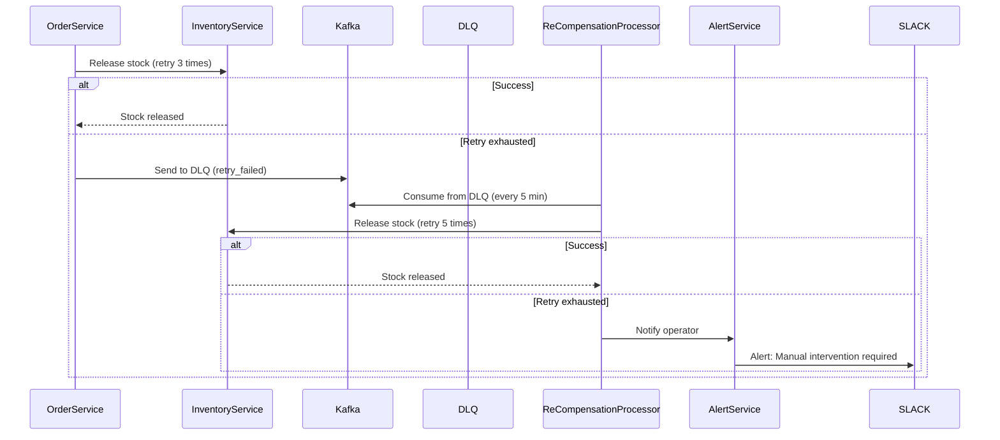

```java
@Service
public class ReCompensationService {
    
    @KafkaListener(topics = "order-compensations-dlq")
    public void handleReCompensation(OrderCompensation compensation) {
        try {
            // Retry 5 times with exponential backoff
            retryTemplate.execute(context -> {
                log.info("Re-compensation attempt {} for type: {}",
                    context.getRetryCount(), compensation.getCompensationType());
                
                switch (compensation.getCompensationType()) {
                    case INVENTORY_RELEASE:
                        inventoryClient.releaseStock(compensation.getOrderId());
                        break;
                    case PAYMENT_CANCEL:
                        paymentClient.cancelPayment(compensation.getPaymentId());
                        break;
                }
                
                return null;
            });
            
            log.info("Re-compensation succeeded for order: {}",
                compensation.getOrderId());
        } catch (Exception e) {
            log.error("Re-compensation failed after 5 attempts for order: {}",
                compensation.getOrderId(), e);
            
            // Notify operator
            alertService.sendManualInterventionAlert(
                "Re-compensation failed for order: " + compensation.getOrderId(),
                e
            );
        }
    }
}
```

#### 3. Ошибка оплаты

```java
// При ошибке оплаты
@EventListener
public void handlePaymentFailed(PaymentFailedEvent event) {
    // Отменить заказ
    orderService.cancelOrder(event.getOrderId(), "Payment failed");
    
    // Освободить резерв товара
    inventoryService.releaseStock(event.getOrderId());
    
    // Отправить уведомление
    notificationService.sendOrderCancelled(
        event.getOrderId(), 
        "Ошибка оплаты"
    );
}
```

#### 4. Ошибка reconciliation (Сложный сценарий)

**Проблема:** Reconciliation job обнаруживает рассогласовку, но автоматическое исправление невозможно.

**Решение:** Создать reconciliation task для ручного исправления.

```sql
-- Таблица reconciliation tasks
CREATE TABLE reconciliation_tasks (
    id                  BIGSERIAL      PRIMARY KEY,
    task_type           VARCHAR(50)    NOT NULL,
    entity_type         VARCHAR(50)    NOT NULL,
    entity_id           VARCHAR(255)   NOT NULL,
    discrepancy         TEXT           NOT NULL,
    status              VARCHAR(20)    NOT NULL DEFAULT 'PENDING',
    created_at          TIMESTAMP      NOT NULL   DEFAULT CURRENT_TIMESTAMP,
    resolved_at         TIMESTAMP      NULL,
    resolved_by         VARCHAR(255)   NULL
);
```

```java
@Service
public class ReconciliationTaskService {
    
    @Scheduled(fixedRate = 900000) // каждые 15 минут
    public void createReconciliationTasks() {
        List<Discrepancy> discrepancies = 
            reconciliationService.findDiscrepancies();
        
        for (Discrepancy discrepancy : discrepancies) {
            // Проверить, не создана ли уже задача
            if (taskRepository.findByEntityId(discrepancy.getEntityId()) == null) {
                ReconciliationTask task = new ReconciliationTask(
                    discrepancy.getType(),
                    discrepancy.getEntityType(),
                    discrepancy.getEntityId(),
                    discrepancy.getMessage()
                );
                taskRepository.save(task);
                
                // Уведомить администратора
                notificationService.sendReconciliationTask(task);
            }
        }
    }
}
```

### Сценарий: Полный откат заказа (Сложный Saga)

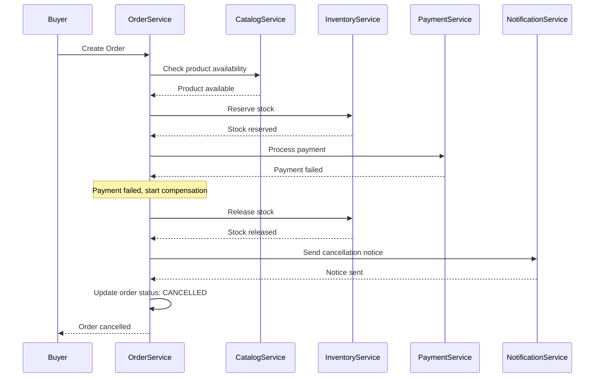

### Компенсационные метрики

| Метрика | Описание | SLA |
|---------|----------|-----|
| `compensations_attempted_total` | Количество попыток компенсации | - |
| `compensations_success_total` | Успешные компенсации | > 95% |
| `compensations_failed_total` | Неудачные компенсации | < 5% |
| `re_compensations_total` | Повторные компенсации | < 1% |
| `manual_intervention_alerts` | Алерты ручного вмешательства | < 1/неделя |

---

## Reconciliation Mechanism

### Принципы

Reconciliation — это механизм периодической проверки согласованности данных между сервисами.

**Когда использовать:**
- Когда event-driven синхронизация может потерять события
- Для выявления рассогласовок данных между основной БД и индексами (PostgreSQL vs Elasticsearch)
- Для проверки согласованности между микросервисами

**Ключевые принципы:**
1. **Periodic execution:** Reconciliation запускается периодически (например, каждые 15 минут)
2. **Idempotent operations:** Все операции reconciliation идемпотентны
3. **Logging discrepancies:** Все рассогласовки логируются для анализа
4. **Alerting:** Критичные рассогласовки вызывают алерты

### Архитектура Reconciliation

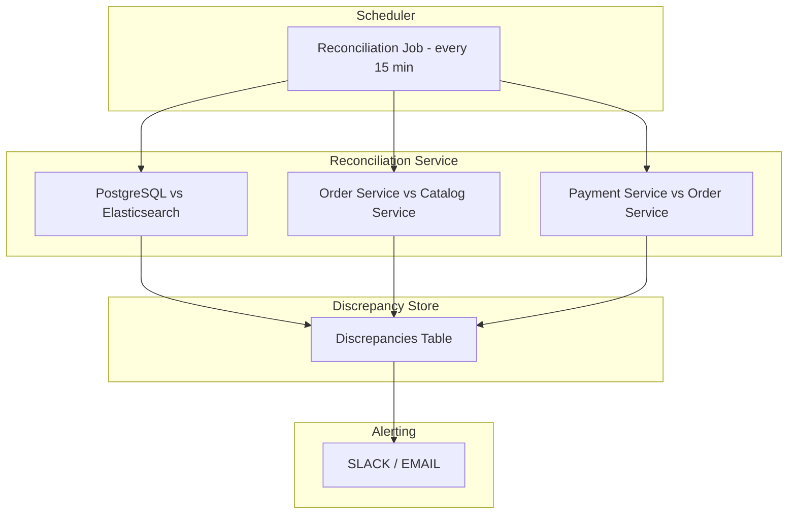

### Примеры Reconciliation

#### 1. Reconciliation: Catalog → Elasticsearch

**Задача:** Найти товары, которые есть в PostgreSQL, но отсутствуют в Elasticsearch.

**Алгоритм:**
```
1. Выбрать все продукты из PostgreSQL (last_updated > N минут назад)
2. Проверить наличие в Elasticsearch
3. Если отсутствует → добавить в Elasticsearch
4. Логировать рассогласовки
```

**SQL пример:**
```sql
-- Reconciliation query
SELECT p.id, p.sku, p.name, p.updated_at
FROM catalog.products p
WHERE p.updated_at < NOW() - INTERVAL '15 minutes'
  AND NOT EXISTS (
    SELECT 1 FROM elasticsearch_index e
    WHERE e.product_id = p.id
  );
```

**Java пример:**
```java
@Service
public class CatalogReconciliationService {
    
    @Scheduled(fixedRate = 900000) // 15 minutes
    public void checkProductConsistency() {
        List<Product> products = productRepository.findMissingFromElasticsearch();
        
        for (Product product : products) {
            try {
                elasticsearchService.indexProduct(product);
                log.info("Reindexed product: {}", product.getId());
            } catch (Exception e) {
                discrepancyRepository.save(new Discrepancy(
                    "product_missing_in_es",
                    product.getId().toString(),
                    e.getMessage()
                ));
                alertService.sendAlert("Product missing in Elasticsearch: " + product.getId());
            }
        }
    }
}
```

#### 2. Reconciliation: Order → Catalog (Inventory)

**Задача:** Найти заказы с зарезервированным товаром, но резерв истёк.

**Алгоритм:**
```
1. Найти все заказы с зарезервированным товаром (reserverd_at + 15min < NOW())
2. Проверить статус заказа
3. Если заказ не оформлен → освободить резерв
4. Логировать действия
```

**SQL пример:**
```sql
-- Reconciliation query
SELECT oi.id, oi.order_id, oi.product_id, oi.quantity, oi.reserved_at
FROM order_service.order_items oi
WHERE oi.status = 'RESERVED'
  AND oi.reserved_at + INTERVAL '15 minutes' < NOW()
  AND NOT EXISTS (
    SELECT 1 FROM order_service.orders o
    WHERE o.id = oi.order_id
      AND o.status IN ('CREATED', 'CONFIRMED')
  );
```

#### 3. Reconciliation: Payment → Order (Escrow)

**Задача:** Найти эскроу-счёта, которые не были использованы в течение 24 часов.

**Алгоритм:**
```
1. Найти все эскроу-счёта (created_at + 24h < NOW())
2. Проверить статус заказа
3. Если заказ отменён → вернуть средства
4. Если заказ завершён → перевести средства продавцу
5. Логировать действия
```

### Метрики Reconciliation

| Метрика | Описание | SLA |
|---------|----------|-----|
| `reconciliation_duration_seconds` | Время выполнения reconciliation | < 5 min |
| `reconciliation_discrepancies_total` | Количество рассогласовок | < 100/день |
| `reconciliation_success_rate` | Процент успешных reconciliation | > 99% |

### Конфигурация

```yaml
# application.yml
reconciliation:
  enabled: true
  jobs:
    catalog-es:
      enabled: true
      cron: "0 */15 * * * ?" # каждые 15 минут
    order-catalog:
      enabled: true
      cron: "0 */15 * * * ?"
    payment-order:
      enabled: true
      cron: "0 0 * * * ?" # каждый час
```

---

## Retry Mechanism

### Retry Policy

| Сценарий | Retry Count | Backoff | Timeout |
|----------|-------------|---------|---------|
| Network error | 3 | Exponential (1s, 2s, 4s) | 30s |
| Database error | 3 | Exponential (1s, 2s, 4s) | 30s |
| External API error | 2 | Exponential (2s, 4s) | 60s |
| Business rule error | 0 | - | - |

### Retry Configuration

```yaml
# application.yml
retry:
  enabled: true
  max-attempts: 3
  initial-interval: 1000ms
  max-interval: 4000ms
  multiplier: 2.0
  retryable-exceptions:
    - java.net.SocketTimeoutException
    - java.net.ConnectException
    - org.springframework.dao.DataAccessResourceFailureException
  non-retryable-exceptions:
    - java.lang.IllegalArgumentException
    - com.autodev.exceptions.BusinessRuleException
```

---

## Dead Letter Queue (DLQ)

### Архитектура

```
Kafka Topic (Main)
    |
    v
Consumer Group
    |
    v
Success/Failure
    |
    +-- Success --> Next Topic
    |
    +-- Failure --> DLQ Topic
                     |
                     v
                Dead Letter Processor
                     |
                     v
                Alert + Manual Retry
```

### DLQ Configuration

```java
@Configuration
public class KafkaConfig {
    
    @Bean
    public ConcurrentKafkaListenerContainerFactory<String, String> kafkaListenerContainerFactory() {
        ConcurrentKafkaListenerContainerFactory<String, String> factory = 
            new ConcurrentKafkaListenerContainerFactory<>();
        
        // Основной consumer
        factory.setConsumerFactory(consumerFactory());
        
        // Error handling
        ErrorHandlingDeserializer<String> errorDeserializer = 
            new ErrorHandlingDeserializer<>(new StringDeserializer());
        
        // Dead letter topic
        Map<String, Object> props = factory.getContainerProperties().getConsumerProperties();
        props.put(ConsumerConfig.DEFAULT_API_TIMEOUT_MS_CONFIG, 60000);
        
        return factory;
    }
}
```

---

## Monitoring & Alerting

### Метрики

| Метрика | Описание | SLA |
|---------|----------|-----|
| **Saga Metrics** ||
| `saga_duration_seconds` | Время выполнения саги | < 5s (95p) |
| `saga_success_total` | Успешные саги | > 95% |
| `saga_failure_total` | Неудачные саги | < 5% |
| **Compensation Metrics** ||
| `compensations_attempted_total` | Количество попыток компенсации | - |
| `compensations_success_total` | Успешные компенсации | > 95% |
| `compensations_failed_total` | Неудачные компенсации | < 5% |
| `re_compensations_total` | Повторные компенсации | < 1% |
| `manual_intervention_alerts` | Алерты ручного вмешательства | < 1/неделя |
| **Retry Metrics** ||
| `retry_attempts_total` | Количество повторных попыток | < 5% |
| `retry_success_total` | Успешные попытки | > 95% |
| `retry_failure_total` | Неудачные попытки | < 1% |
| **DLQ Metrics** ||
| `dlq_messages_total` | Сообщения в DLQ | < 10/ч |
| `dlq_processed_total` | Обработанные сообщения | > 99% |
| **Reconciliation Metrics** ||
| `reconciliation_duration_seconds` | Время выполнения reconciliation | < 5 min |
| `reconciliation_discrepancies_total` | Количество рассогласовок | < 100/день |
| `reconciliation_success_rate` | Процент успешных reconciliation | > 99% |
| `reconciliation_tasks_pending` | Ожидающие задачи reconciliation | < 10 |
| **Kafka Metrics** ||
| `kafka_consumer_lag` | Лаг консьюмера | < 1000 |
| `kafka_producer_success_rate` | Успешные отправки | > 99% |
| `kafka_rebalance_rate` | Частота rebalancing | < 1/день |

### Alerting Rules

```yaml
# prometheus/rules.yml
groups:
  - name: saga-monitoring
    rules:
      - alert: HighSagaDuration
        expr: histogram_quantile(0.95, saga_duration_seconds_bucket) > 5
        for: 5m
        labels:
          severity: warning
        annotations:
          summary: "High saga duration detected"
          description: "95p saga duration is > 5s"
      
      - alert: HighCompensationRate
        expr: rate(compensations_total[5m]) > 0.1
        for: 10m
        labels:
          severity: critical
        annotations:
          summary: "High compensation rate detected"
          description: "Compensation rate > 10% in last 5m"
      
      - alert: DLQMessages
        expr: rate(dmq_messages_total[5m]) > 10
        for: 10m
        labels:
          severity: critical
        annotations:
          summary: "High DLQ messages rate"
          description: "DLQ messages > 10/minute"
```

---

## Kafka Configuration for MVP and Production

### Конфигурация для MVP (development/staging)

**Цель:** Минимальная конфигурация для разработки и тестирования

**Настройки:**
```yaml
# application.yml (MVP)
spring:
  kafka:
    bootstrap-servers: localhost:9092
    producer:
      key-serializer: org.apache.kafka.common.serialization.StringSerializer
      value-serializer: org.springframework.kafka.support.serializer.JsonSerializer
      properties:
        acks: 1  # Минимум 1 подтверждение (для MVP)
        retries: 3
        retry.backoff.ms: 1000
    consumer:
      group-id: ${spring.application.name}-group
      auto-offset-reset: earliest
      key-deserializer: org.apache.kafka.common.serialization.StringDeserializer
      value-deserializer: org.springframework.kafka.support.serializer.JsonDeserializer
      properties:
        spring.json.trusted.packages: "*"
        isolation.level: read_committed
    listener:
      ack-mode: record  # Автоматическое подтверждение после обработки
```

**Параметры Kafka для MVP:**
- **replication.factor=1** (один брокер)
- **min.insync.replicas=1** (достаточно одного подтверждения)
- **unclean.leader.election.enable=false** (предотвращение потери данных)

**Команды запуска (Docker Compose):**
```yaml
# docker-compose.yaml (MVP)
kafka:
  image: apache/kafka:3.6.0
  ports:
    - "9092:9092"
  environment:
    KAFKA_PROCESS_ROLES: broker
    KAFKA_NODE_ID: 1
    KAFKA_CONTROLLER_LISTENER_NAMES: PLAINTEXT
    KAFKA_LISTENERS: PLAINTEXT://:9092
    KAFKA_ADVERTISED_LISTENERS: PLAINTEXT://localhost:9092
    KAFKA_CONTROLLER_QUORUM_VOTERS: 1@localhost:9093
    KAFKA_LISTENER_SECURITY_PROTOCOL_MAP: PLAINTEXT:PLAINTEXT
    KAFKA_INTER_BROKER_LISTENER_NAME: PLAINTEXT
    KAFKA_OFFSETS_TOPIC_REPLICATION_FACTOR: 1
    KAFKA_TRANSACTION_STATE_LOG_REPLICATION_FACTOR: 1
    KAFKA_TRANSACTION_STATE_LOG_MIN_ISR: 1
    KAFKA_GROUP_INITIAL_REBALANCE_DELAY_MS: 0
    KAFKA_MIN_INSYNC_REPLICAS: 1
    KAFKA_NUM_PARTITIONS: 3
```

### Конфигурация для Production

**Цель:** Высокая доступность и отказоустойчивость

**Настройки:**
```yaml
# application.yml (Production)
spring:
  kafka:
    bootstrap-servers: kafka-1:9092,kafka-2:9092,kafka-3:9092
    producer:
      key-serializer: org.apache.kafka.common.serialization.StringSerializer
      value-serializer: org.springframework.kafka.support.serializer.JsonSerializer
      properties:
        acks: all  # Все реплики должны подтвердить
        retries: 5
        retry.backoff.ms: 2000
        enable.idempotence: true  # Идемпотентность producer
    consumer:
      group-id: ${spring.application.name}-group
      auto-offset-reset: latest  # Для production лучше latest
      key-deserializer: org.apache.kafka.common.serialization.StringDeserializer
      value-deserializer: org.springframework.kafka.support.serializer.JsonDeserializer
      properties:
        spring.json.trusted.packages: "*"
        isolation.level: read_committed
        enable.auto.commit: false  # Ручное подтверждение
    listener:
      ack-mode: manual  # Ручное подтверждение после успешной обработки
```

**Параметры Kafka для Production:**
- **replication.factor=3** (данные на 3 брокерах)
- **min.insync.replicas=2** (минимум 2 подтверждения)
- **unclean.leader.election.enable=false** (предотвращение потери данных)
- **enable.idempotence=true** (идемпотентность producer)

**Команды запуска (Kubernetes):**
```yaml
# kafka-strimzi.yaml (Production)
apiVersion: kafka.strimzi.io/v1beta2
kind: Kafka
metadata:
  name: autodev-kafka
spec:
  kafka:
    version: 3.6.0
    replicas: 3  # 3 брокера
    listeners:
      - name: plain
        port: 9092
        type: internal
        tls: false
      - name: tls
        port: 9093
        type: internal
        tls: true
    config:
      offsets.topic.replication.factor: 3
      transaction.state.log.replication.factor: 3
      transaction.state.log.min.isr: 2
      min.insync.replicas: 2
      unclean.leader.election.enable: false
      auto.create.topics.enable: false
    storage:
      type: persistent-claim
      size: 100Gi
      class: fast-storage
  zookeeper:
    replicas: 3
    storage:
      type: persistent-claim
      size: 20Gi
```

### Сравнение конфигураций

| Параметр | MVP | Production |
|----------|-----|------------|
| **Брокеры** | 1 | 3 |
| **Replication factor** | 1 | 3 |
| **Min in-sync replicas** | 1 | 2 |
| **Acks** | 1 | all |
| **Idempotence** | false | true |
| **Auto commit** | true | false |
| **Ack mode** | record | manual |
| **ZooKeeper** | не нужен | 3 реплики |
| **Хранилище** | ephemeral | persistent-claim |

### Migration Strategy: MVP → Production

**Фаза 1: MVP (один брокер)**
- Разработка и тестирование
- Начальная нагрузка

**Фаза 2: Подготовка к production**
- Добавить 2 дополнительных брокера
- Обновить конфигурацию
- Проверить репликацию

**Фаза 3: Production-ready**
- Обновить application.yml
- Включить idempotence
- Включить ручное подтверждение
- Настроить мониторинг

**Критерии перехода:**
- 99% успешных отправок сообщений
- Репликация стабильна
- Мониторинг настроен
- Тесты пройдены

---

## Eventual Consistency Checklist

### Для каждого сервиса

- [ ] Все изменения состояния публикуются как события
- [ ] Сервисы подписываются на нужные события
- [ ] Обработка событий идемпотентна
- [ ] Есть механизм компенсации при ошибках
- [ ] Есть DLQ для обработки ошибок
- [ ] Есть мониторинг состояния согласованности
- [ ] Есть alerting на отклонения

### Примеры идемпотентной обработки

```java
@KafkaListener(topics = "order-created")
public void handleOrderCreated(OrderCreatedEvent event) {
    // Идемпотентность через order_id
    if (orderRepository.existsById(event.getOrderId())) {
        log.info("Order {} already processed, skipping", event.getOrderId());
        return;
    }
    
    // Обработка события
    Order order = new Order();
    order.setId(event.getOrderId());
    order.setStatus(OrderStatus.CREATED);
    orderRepository.save(order);
}
```

---

## Заключение

Eventual Consistency и Saga Pattern обеспечивают согласованность данных в распределённой системе AutoDev Marketplace.

**Ключевые принципы:**
- Event-Driven Architecture для асинхронной коммуникации
- Idempotency для повторной обработки сообщений (с примерами для MVP критичных операций)
- Compensation Actions для отката при ошибках (с Re-Compensation Pattern)
- Retry Mechanism для устойчивости к сбоям
- Dead Letter Queue для обработки некорректных сообщений
- Reconciliation Mechanism для периодической проверки согласованности данных
- Kafka Configuration для MVP и Production с миграционной стратегией
- Monitoring и Alerting для контроля состояния согласованности

**Обновления в версии 1.1:**
1. Добавлены сценарии конфликта данных между catalog-service и order-service
2. Расширен раздел про компенсационные действия при сбоях (Re-Compensation Pattern)
3. Добавлен механизм reconciliation для выявления рассогласовок
4. Детализированы примеры idempotency для критичных MVP операций (платежи, заказы, возвраты)
5. Описаны настройки Kafka для MVP и production с миграционной стратегией

**Ключевые сценарии для MVP:**
- Обновление цены товара (Catalog → Order)
- Удаление товара (Catalog → Order)
- Резервирование товара (Catalog → Order)
- Синхронизация Elasticsearch (Catalog → Search)
- Эскроу-счёт (Order → Payment)

**Ответственные:**
- **Backend Team:** Реализация Saga Pattern и idempotency
- **DevOps:** Инфраструктура Kafka и мониторинг
- **QA Team:** Тестирование eventual consistency и reconciliation

**Обновления:**
- Еженедельное ревью saga выполняемых
- Ежемесячное обновление стратегии
- Еженедельное ревью reconciliation задач
