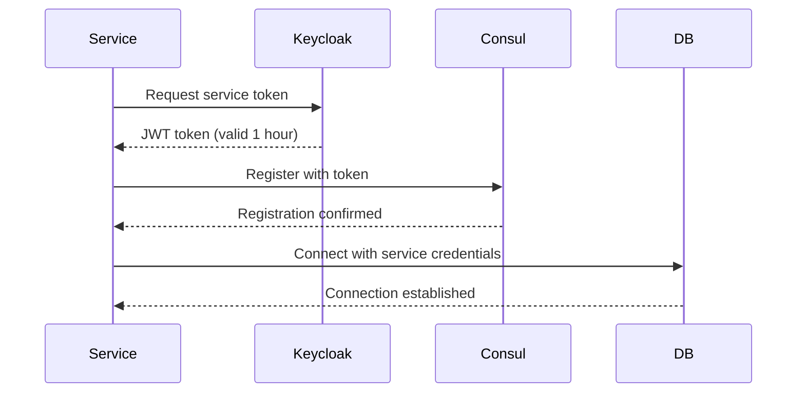
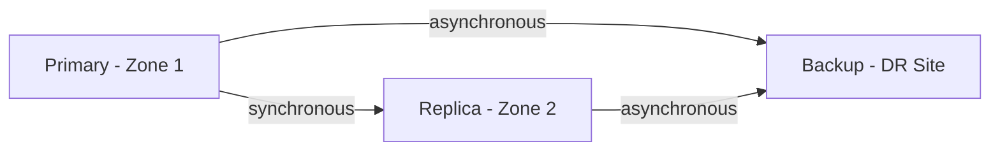
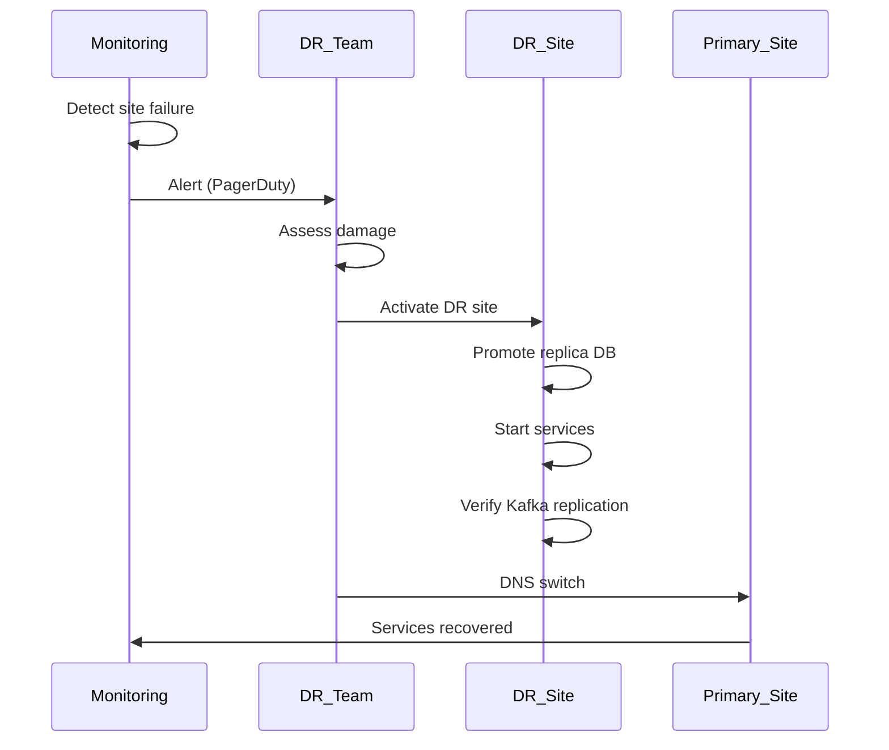

# AutoDev Marketplace — План обеспечения отказоустойчивости

**Версия документа:** 1.1  
**Дата создания:** 2026-06-03  
**Последнее обновление:** 2026-06-13

---

## Обзор

Документ описывает стратегию обеспечения отказоустойчивости AutoDev Marketplace, включая зоны отказа, резервирование, бэкапы, стратегии отката и Disaster Recovery.

---

## 1. Безопасность отказоустойчивости

### 1.1 Аутентификация сервисов при восстановлении

При автоматическом восстановлении сервисов (failover) необходимо:
- Валидация service account токена перед запуском
- Проверка сертификатов TLS (для production)
- Проверка прав доступа к ресурсам (DB, Kafka, Redis)

### 1.2 Identity and Access Management (IAM)

#### При восстановлении сервиса:


### 1.3 Token rotation

- Service token обновляется каждые 30 минут
- Auto-renewal через Background service
- Graceful shutdown с валидацией токена

---

## Общие принципы

### Цели
- **Высокая доступность:** 99.9% uptime для критичных сервисов
- **Минимальное время восстановления:** RTO < 4 часа
- **Минимальная потеря данных:** RPO < 1 час
- **Изоляция отказов:** Отказ одного сервиса не влияет на другие
- **Безопасность:** Аутентификация сервисов при восстановлении

### Мониторинг и алертинг
- **Prometheus** для сбора метрик
- **Grafana** для визуализации
- **Alertmanager** для уведомлений
- **Критичные алерты:** SLAbreach, ServiceDown, HighErrorRate

---

## Зоны отказа

### Физическая инфраструктура

#### Kubernetes Cluster
```
Zone 1 (eu-west-1a):    Zone 2 (eu-west-1b):    Zone 3 (eu-west-1c):
- api-gateway-pod-1     - api-gateway-pod-2     - api-gateway-pod-3
- auth-service-pod-1    - auth-service-pod-2    - (резерв)
- platform-service-pod-1 - platform-service-pod-2 - (резерв)
- catalog-service-pod-1 - catalog-service-pod-2 - (резерв)
- order-service-pod-1   - order-service-pod-2   - (резерв)
- payment-service-pod-1 - payment-service-pod-2 - (резерв)
- search-service-pod-1  - search-service-pod-2  - (резерв)
- comm-service-pod-1    - comm-service-pod-2    - (резерв)
- primary-db            - replica-db            - backup-db
```

#### Service Distribution
| Сервис | Zone 1 | Zone 2 | Zone 3 | Реплики |
|--------|--------|--------|--------|---------|
| API Gateway | 1 | 1 | 1 | 3 |
| Auth Service | 1 | 1 | - | 2 |
| Platform Service | 1 | 1 | - | 2 |
| Catalog Service | 1 | 1 | - | 2 |
| Order Service | 1 | 1 | - | 2 |
| Payment Service | 1 | 1 | - | 2 |
| Search Service | 1 | 1 | - | 2 |
| Communication Service | 1 | 1 | - | 2 |

---

## Резервирование

### Резервирование базы данных

#### PostgreSQL Primary-Replica


**Настройки:**
- `synchronous_commit = on` (дляPrimary)
- `synchronous_standby_names = 'replica'`
- `wal_level = replica`
- `max_wal_senders = 10`

#### Автоматический failover
```yaml
# Patroni конфигурация
bootstrap:
  dcs:
    synchronous_mode: true
    synchronous_standby_names:
      - replica
```

**Failover триггеры:**
- Primary недоступен > 30s
- Replication lag > 5s
- WAL sender stopped

### Резервирование кэша

#### Redis Cluster with Sentinel (Production)
```yaml
apiVersion: redis.redis.io/v1alpha1
kind: Redis
metadata:
  name: redis-cluster
spec:
  redis:
    replicas: 3
    sentinel:
      replicas: 3
```

**Настройки:**
- 3 узла Redis (Cluster mode)
- 3 узла Sentinel (для автоматического failover)
- Auto-failover через Sentinel для отказоустойчивости
- Sentinel контролирует состояние Redis и инициирует failover при сбое

**Зачем нужен Sentinel:**
- **Automatic Failover:** Sentinel автоматически выбирает новый master при сбое текущего
- **Monitoring:** Sentinel постоянно проверяет состояние Redis узлов
- **Notification:** Sentinel уведомляет клиентов о смене master
- **Configuration Provider:** Sentinel предоставляет клиентам информацию о текущем master

**Без Sentinel:**
- При сбое master узла кластер остается неработоспособным
- Требуется ручное вмешательство для восстановления
- Риск потери данных при автоматическом выборе нового master

**Рекомендация:**
Для production окружения всегда используйте Redis Cluster с Sentinel для обеспечения высокой доступности кэша.

### Резервирование сервисов

#### Kubernetes HPA (Horizontal Pod Autoscaler)
```yaml
apiVersion: autoscaling/v2
kind: HorizontalPodAutoscaler
metadata:
  name: api-gateway-hpa
spec:
  scaleTargetRef:
    apiVersion: apps/v1
    kind: Deployment
    name: api-gateway
  minReplicas: 3
  maxReplicas: 10
  metrics:
  - type: Resource
    resource:
      name: cpu
      target:
        type: Utilization
        averageUtilization: 70
  - type: Resource
    resource:
      name: memory
      target:
        type: Utilization
        averageUtilization: 80
```

#### Kubernetes Pod Disruption Budget
```yaml
apiVersion: policy/v1
kind: PodDisruptionBudget
metadata:
  name: api-gateway-pdb
spec:
  minAvailable: 2
  selector:
    matchLabels:
      app: api-gateway
```

---

## Бэкапы

### PostgreSQL бэкапы

#### Регулярные бэкапы
```yaml
apiVersion: batch/v1
kind: CronJob
metadata:
  name: postgresql-backup
spec:
  schedule: "0 2 * * *"  # Ежедневно в 2:00
  jobTemplate:
    spec:
      template:
        spec:
          containers:
          - name: backup
            image: postgres-backup:latest
            env:
            - name: PGHOST
              value: "postgresql-primary"
            - name: PGDATABASE
              value: "services"
            - name: BACKUP_S3_BUCKET
              value: "autodev-backups"
            - name: BACKUP_S3_PREFIX
              value: "postgresql/daily/"
          restartPolicy: OnFailure
```

#### Типы бэкапов
| Тип | Частота | Хранение | Описание |
|-----|---------|----------|----------|
| Full backup | Ежедневно | 30 дней | Полный дамп БД |
| Incremental | Каждые 6 часов | 7 дней | Дельта с последнего полного |
| WAL archiving | Непрерывно | 30 дней | Архив WAL для PITR |

#### Восстановление
```bash
# Восстановление из полного бэкапа
pg_restore -d services /backups/daily/latest.dump

# PITR (Point-in-Time Recovery)
pg_waldump /backups/wal/* | grep "XID"
pg_resetwal -D /var/lib/postgresql/data
```

### Redis бэкапы
- AOF (Append Only File) каждый 1 секунда
- RDB дамп каждые 5 минут
- Replication на 3 узла

### Elasticsearch бэкапы
```yaml
apiVersion: elasticsearch.k8s.elastic.co/v1
kind: Elasticsearch
metadata:
  name: elasticsearch
spec:
  version: 8.13.0
  snapshotRepository:
    name: s3-repo
    uri: s3://autodev-backups/elasticsearch
    settings:
      bucket: autodev-backups
      client: default
```

---

## Стратегии отката

### Rollback сервиса
```bash
# Восстановление предыдущей версии
kubectl rollout undo deployment/api-gateway

# Проверка статуса
kubectl rollout history deployment/api-gateway

# Откат к конкретной ревизии
kubectl rollout undo deployment/api-gateway --to-revision=3
```

### Rollback базы данных
```bash
# Миграция назад
./gradlew liquibaseRollback -Dliquibase.url=jdbc:postgresql://localhost:5438/services \
  -Dliquibase.username=autodev \
  -Dliquibase.password=autodev \
  -Dliquibase.changeLog=src/main/resources/db/changelog/db.changelog-master.yaml \
  -Dliquibase.rollbackCount=1
```

### Auto-rollback при сбое
```yaml
apiVersion: apps/v1
kind: Deployment
metadata:
  name: api-gateway
spec:
  strategy:
    type: RollingUpdate
    rollingUpdate:
      maxUnavailable: 1
      maxSurge: 25%
  revisionHistoryLimit: 10  # Хранить историю для отката
```

---

## Disaster Recovery (DR)

### DR Site
```
Location: eu-west-2
Resources:
- Kubernetes Cluster (3 nodes)
- PostgreSQL Standby (asynchronous replication)
- Redis Cluster
- Elasticsearch Cluster
- Kafka Cluster (replication factor 3, min.insync.replicas=2, 3 brokers)
- MinIO (для бэкапов)
```

**Особенности Kafka Cluster:**
- **3 брокера** для отказоустойчивости
- **replication.factor=3** для всех топиков (данные дублируются на 3 брокера)
- **min.insync.replicas=2** для гарантии записи данных
- **unclean.leader.election.enable=false** для предотвращения потери данных
- **auto.create.topics.enable=false** для явного управления топиками

**ISR (In-Sync Replicas):**
- Топик устойчив к потере 1 брокера (остаётся 2 реплики)
- При потере 2-х брокеров топик становится недоступен для записи
- Consumer читает только из ISR для согласованности данных

### RTO/RPO цели
| Компонент | RTO | RPO |
|-----------|-----|-----|
| API Gateway | 10 мин | 0 |
| Auth Service | 10 мин | 0 |
| Platform Service | 30 мин | 1 час |
| Catalog Service | 30 мин | 1 час |
| Order Service | 1 час | 1 час |
| Payment Service | 1 час | 15 мин |
| Search Service | 30 мин | 1 час |
| Communication Service | 30 мин | 1 час |
| Kafka Cluster | 30 мин | 0 |
| База данных | 4 часа | 1 час |

### DR процедура


---

## Circuit Breaker

### Настройки Resilience4j

#### Global configuration
```yaml
resilience4j:
  circuit-breaker:
    instances:
      auth-service:
        failure-rate-threshold: 50
        wait-duration-in-open-state: 5s
        ring-buffer-size-in-closed-state: 5
        ring-buffer-size-in-half-open-state: 3
      catalog-service:
        failure-rate-threshold: 50
        wait-duration-in-open-state: 10s
        ring-buffer-size-in-closed-state: 10
        ring-buffer-size-in-half-open-state: 5
      payment-service:
        failure-rate-threshold: 30
        wait-duration-in-open-state: 30s
        ring-buffer-size-in-closed-state: 5
        ring-buffer-size-in-half-open-state: 3
```

### Fallback strategies
```java
@Service
public class PaymentService {
    
    @CircuitBreaker(name = "payment-service", fallbackMethod = "fallbackProcessPayment")
    public Payment processPayment(PaymentRequest request) {
        return paymentClient.processPayment(request);
    }
    
    private Payment fallbackProcessPayment(PaymentRequest request, Throwable throwable) {
        // Запись в очередь для повторной обработки
        paymentRetryQueue.send(request);
        
        // Возврат ошибки клиенту
        return new Payment(null, request.getAmount(), "Service temporarily unavailable");
    }
}
```

---

## Retry Strategy

### Retry с экспоненциальной задержкой
```yaml
spring:
  retry:
    max-attempts: 3
    initial-interval: 1000
    multiplier: 2.0
    max-interval: 10000
```

### Retry для Kafka
```java
@Service
public class KafkaProducer {
    
    @Retryable(
        value = {KafkaSendException.class},
        maxAttempts = 3,
        backoff = @Backoff(delay = 1000, multiplier = 2.0)
    )
    public void sendMessage(String topic, String key, String payload) {
        kafkaTemplate.send(topic, key, payload).get();
    }
}
```

---

## Dead Letter Queue (DLQ)

### Kafka DLQ
```yaml
spring:
  kafka:
    consumer:
      enable-auto-commit: false
      auto-offset-reset: earliest
      properties:
        isolation.level: read_committed
```

```java
@Service
public class DeadLetterQueueHandler {
    
    @KafkaListener(
        topics = "dead-letter-queue",
        groupId = "dlq-consumer-group"
    )
    public void handleDeadLetter(ConsumerRecord<String, String> record) {
        log.error("Processing DLQ message: {}", record.value());
        
        // Анализ и обработка ошибки
        // 1. Логирование
        // 2. Уведомление
        // 3. Возврат в основную очередь (если применимо)
        // 4. Удаление из DLQ
    }
}
```

### PostgreSQL Dead Letter Table
```sql
CREATE TABLE dead_letter_queue (
    id                  BIGSERIAL      PRIMARY KEY,
    topic               VARCHAR(255)   NOT NULL,
    message_key         VARCHAR(255)   NULL,
    message_payload     JSONB          NOT NULL,
    error_message       TEXT           NOT NULL,
    error_timestamp     TIMESTAMP      NOT NULL   DEFAULT CURRENT_TIMESTAMP,
    processed           BOOLEAN        NOT NULL   DEFAULT FALSE
);
```

---

## Rate Limiting

### API Gateway rate limiting
```yaml
spring:
  cloud:
    gateway:
      routes:
        - id: user-service
          uri: lb://user-service
          predicates:
            - Path=/api/v1/users/**
          filters:
            - name: RequestRateLimiter
              args:
                redis-rate-limiter.replenishRate: 100
                redis-rate-limiter.burstCapacity: 200
                redis-rate-limiter.requestedTokens: 1
```

### Per-user rate limiting
```redis
KEY: rate_limit:user:{user_id}
TYPE: Atomic counter
TTL: 1 minute
```

---

## Health Checks

### Kubernetes liveness probe
```yaml
livenessProbe:
  httpGet:
    path: /actuator/health/liveness
    port: 8080
  initialDelaySeconds: 60
  periodSeconds: 10
  timeoutSeconds: 5
  failureThreshold: 3
```

### Kubernetes readiness probe
```yaml
readinessProbe:
  httpGet:
    path: /actuator/health/readiness
    port: 8080
  initialDelaySeconds: 30
  periodSeconds: 5
  timeoutSeconds: 3
  failureThreshold: 3
```

### Custom health checks
```java
@Component
public class CustomHealthIndicator implements HealthIndicator {
    
    @Override
    public Health health() {
        try {
            // Проверка подключения к Redis
            redisTemplate.opsForValue().get("health-check");
            
            // Проверка подключения к Kafka
            kafkaTemplate.send("health-check", "ping").get();
            
            return Health.up().build();
        } catch (Exception e) {
            return Health.down(e).build();
        }
    }
}
```

---

## Метрики отказоустойчивости

| Метрика | Целевое значение |
|---------|-----------------|
| Uptime | 99.9% |
| MTBF (Mean Time Between Failures) | >720 часов |
| MTTR (Mean Time To Recovery) | <30 минут |
| Error Rate | <1% |
| Circuit Breaker Open Rate | <1% вызовов |

---

## Алерты

### Критичные алерты (PagerDuty)
| Алерт | Условие | Действие |
|-------|---------|----------|
| ServiceDown | Сервис недоступен > 1 мин | PagerDuty |
| HighErrorRate | Error rate > 5% за 5 мин | PagerDuty |
| DatabaseDown | PostgreSQL недоступен | PagerDuty |
| ReplicationLag | Репликация > 10 сек | Email + Slack |

### Важные алерты (Slack)
| Алерт | Условие | Действие |
|-------|---------|----------|
| HighLatency | p95 > 500ms | #alerts |
| CircuitBreakerOpen | Circuit breaker открыт | #alerts |
| HighCPU | CPU > 80% | #alerts |
| HighMemory | Memory > 80% | #alerts |

---

## Заключение

План обеспечения отказоустойчивости:
- **3 зоны отказа** с распределением сервисов
- **Primary-Replica** PostgreSQL с автоматическим failover
- **Redis Cluster** для кэширования
- **HPA** и **PDB** для масштабирования
- **Регулярные бэкапы** с RPO < 1 час
- **Circuit Breaker** для изоляции отказов
- **Retry Pattern** для временных сбоев
- **Dead Letter Queue** для обработки ошибок
- **Disaster Recovery** site с RTO < 4 часа
