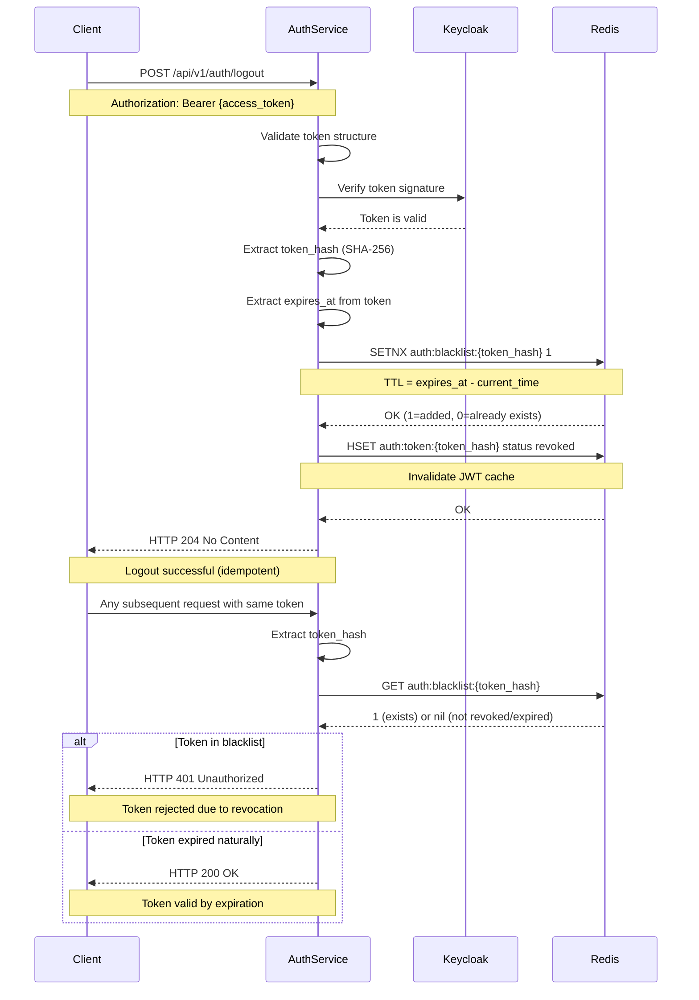

# Auth Service Logout Sequence Diagram

**Версия документа:** 1.1  \
**Дата создания:** 2026-06-14  \
**Последнее обновление:** 2026-06-14  \
**Описание:** Последовательность операций при logout с Redis-only механизмом revoked tokens

---

## Обзор

Диаграмма описывает полный цикл logout с использованием Redis-only механизма revoked tokens для защиты от использования отзыванных токенов.

**Детали механизма:** [security/revoked-tokens.md](../security/revoked-tokens.md)

---

## Sequence Diagram



---

## Механизм revoked tokens (Redis-only)

### 1. При logout

1. **Валидация токена** — проверка подписи через Keycloak
2. **Извлечение данных** — `token_hash` (SHA-256) и `expires_at`
3. **Добавление в Redis** — `SETNX auth:blacklist:{token_hash} 1` с TTL = expires_at - current_time
4. **Инвалидация кэша** — обновление статуса токена в Redis (опционально)

**Важно:** Идемпотентность logout обеспечивается через `SETNX` — повторные вызовы не создадут дубликатов.

### 2. При последующих запросах

1. **Извлечение токена** — из заголовка `Authorization: Bearer {token}`
2. **Вычисление hash** — `SHA-256(token)`
3. **Проверка в Redis** — `GET auth:blacklist:{token_hash}`
4. **Возврат 401** — если токен в черном списке (ключ существует)
5. **Возврат 200** — если ключ не найден (токен не отзывался и не истек)

---

## Ключи Redis

| Ключ | Тип | TTL | Описание |
|------|-----|-----|----------|
| `auth:blacklist:{token_hash}` | String | expires_at - current_time | Revoked token marker (автоматическая очистка) |
| `auth:token:{token_hash}` | Hash | 12 hours | Token status (valid/revoked) |

---

## Алгоритм валидации токена (Java pseudo-code)

```java
@Service
public class TokenValidationService {
    
    @Autowired
    private RedisTemplate<String, Object> redisTemplate;
    
    public boolean isTokenRevoked(String token) {
        String tokenHash = sha256(token);
        String redisKey = "auth:blacklist:" + tokenHash;
        
        // Проверка в Redis (БЕЗ fallback на PostgreSQL)
        Boolean isRevoked = redisTemplate.opsForValue().get(redisKey);
        return isRevoked != null;
    }
}
```

---

## План очистки revoked tokens

### Автоматическая очистка через TTL

**Все ключи Redis автоматически удаляются после истечения TTL:**
- TTL устанавливается как `expires_at - current_time`
- После истечения TTL ключи удаляются Redis автоматически
- **Нет необходимости в scheduled cleanup для MVP**

### Scheduled cleanup (опционально для production)

```java
@Service
public class RevokedTokenCleanupService {
    
    @Scheduled(cron = "0 0 3 * * ?") // Каждый день в 3:00
    public void cleanupRevokedTokens() {
        // Для MVP не требуется - TTL уже обеспечивает автоматическую очистку
        // Для production можно добавить логику архивирования в Redis Streams
    }
}
```

---

## Метрики мониторинга

| Метрика | Описание | Тип |
|---------|----------|-----|
| `auth_logout_total` | Количество logout операций | Counter |
| `auth_revoked_tokens_blacklist_size` | Количество revoked tokens в Redis | Gauge |
| `auth_revoked_tokens_check_total` | Количество проверок revoked токенов | Counter |
| `auth_invalid_tokens_rejected` | Отклоненные токены | Counter |

---

## Преимущества Redis-only подхода

1. **Простота** — нет необходимости синхронизировать Redis и PostgreSQL
2. **Автоматическая очистка** — TTL обеспечивает удаление истекших токенов
3. **Высокая производительность** — все операции через Redis (in-memory)
4. **Идемпотентность logout** — SETNX гарантирует однозначность операции
5. **Отсутствие сбоев из-за падения БД** — logout работает даже если PostgreSQL недоступен

---

## Риски и ограничения

### 1. Redis недоступен

**Решение для MVP:** При падении Redis logout временно недоступен. Для production использовать Redis Cluster.

**Mitigation:** 
- Redis Cluster для отказоустойчивости
- Health checks и алерты на доступность Redis

### 2. Утечка памяти в Redis

**Решение:** Все ключи имеют TTL = expires_at - current_time. После истечения TTL ключи автоматически удаляются Redis.

**Для MVP:** Не является проблемой — ttl совпадает с lifetime токена.

**Для production:** Можно добавить Redis Streams для аудита (если потребуется долгосрочное хранение).

---

## Сравнение с альтернативами

| Характеристика | Redis-only (MVP) | Redis + PostgreSQL | PostgreSQL-only |
|----------------|------------------|-------------------|-----------------|
| Простота | ✅ Высокая | Средняя | Средняя |
| Производительность | ✅ Высокая | Высокая | Низкая |
| Автоматическая очистка | ✅ Да (TTL) | Нет | Нет |
| Утечка revoked токенов при падении | ⚠️ Да (для MVP) | Нет | Нет |
| Долгосрочное хранение | ❌ Нет | ✅ Да | ✅ Да |
| Аудит | ❌ Нет | ✅ Да | ✅ Да |

---

## Заключение

Redis-only механизм revoked tokens обеспечивает:

1. **Быструю проверку** — < 5ms через Redis
2. **Простую реализацию** — без fallback и синхронизации
3. **Автоматическую очистку** — через TTL
4. **Идемпотентный logout** — через SETNX

**Для MVP:** Достаточно только Redis с TTL = expires_at - current_time.

**Для production:** При необходимости аудита можно добавить Redis Streams или отдельную audit таблицу (но это не требуется для MVP).
