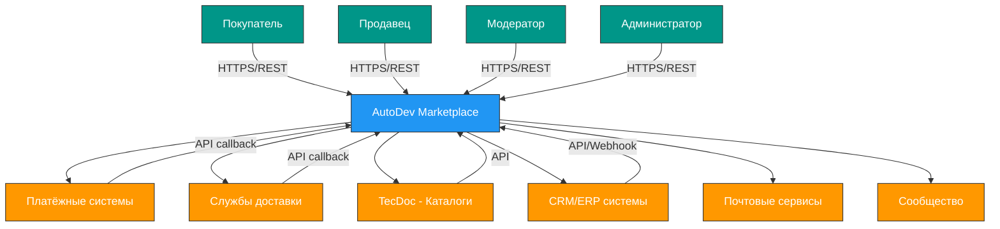

# AutoDev Marketplace — Контекстная диаграмма системы (C4 Level 1)

**Версия документа:** 1.0  
**Дата создания:** 2026-06-03  
**Последнее обновление:** 2026-06-03

---

## Обзор

Диаграмма контекста системы (C4 Level 1) показывает AutoDev Marketplace в контексте её окружения: какие внешние акторы и системы взаимодействуют с платформой.

---

## Диаграмма



---

## Акторы (Users)

### Покупатель
**Описание:** Физическое лицо, ищущее и покупающее автозапчасти

**Взаимодействие:**
- Поиск запчастей по VIN, артикулу, марке
- Просмотр каталога и фильтрация
- Добавление в корзину и оформление заказа
- Оплата через онлайн-платежи
- Отслеживание статуса доставки
- Написание отзывов и рейтингов
- Взаимодействие с продавцом через чат

**Каналы:** Web SPA (React), Mobile App (в будущем)

---

### Продавец
**Описание:** Юридическое или физическое лицо, продающее автозапчасти

**Взаимодействие:**
- Размещение и управление объявлениями
- Загрузка прайс-листов (CSV, XLSX, XML, YML)
- Управление ценами и акциями
- Ответы на запросы покупателей
- Обработка заказов
- Статистика просмотров и продаж
- Взаимодействие с покупателями через чат

**Каналы:** Web SPA (React) — Seller Dashboard

---

### Модератор
**Описание:** Сотрудник платформы, контролирующий контент

**Взаимодействие:**
- Модерация объявлений и отзывов
- Проверка верификации продавцов
- Обработка жалоб от пользователей
- Блокировка нарушителей
- Администраторский панель

**Каналы:** Web SPA (React) — Admin Panel

---

### Администратор
**Описание:** Технический администратор системы

**Взаимодействие:**
- Настройка конфигурации системы
- Мониторинг состояния сервисов
- Управление пользователями
- Аудит действий
- Управление интеграциями

**Каналы:** Web SPA (React) — Admin Panel, API

---

## Внешние системы

### Платёжные системы

**Сбербанк**
- **Интеграция:** OAuth2, REST API
- **Функционал:** Онлайн-оплата картой (3DSecure), эскроу-счёт
- **Направление:** Запрос к оплате → Оповещение об оплате

**Тинькофф**
- **Интеграция:** OAuth2, REST API
- **Функционал:** Онлайн-оплата картой, рассрочка
- **Направление:** Запрос к оплате → Оповещение об оплате

---

### Службы доставки

**СДЭК**
- **Интеграция:** REST API, Webhook
- **Функционал:** Расчёт стоимости, отслеживание, создание заявок
- **Направление:** Запрос расчёта → Ответ со стоимостью

**Boxberry**
- **Интеграция:** REST API, Webhook
- **Функционал:** Расчёт стоимости, отслеживание
- **Направление:** Запрос расчёта → Ответ со стоимостью

**Почта России**
- **Интеграция:** REST API
- **Функционал:** Расчёт стоимости, отслеживание
- **Направление:** Запрос расчёта → Ответ со стоимостью

---

### TecDoc - Каталоги

**TecDoc**
- **Интеграция:** REST API
- **Функционал:** Данные о совместимости автомобилей, каталоги запчастей
- **Направление:** Запрос совместимости → Ответ с подбором

---

### CRM/ERP системы

**1С**
- **Интеграция:** Webhook, REST API
- **Функционал:** Синхронизация цен и наличия
- **Направление:** Веб-хук обновления → Синхронизация

**Bitrix24**
- **Интеграция:** REST API
- **Функционал:** Интеграция с CRM
- **Направление:** Создание лида → Синхронизация

---

### Почтовые сервисы

**SMTP (SMTP relay)**
- **Интеграция:** SMTP
- **Функционал:** Отправка email-уведомлений
- **Направление:** Запрос отправки → Уведомление

**SMS (SMS-шлюз)**
- **Интеграция:** REST API
- **Функционал:** Отправка SMS-уведомлений
- **Направление:** Запрос отправки → Уведомление

---

### Прочие системы

**Сообщество**
- **Интеграция:** API
- **Функционал:** Интеграция с соцсетями для shares и рекламы

---

## Потоки данных

### Поток 1: Поиск и просмотр товара
```
Покупатель → HTTP/HTTPS → AutoDev Marketplace
AutoDev Marketplace → HTTP/REST → Search Service
Search Service → HTTP/REST → Elasticsearch
Elasticsearch → ответ → Search Service
Search Service → ответ → AutoDev Marketplace
AutoDev Marketplace → ответ → Покупатель
```

### Поток 2: Оформление заказа
```
Покупатель → HTTP/HTTPS → AutoDev Marketplace
AutoDev Marketplace → HTTP/REST → Order Service
Order Service → HTTP/REST → Catalog Service (резервирование товара)
Catalog Service → ответ → Order Service
Order Service → HTTP/REST → Payment Service
Payment Service → HTTP/REST → Сбербанк/Тинькофф
Сбербанк/Тинькофф → callback → Payment Service
Payment Service → ответ → Order Service
Order Service → HTTP/REST → Communication Service (событие)
Communication Service → Kafka → все подписчики
```

### Поток 3: Обновление прайс-листа продавцом
```
Продавец → HTTP/HTTPS → AutoDev Marketplace
AutoDev Marketplace → HTTP/REST → Catalog Service
Catalog Service → Kafka → все сервисы (событие price_updated)
Все сервисы → обновление кэша/данных
```

---

## Границы системы

### Что входит в систему
- Все микросервисы (API Gateway, Auth, Catalog, Order, Search, Payment, Communication, Platform)
- Базы данных (PostgreSQL, Redis, Elasticsearch)
- Брокеры сообщений (Apache Kafka)
- API Gateway
- Менеджер конфигураций (Consul)

### Что вне системы
- Мобильное приложение (разрабатывается отдельно)
- Веб-SPA (разрабатывается отдельно)
- Все внешние интеграции (платежи, доставка, каталоги)

---

## Инфраструктура

### Внутренняя инфраструктура
- **Kubernetes** — оркестрация контейнеров
- **Docker** — контейнеризация
- **Consul** — Service Discovery и KV-store
- **PostgreSQL** — основная база данных (Primary-Replica)
- **Redis** — кэширование и сессии (Cluster с Sentinel для автоматического failover)
- **Elasticsearch** — полнотекстовый поиск (Cluster с 3 узлами)
- **Apache Kafka** — асинхронная коммуникация между сервисами
- **ZooKeeper** — координация Kafka кластера (3 узла)

**Конфигурация Redis Cluster с Sentinel:**
- **3 узла Redis** (Cluster mode) для хранения данных
- **3 узла Sentinel** для автоматического failover и мониторинга
- **sentinel monitor redis-master redis-cluster 6379 2** — мониторинг master
- **sentinel down-after-milliseconds redis-master 30000** — таймаут для объявления недоступным
- **sentinel failover-timeout redis-master 180000** — таймаут для failover

**Конфигурация Kafka Cluster:**
- **3 брокера** для отказоустойчивости
- **replication.factor=3** для всех топиков (данные дублируются на 3 брокера)
- **min.insync.replicas=2** для гарантии записи данных
- **unclean.leader.election.enable=false** для предотвращения потери данных
- **isr** — In-Sync Replicas: топик устойчив к потере 1 брокера

### Инфраструктурные сервисы
- **Prometheus** — сбор метрик
- **Grafana** — визуализация метрик
- **Loki** — централизованное логирование
- **Tempo** — трассировка запросов
- **Alloy** — агент телеметрии

---

## Сценарии использования

### Сценарий 1: Регистрация покупателя
1. Покупатель открывает сайт
2. Покупатель нажимает "Зарегистрироваться"
3. AutoDev Marketplace → Auth Service (создание пользователя в Keycloak)
4. Auth Service → PostgreSQL (сохранение пользователя)
5. Auth Service → Kafka (событие user_registered)
6. User Service → слушает событие и создаёт профиль
7. Ответ → Покупатель

### Сценарий 2: Поиск по VIN
1. Покупатель вводит VIN
2. AutoDev Marketplace → Search Service
3. Search Service → Catalog Service (получение данных)
4. Catalog Service → TecDoc API (совместимость)
5. TecDoc → ответ → Catalog Service
6. Catalog Service → Elasticsearch (индексация)
7. Search Service → Elasticsearch (поиск)
8. Elasticsearch → ответ → Search Service
9. Search Service → ответ → AutoDev Marketplace
10. AutoDev Marketplace → ответ → Покупатель

### Сценарий 3: Оформление заказа
1. Покупатель добавляет товар в корзину
2. AutoDev Marketplace → Order Service (создание корзины)
3. Order Service → PostgreSQL (сохранение корзины)
4. Покупатель нажимает "Оформить заказ"
5. AutoDev Marketplace → Order Service (создание заказа)
6. Order Service → Inventory Service (резервирование)
7. Inventory Service → PostgreSQL (обновление наличия)
8. Order Service → Payment Service (оплата)
9. Payment Service → Сбербанк (запрос оплаты)
10. Сбербанк → callback (успех/ошибка)
11. Payment Service → Order Service (обновление статуса)
12. Order Service → Notification Service (уведомление)
13. Notification Service → Kafka (событие order_created)
14. Все подписчики обрабатывают событие
15. Ответ → Покупатель

---

## Важные метрики

| Метрика | Целевое значение | Метод измерения |
|---------|-----------------|-----------------|
| Количество акторов | 10K+ пользователей | Prometheus, аналитика |
| RPS внешних систем | 100+ запросов/сек | API Gateway metrics |
| Доступность системы | 99.9% | Prometheus uptime |
| Время отклика (p95) | <500 мс | Tempo traces |
| Ошибки (p99) | <1% | Prometheus errors |

---

## Заключение

Диаграмма контекста системы показывает AutoDev Marketplace как центральный элемент экосистемы продажи автозапчастей, взаимодействующий с:
- 4 типами акторов (покупатели, продавцы, модераторы, администраторы)
- 5+ внешними системами (платежи, доставка, каталоги, CRM, почта)

Система построена по принципу микросервисов с чёткими границами ответственности, что позволяет масштабировать отдельные компоненты и обеспечивать отказоустойчивость.
