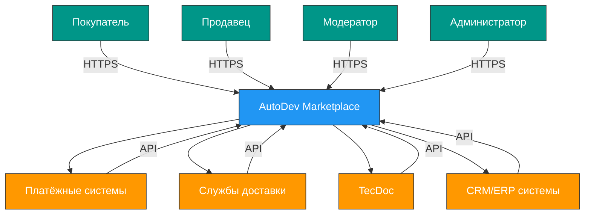

# AutoDev Marketplace — System Architecture Overview
**Распределённая система продажи автозапчастей на стеке Java и Spring Boot**

*Версия документа: 1.0*
*Дата обновления: 2026-05-27*

---


## 1. Обзор системы

AutoDev Marketplace — это учебная платформа для продажи автозапчастей, построенная по принципам современных распределённых систем. Проект предназначен для обучения Java backend-разработчиков best practices разработки микросервисных приложений на Spring Boot 3.x и Java 17+.


Система предоставляет ключевые бизнес-ценности: удобный поиск запчастей по VIN и артикулам, безопасную сделку через эскроу-счёт, автоматизированную загрузку прайс-листов от продавцов и надёжную интеграцию с внешними сервисами доставки и оплаты.


**Целевая аудитория:**
- Покупатели автозапчастей
- Продавцы (магазины, разборки)
- Модераторы платформы
- Администраторы системы

---


## 2. Контекст системы (C4 Level 1)




**Границы системы:**
- Внутри: все микросервисы, базы данных, брокеры сообщений, API Gateway
- Вне: мобильное приложение (разрабатывается отдельно), внешние интеграции (платежи, доставка, каталоги)


**Внешние системы:**
- Платёжные шлюзы: Сбербанк, Тинькофф
- Службы доставки: СДЭК, Boxberry, Почта России
- Каталоги запчастей: TecDoc
- CRM/ERP: 1С, Bitrix24

---


## 3. Архитектурное представление

### 3.1. Контейнеры (C4 Level 2)


```mermaid
graph TD
    subgraph "Клиенты"
        A[Web SPA (React)]
        B[Admin SPA (React)]
        C[Мобильное приложение]
    end
    
    subgraph "Инфраструктура"
        D[API Gateway]
        E[Auth Service]
        F[User Service]
        G[Catalog Service]
        H[Listing Service]
        I[Search Service]
        J[Order Service]
        K[Notification Service]
        L[Media Service]
        M[Analytics Service]
        N[Admin Service]
        O[Review Service]
        P[Recommendation Service]
    end
    
    subgraph "Хранилища"
        Q[PostgreSQL]
        R[Redis]
        S[Elasticsearch]
        T[Kafka]
        U[MinIO]
    end
    
    A --> D
    B --> D
    C --> D
    
    D --> E
    D --> F
    D --> G
    D --> H
    D --> I
    D --> J
    D --> K
    D --> L
    D --> M
    D --> N
    D --> O
    D --> P
    
    F --> Q
    G --> Q
    H --> Q
    J --> Q
    M --> Q
    N --> Q
    O --> Q
    P --> Q
    
    I --> S
    K --> R
    D --> R
    E --> R
    P --> R
    
    F --> T
    G --> T
    H --> T
    J --> T
    K --> T
    L --> T
    M --> T
    N --> T
    O --> T
    P --> T
    
    L --> U
    
    classDef client fill:#4CAF50,stroke:#333,stroke-width:1px,color:white;
    classDef service fill:#2196F3,stroke:#333,stroke-width:1px,color:white;
    classDef storage fill:#9C27B0,stroke:#333,stroke-width:1px,color:white;
    
    class A,B,C client
    class D,E,F,G,H,I,J,K,L,M,N,O,P service
    class Q,R,S,T,U storage
```

### 3.2. Компоненты (C4 Level 3)


**API Gateway:**
- `GatewayService` - маршрутизация запросов
- `AuthenticationFilter` - JWT валидация
- `RateLimitingFilter` - ограничение запросов
- `CORSFilter` - управление политиками CORS

**Auth Service:**
- `KeycloakIntegrationService` - интеграция с Keycloak
- `TokenService` - генерация и валидация JWT
- `UserService` - управление пользователями в Keycloak
- `RoleService` - управление ролями и правами

**User Service:**
- `UserService` - управление профилями
- `AuthenticationService` - аутентификация и авторизация
- `RatingService` - рейтинг пользователей
- `FavoriteService` - избранное

**Catalog Service:**
- `ProductCatalogService` - каталог товаров
- `CategoryService` - категории
- `CompatibilityService` - совместимость по VIN
- `CrossReferenceService` - кросс-номера

**Pricing & Inventory Service:**
- `PricingService` - управление ценами
- `InventoryService` - учёт наличия
- `PriceListImportService` - загрузка прайс-листов
- `AvailabilityService` - статус наличия

**Order Service:**
- `OrderService` - оформление заказов
- `CartService` - корзина
- `PaymentService` - обработка оплаты
- `EscrowService` - безопасная сделка

**Notification Service:**
- `EmailNotificationService` - email уведомления
- `SmsNotificationService` - SMS уведомления
- `PushNotificationService` - push уведомления
- `SubscriptionService` - управление подписками

**Messaging Service:**
- `ChatService` - чат между пользователями
- `MessageService` - хранение сообщений
- `NotificationService` - уведомления о сообщениях

**Analytics & Reporting Service:**
- `SalesAnalyticsService` - аналитика продаж
- `DashboardService` - дашборды
- `ReportService` - генерация отчётов
- `StatisticsService` - статистика просмотров

**Admin Service:**
- `ModerationService` - модерация объявлений
- `ContentService` - управление контентом
- `MonitoringService` - мониторинг системы
- `AuditService` - аудит действий

**Review Service:**
- `ReviewService` - управление отзывами
- `RatingService` - расчёт рейтингов
- `ReviewValidationService` - валидация отзывов
- `ReviewModerationService` - модерация отзывов

**Recommendation Service:**
- `RecommendationEngine` - алгоритмы рекомендаций
- `CollaborativeFilteringService` - фильтрация по поведению
- `ContentBasedService` - фильтрация по характеристикам
- `TrendingService` - популярные товары

---


## 4. Ключевые архитектурные решения

### Стиль архитектуры
**Микросервисная архитектура** выбрана как наиболее подходящая для данного проекта, так как:
- Позволяет независимую разработку и развёртывание сервисов
- Обеспечивает гибкость в выборе технологий для отдельных сервисов
- Упрощает масштабирование отдельных компонентов
- Соответствует учебным целям проекта по изучению распределённых систем

### Коммуникация между сервисами
- **Синхронная коммуникация:** REST API для прямых запросов с ожиданием ответа
- **Асинхронная коммуникация:** Apache Kafka для событийной архитектуры и обеспечения отказоустойчивости
- **gRPC:** для высокопроизводительных вызовов между сервисами при необходимости

### Паттерны проектирования
- **API Gateway:** единая точка входа для всех клиентов с маршрутизацией, аутентификацией и rate limiting
- **Service Discovery:** Consul для динамического обнаружения сервисов
- **Circuit Breaker:** Resilience4j для предотвращения каскадных сбоев
- **Saga Pattern:** для управления распределёнными транзакциями (оформление заказа)
- **CQRS:** разделение команд и запросов для оптимизации производительности
- **Event Sourcing:** сохранение событий для восстановления состояния системы

### Стратегия развёртывания
- **Blue-Green Deployment:** для обеспечения zero-downtime обновлений в production
- Поддержка **Canary Releases** для постепенного внедрения изменений

### Масштабирование
- **Горизонтальное масштабирование** stateless сервисов (API Gateway, Auth Service)
- **Вертикальное масштабирование** баз данных при необходимости
- **Автомасштабирование** на основе метрик (CPU, memory, request rate)

---


## 5. Основные функциональные модули

### API Gateway
Реализует единую точку входа для всех клиентов. Выполняет маршрутизацию запросов к соответствующим микросервисам, аутентификацию через JWT, ограничение частоты запросов (rate limiting) и управление политиками CORS. Использует Spring Cloud Gateway с интеграцией в Keycloak для проверки токенов.


### Auth Service
Обеспечивает централизованную аутентификацию и авторизацию через Keycloak. Реализует OAuth2/OpenID Connect протоколы, управление пользователями, ролями и правами доступа. Генерирует JWT-токены с информацией о пользователе и его ролях для использования в других сервисах.


### User Service
Отвечает за управление пользователями, аутентификацию, авторизацию и профили. Реализует RBAC (Role-Based Access Control) с ролями BUYER, SELLER, MODERATOR, ADMIN. Хранит персональную информацию пользователей с шифрованием чувствительных данных.


### Product Catalog Service
Предоставляет функционал каталога товаров с поиском по VIN, марке/модели, артикулу. Управляет категориями, характеристиками и совместимостью запчастей. Интегрируется с внешними каталогами (TecDoc) для получения данных о совместимости автомобилей.


### Pricing & Inventory Service
Обеспечивает управление ценами и учётом наличия. Поддерживает массовую загрузку прайс-листов в форматах CSV, XLSX, XML, YML. Реализует механизм сопоставления полей файла с полями системы и различные режимы обработки (полная замена, добавление, обновление). Интегрируется с системами учёта продавцов.


### Order Service
Реализует процесс оформления заказов с корзиной, безопасной сделкой (эскроу) и управлением статусами. Использует Saga Pattern для координации распределённых транзакций между сервисами. Обеспечивает согласованность данных при изменении статусов заказа.


### Notification Service
Обеспечивает отправку уведомлений через email, SMS и push. Поддерживает подписки на события (снижение цены, статус заказа). Реализует асинхронную отправку уведомлений через Kafka для обеспечения надёжности доставки.


### Messaging Service
Предоставляет функционал внутреннего чата между покупателями и продавцами. Включает историю переписки, уведомления о новых сообщениях и возможность прикрепления файлов. Поддерживает WebSocket для реального времени обмена сообщениями.


### Analytics & Reporting Service
Собирает и анализирует данные о продажах, просмотрах и поведении пользователей. Предоставляет дашборды и отчёты для продавцов и администраторов. Реализует агрегацию данных из различных источников для формирования бизнес-метрик.


### Admin Service
Обеспечивает модерацию контента, мониторинг системы и административные функции. Включает инструменты для проверки объявлений на соответствие правилам, блокировки нарушителей и аналитики платформы. Предоставляет интерфейс для управления системой администраторам.


### Review Service
Обеспечивает управление отзывами и рейтингами. Позволяет пользователям оставлять отзывы с фото/видео, оценивать товары и продавцов по 5-балльной шкале. Реализует систему модерации отзывов и расчёт рейтингов на основе количества сделок, оценок, скорости ответов и соблюдения условий сделки. Интегрируется с Media Service для хранения медиафайлов отзывов.


### Recommendation Service
Предоставляет персонализированные рекомендации на основе поведения пользователя. Реализует алгоритмы коллаборативной фильтрации, контент-базированной фильтрации и анализа трендов. Формирует рекомендации "Вам может понравиться", "Часто покупают вместе" и "Похожие товары". Использует данные из Analytics Service и Catalog Service для формирования рекомендаций.


---


## 6. Нефункциональные требования (NFR)


| Требование | Значение | Метрика |
|-----------|---------|--------|
| **Производительность** | Время отклика < 500 мс | p95 latency |
| **Пропускная способность** | 1000 RPS | Requests per second |
| **Доступность** | 99.9% | Uptime |
| **Масштабируемость** | Поддержка роста в 10 раз | Load testing |
| **Безопасность** | TLS 1.3, BCrypt | OWASP Top 10 |
| **Локализация** | Русский, английский | i18n support |


---


## 7. Данные и хранение

### Основные сущности
- `User`: пользователи системы
- `Product`: товарные позиции
- `Category`: категории товаров
- `Order`: заказы
- `PriceList`: прайс-лист

## 8. Технологический стек

### Бэкенд
- **Java**: 17 (LTS версия) - основной язык разработки
- **Spring Boot**: 3.4.5 - фреймворк для создания микросервисов
- **Spring Cloud**: 2023.0.1 - интеграция микросервисов, Service Discovery, Circuit Breaker
- **Spring Data JPA**: 3.4.5 - доступ к данным в реляционных базах данных
- **Spring Security**: 6.4.5 - аутентификация и авторизация
- **Spring Cloud Gateway**: 4.4.5 - API Gateway для маршрутизации запросов
- **Spring Cloud Consul**: 5.0.0 - Service Discovery и конфигурация
- **Resilience4j**: 2.1.0 - реализация паттернов Circuit Breaker, Rate Limiter
- **Liquibase**: 4.27.0 - версионирование и миграция схемы базы данных
- **MapStruct**: 1.5.2 - маппинг объектов
- **Lombok**: 1.18.34 - уменьшение boilerplate кода
- **JUnit 5**: 5.10.3 - модульное тестирование
- **Mockito**: 5.12.0 - мокирование в тестах
- **Testcontainers**: 1.19.7 - интеграционное тестирование с реальными контейнерами
- **WireMock**: 2.35.0 - мокирование HTTP сервисов в тестах
- **Gradle**: 8.8 - сборка проекта и управление зависимостями

### Базы данных и кэширование
- **PostgreSQL**: 15 - основная реляционная база данных для хранения структурированных данных
- **Redis**: 7 - кэширование часто запрашиваемых данных и хранение сессий
- **Elasticsearch**: 8.13.0 - полнотекстовый поиск и агрегации
- **Apache Kafka**: 7.3.2 - асинхронная коммуникация между сервисами, event sourcing
- **Zookeeper**: 7.3.2 - координация Kafka кластера
- **MinIO**: 2023.05.14 - объектное хранилище для файлов и изображений

### Инфраструктура и мониторинг
- **Docker**: 20.10.23 - контейнеризация сервисов
- **Docker Compose**: 2.20.2 - оркестрация контейнеров в development и staging окружениях
- **Consul**: 1.15.3 - Service Discovery и управление конфигурациями
- **Keycloak**: 21.1.1 - централизованная аутентификация и авторизация (IAM)
- **Grafana**: 12.4.0 - визуализация метрик и логов
- **Prometheus**: 2.48.0 - сбор и хранение метрик
- **Loki**: 2.9.2 - централизованное логирование
- **Tempo**: 2.4.0 - трассировка распределённых запросов
- **Alloy**: 1.12.2 - агент для отправки метрик, логов и трассировок в Grafana Cloud
- **Nginx**: 1.25 - обратный прокси и балансировка нагрузки

### CI/CD и DevOps
- **GitLab CI/CD**: 16.11 - автоматизация сборки, тестирования и развёртывания
- **Git**: 2.40.1 - система контроля версий
- **Conventional Commits**: 1.0.0 - стандарт для сообщений коммитов

### Фронтенд (для полноты картины)
- **React**: 18.2.0 - фронтенд фреймворк для веб-интерфейсов
- **TypeScript**: 5.0.4 - типизированный JavaScript
- **Redux**: 4.2.1 - управление состоянием приложения
- **Material UI**: 5.11.16 - компоненты интерфейса

### Документация API
- **OpenAPI 3.0**: спецификация для описания REST API
- **Swagger UI**: 4.15.5 - визуализация документации API

### Тестирование
- **Postman**: 10.18.7 - ручное тестирование API
- **JMeter**: 5.6.3 - нагрузочное тестирование

### Примечания по совместимости
Все указанные версии технологий совместимы между собой:
- Spring Boot 3.4.5 совместим с Java 17 и поддерживает все указанные версии Spring Cloud и Spring Data
- Liquibase 4.27.0 полностью поддерживается Spring Boot 3.4.5
- Указанные версии Grafana, Prometheus, Loki, Tempo и Alloy совместимы между собой и образуют полноценную альтернативу ELK стеку для мониторинга и логирования
- Все версии библиотек и фреймворков протестированы на совместимость в рамках Spring Boot 3.4.5