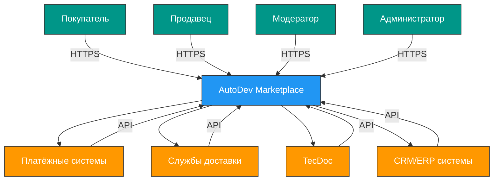

# AutoDev Marketplace — System Architecture Overview
**Распределённая система продажи автозапчастей на стеке Java и Spring Boot**

*Версия документа: 1.2*
*Дата обновления: 2026-06-02*

---


## 1. Обзор системы

AutoDev Marketplace — это учебная платформа для продажи автозапчастей, построенная по принципам современных распределённых систем. Проект предназначен для обучения Java backend-разработчиков best practices разработки микросервисных приложений на Spring Boot 3.x и Java 17+.


Система предоставляет ключевые бизнес-ценности: удобный поиск запчастей по VIN и артикулам, безопасную сделку через эскроу-счёт, автоматизированную загрузку прайс-листов от продавцов и надёжную интеграцию с внешними сервисами доставки и оплаты.


**Целевая аудитория:**
- Покупатели автозапчастей
- Продавцы (магазины, разборки)
- Модераторы платформы
- Администраторы системы

---


## 2. Контекст системы (C4 Level 1)




**Границы системы:**
- Внутри: все микросервисы, базы данных, брокеры сообщений, API Gateway
- Вне: мобильное приложение (разрабатывается отдельно), внешние интеграции (платежи, доставка, каталоги)


**Внешние системы:**
- Платёжные шлюзы: Сбербанк, Тинькофф
- Службы доставки: СДЭК, Boxberry, Почта России
- Каталоги запчастей: TecDoc
- CRM/ERP: 1С, Bitrix24

---


## 3. Архитектурное представление

### 3.0. Названия сервисов и директорий

| Человекочитаемое название | Название сервиса (service name) | Директория |
|---------------------------|--------------------------------|-----------|
| API Gateway | api-gateway | services/api-gateway |
| Auth Service | auth-service | services/auth-service |
| User Service | user-service | services/user-service |
| Catalog Service | catalog-service | services/catalog-service |
| Pricing Service | pricing-service | services/pricing-service |
| Inventory Service | inventory-service | services/inventory-service |
| Search Service | search-service | services/search-service |
| Order Service | order-service | services/order-service |
| Payment Service | payment-service | services/payment-service |
| Logistics Service | logistics-service | services/logistics-service |
| Returns Service | returns-service | services/returns-service |
| Notification Service | notification-service | services/notification-service |
| Messaging Service | messaging-service | services/messaging-service |
| Moderation Service | moderation-service | services/moderation-service |
| Marketing Service | marketing-service | services/marketing-service |
| Reporting Service | reporting-service | services/reporting-service |
| Analytics Service | analytics-service | services/analytics-service |
| Admin Service | admin-service | services/admin-service |
| SellerDashboard Service | seller-dashboard-service | services/seller-dashboard-service |
| SellerAnalytics Service | seller-analytics-service | services/seller-analytics-service |
| KnowledgeBase Service | knowledgebase-service | services/knowledgebase-service |
| PartsCalculator Service | partscalculator-service | services/partscalculator-service |
| Integration Service | integration-service | services/integration-service |
| VideoCall Service | videocall-service | services/videocall-service |
| Media Service | media-service | services/media-service |

### 3.1. Контейнеры (C4 Level 2)


```mermaid
graph TD
    subgraph "Клиенты"
        A[Web SPA (React)]
        B[Admin SPA (React)]
        C[Мобильное приложение]
    end
    
    subgraph "Инфраструктура"
        D[API Gateway]
        E[Auth Service]
        F[User Service]
        G[Catalog Service]
        H[Pricing Service]
        I[Inventory Service]
        J[Search Service]
        K[Order Service]
        L[Payment Service]
        M[Logistics Service]
        N[Returns Service]
        O[Notification Service]
        P[Messaging Service]
        Q[Moderation Service]
        R[Marketing Service]
        S[Reporting Service]
        T[Analytics Service]
        U[Admin Service]
        V[SellerDashboard Service]
        W[SellerAnalytics Service]
        X[KnowledgeBase Service]
        Y[PartsCalculator Service]
        Z[Integration Service]
        AA[VideoCall Service]
        AB[Media Service]
    end
    
    subgraph "Хранилища"
        AC[PostgreSQL]
        AD[Redis]
        AE[Elasticsearch]
        AF[Kafka]
        AG[MinIO]
    end
    
    A --> D
    B --> D
    C --> D
    
    D --> E
    D --> F
    D --> G
    D --> H
    D --> I
    D --> J
    D --> K
    D --> L
    D --> M
    D --> N
    D --> O
    D --> P
    D --> Q
    D --> R
    D --> S
    D --> T
    D --> U
    D --> V
    D --> W
    D --> X
    D --> Y
    D --> Z
    D --> AA
    D --> AB
    
    F --> AC
    G --> AC
    H --> AC
    I --> AC
    K --> AC
    L --> AC
    M --> AC
    N --> AC
    O --> AC
    P --> AC
    Q --> AC
    R --> AC
    S --> AC
    T --> AC
    U --> AC
    V --> AC
    W --> AC
    X --> AC
    Y --> AC
    Z --> AC
    AA --> AC
    AB --> AC
    
    J --> AE
    O --> AD
    P --> AD
    D --> AD
    E --> AD
    V --> AD
    
    F --> AF
    G --> AF
    H --> AF
    I --> AF
    K --> AF
    L --> AF
    M --> AF
    N --> AF
    O --> AF
    P --> AF
    Q --> AF
    R --> AF
    S --> AF
    T --> AF
    U --> AF
    V --> AF
    W --> AF
    X --> AF
    Y --> AF
    Z --> AF
    AA --> AF
    AB --> AF
    
    P --> AG
    AB --> AG
    
    classDef client fill:#4CAF50,stroke:#333,stroke-width:1px,color:white;
    classDef service fill:#2196F3,stroke:#333,stroke-width:1px,color:white;
    classDef storage fill:#9C27B0,stroke:#333,stroke-width:1px,color:white;
    
    class A,B,C client
    class D,E,F,G,H,I,J,K,L,M,N,O,P,Q,R,S,T,U,V,W,X,Y,Z,AA,AB service
    class AC,AD,AE,AF,AG storage
```

### 3.2. Компоненты (C4 Level 3)


**API Gateway:**
- `GatewayService` - маршрутизация запросов
- `AuthenticationFilter` - JWT валидация
- `RateLimitingFilter` - ограничение запросов
- `CORSFilter` - управление политиками CORS

**Auth Service:**
- `KeycloakIntegrationService` - интеграция с Keycloak
- `TokenService` - генерация и валидация JWT
- `UserService` - управление пользователями в Keycloak
- `RoleService` - управление ролями и правами

**User Service:**
- `UserProfileService` - управление профилями пользователей
- `VerificationService` - верификация пользователей
- `StoreSettingsService` - настройки магазина продавца
- `LocalizationService` - мультивалютность и мультиязычность
- `LoyaltyService` - программа лояльности
- `FavoriteListService` - управление избранным с папками
- `SearchHistoryService` - история поиска
- `ViewHistoryService` - история просмотров
- `ShoppingCartReminderService` - напоминания о незавершённых покупках
- `PersonalizedDiscountService` - персонализированные скидки

**Catalog Service:**
- `ProductCatalogService` - каталог товаров
- `CategoryService` - категории
- `VINLookupService` - подбор по VIN
- `AlternativesService` - каталог аналогов
- `CompatibilityService` - совместимость по VIN
- `CrossReferenceService` - кросс-номера

**Pricing Service:**
- `PriceManagementService` - управление ценами
- `PriceHistoryService` - история изменения цен
- `DynamicPricingService` - динамическое ценообразование
- `PromotionService` - акции и скидки
- `PriceListImportService` - загрузка прайс-листов
- `ExternalSystemIntegrationService` - интеграция с 1С, ERP

**Inventory Service:**
- `AvailabilityService` - учёт наличия товаров
- `StockStatusService` - статус наличия (в наличии, под заказ, на складе)
- `InventoryTrackingService` - отслеживание движения товара
- `StockReservationService` - резервирование наличия при заказе

**Search Service:**
- `SearchService` - полнотекстовый поиск
- `FilterService` - фильтрация результатов
- `AutocompleteService` - автодополнение
- `RecommendationSearchService` - рекомендательный поиск

**Order Service:**
- `OrderService` - оформление заказов
- `CartService` - корзина
- `BookingService` - бронирование товара
- `DeliveryService` - выбор способа доставки и календарь
- `TrackingService` - отслеживание заказа с ТК
- `DocumentService` - печать документов
- `DeliveryCostService` - расчёт стоимости доставки

**Payment Service:**
- `PaymentProcessingService` - обработка оплаты
- `EscrowService` - безопасная сделка (эскроу)
- `PaymentMethodService` - управление способами оплаты
- `PaymentHistoryService` - история платежей
- `SberbankIntegrationService` - интеграция со Сбербанком
- `TinkoffIntegrationService` - интеграция с Тинькофф

**Logistics Service:**
- `DeliveryService` - управление доставкой
- `TrackingService` - отслеживание заказа с ТК
- `DeliveryCostService` - расчёт стоимости доставки
- `DeliveryProviderService` - интеграция с СДЭК, Boxberry, Почта России

**Returns Service:**
- `ReturnService` - возвраты и гарантия
- `RefundService` - возврат денежных средств
- `ReturnReasonService` - причины возврата
- `WarrantyService` - гарантийное обслуживание

**Notification Service:**
- `EmailNotificationService` - email уведомления
- `SmsNotificationService` - SMS уведомления
- `PushNotificationService` - push уведомления
- `SubscriptionRuleService` - управление правилами подписок
- `NotificationPreferenceService` - настройка частоты и типов

**Messaging Service:**
- `ChatService` - чат в реальном времени
- `MessageHistoryService` - хранение истории переписки
- `FileAttachmentService` - прикрепление файлов
- `MessageTemplateService` - шаблоны быстрых ответов
- `VideoCallService` - видеозвонки

**Moderation Service:**
- `AdModerationService` - модерация объявлений
- `ReviewModerationService` - модерация отзывов
- `ContentModerationService` - модерация контента
- `UserReportingService` - жалобы от пользователей

**Marketing Service:**
- `TargetedAdvertisingService` - таргетированная реклама
- `PromotionService` - управление акциями
- `BannerService` - управление баннерами
- `MarketingAnalyticsService` - аналитика маркетинга

**Reporting Service:**
- `ReportService` - генерация отчётов
- `ExportService` - экспорт в Excel/PDF
- `ReportingDashboardService` - дашборд отчётов
- `CustomReportService` - кастомные отчёты

**Analytics Service:**
- `PlatformAnalyticsService` - аналитика платформы
- `CategoryAnalyticsService` - аналитика по категориям
- `RegionalAnalyticsService` - региональная аналитика
- `TrendAnalysisService` - анализ трендов

**Admin Service:**
- `AuditService` - аудит действий
- `MonitoringService` - мониторинг системы
- `SystemConfigurationService` - настройка системы
- `UserActivityLogService` - журнал действий

**SellerDashboard Service:**
- `SellerDashboardService` - дашборд продавца
- `AdPerformanceService` - статистика по объявлениям
- `SaleAnalyticsService` - аналитика продаж

**SellerAnalytics Service:**
- `SellerPerformanceService` - производительность продавца
- `AdPerformanceService` - статистика по объявлениям
- `FinancialAnalyticsService` - финансовая аналитика
- `ConversionAnalyticsService` - конверсия продавца

**KnowledgeBase Service:**
- `ArticleService` - статьи и руководства
- `VideoService` - видеоинструкции
- `FAQService` - часто задаваемые вопросы
- `KnowledgeSearchService` - поиск в базе знаний

**PartsCalculator Service:**
- `VINCalculatorService` - калькулятор подбора по VIN
- `ComponentCalculatorService` - расчёт количества расходников
- `MaintenanceCalculatorService` - подбор комплекта для ТО
- `SeasonalCalculatorService` - рекомендации по сезонной замене

**Integration Service:**
- `TecDocIntegrationService` - интеграция с TecDoc
- `1CIntegrationService` - интеграция с 1С
- `ERPIntegrationService` - интеграция с ERP
- `Bitrix24IntegrationService` - интеграция с Bitrix24
- `WebhookService` - веб-хуки
- `APIPartnerService` - API для партнёров

**VideoCall Service:**
- `VideoCallService` - видеозвонки
- `CallHistoryService` - история видеозвонков
- `CallRecordingService` - запись видеозвонков

**Media Service:**
- `MediaStorageService` - хранение медиафайлов (изображения, видео)
- `MediaProcessingService` - обработка медиафайлов
- `ImageOptimizationService` - оптимизация изображений
- `VideoTranscodingService` - транскодирование видео


---


## 4. Ключевые архитектурные решения

### Стиль архитектуры
**Микросервисная архитектура** выбрана как наиболее подходящая для данного проекта, так как:
- Позволяет независимую разработку и развёртывание сервисов
- Обеспечивает гибкость в выборе технологий для отдельных сервисов
- Упрощает масштабирование отдельных компонентов
- Соответствует учебным целям проекта по изучению распределённых систем

### Коммуникация между сервисами
- **Синхронная коммуникация:** REST API для прямых запросов с ожиданием ответа
- **Асинхронная коммуникация:** Apache Kafka для событийной архитектуры и обеспечения отказоустойчивости
- **gRPC:** для высокопроизводительных вызовов между сервисами при необходимости

### Паттерны проектирования
- **API Gateway:** единая точка входа для всех клиентов с маршрутизацией, аутентификацией и rate limiting
- **Service Discovery:** Consul для динамического обнаружения сервисов
- **Circuit Breaker:** Resilience4j для предотвращения каскадных сбоев
- **Saga Pattern:** для управления распределёнными транзакциями (оформление заказа)
- **CQRS:** разделение команд и запросов для оптимизации производительности
- **Event Sourcing:** сохранение событий для восстановления состояния системы

### Стратегия развёртывания
- **Blue-Green Deployment:** для обеспечения zero-downtime обновлений в production
- Поддержка **Canary Releases** для постепенного внедрения изменений

### Масштабирование
- **Горизонтальное масштабирование** stateless сервисов (API Gateway, Auth Service)
- **Вертикальное масштабирование** баз данных при необходимости
- **Автомасштабирование** на основе метрик (CPU, memory, request rate)

---


## 5. Основные функциональные модули

### API Gateway
Реализует единую точку входа для всех клиентов. Выполняет маршрутизацию запросов к соответствующим микросервисам, аутентификацию через JWT, ограничение частоты запросов (rate limiting) и управление политиками CORS. Использует Spring Cloud Gateway с интеграцией в Keycloak для проверки токенов.

### Auth Service
Обеспечивает централизованную аутентификацию и авторизацию через Keycloak. Реализует OAuth2/OpenID Connect протоколы, управление пользователями, ролями и правами доступа. Генерирует JWT-токены с информацией о пользователе и его ролях для использования в других сервисах.

### User Service
Отвечает за управление пользователями, аутентификацию, авторизацию, профили, верификацию, настройки магазина, мультивалютность и мультиязычность. Реализует RBAC (Role-Based Access Control) с ролями BUYER, SELLER, MODERATOR, ADMIN. Хранит персональную информацию пользователей с шифрованием чувствительных данных. Поддерживает программу лояльности с накоплением баллов, историю поиска и просмотров, избранное с папками по категориям и персонализированные рекомендации и скидки.

### Catalog Service
Предоставляет расширенный функционал каталога товаров с подбором по VIN, каталогом аналогов. Управляет категориями, характеристиками и совместимостью запчастей. Интегрируется с внешними каталогами (TecDoc) для получения данных о совместимости автомобилей.

### Pricing Service
Обеспечивает управление ценами, историю изменения цен и динамическое ценообразование. Поддерживает загрузку прайс-листов в форматах CSV, XLSX, XML, YML. Интегрируется с системами учёта продавцов (1С, ERP) через веб-хуки и автоматическую загрузку.

### Inventory Service
Обеспечивает учёт наличия товаров, статус наличия (в наличии, под заказ, на складе) и отслеживание движения товара. Реализует механизм резервирования наличия при заказе для обеспечения согласованности данных.

### Search Service
Предоставляет полнотекстовый поиск с расширенной фильтрацией по цене, состоянию, наличию, региону продавца, рейтингу, сроку доставки и другим критериям. Реализует автодополнение и рекомендательный поиск на основе истории пользователя.

### Order Service
Реализует процесс оформления заказов с корзиной, безопасной сделкой (эскроу) и управлением статусами. Поддерживает бронирование товара с резервированием наличия, выбор способов доставки с календарем (выбор даты/времени), отслеживание статуса заказа с интеграцией транспортных компаний. Использует Saga Pattern для координации распределённых транзакций между сервисами.

**Статусы заказа:** Ожидает подтверждения, В обработке, Отправлен, Доставляется, Готов к получению, Завершён, Отменён, Возврат.

### Payment Service
Обеспечивает обработку оплаты через онлайн-оплату картой (3DSecure), безопасную сделку (эскроу), наличные при получении и банковский перевод. Интегрируется с платёжными системами Сбербанк и Тинькофф для обеспечения надёжных платежей.

### Logistics Service
Управляет доставкой, отслеживанием заказов с ТК и расчётом стоимости доставки по регионам. Интегрируется с службами доставки СДЭК, Boxberry, Почта России для автоматизации логистических процессов.

### Returns Service
Обеспечивает обработку возвратов и гарантийных случаев. Реализует механизм возврата денежных средств, фиксацию причин возврата и обслуживание гарантийных обязательств.

### Notification Service
Обеспечивает отправку уведомлений через email, SMS и push. Поддерживает персонализированные подписки на события (снижение цены, статус заказа, появление редких запчастей, новые объявления по заданным критериям). Реализует асинхронную отправку уведомлений через Kafka для обеспечения надёжности доставки и настройку частоты и типов уведомлений.

### Messaging Service
Предоставляет функционал внутреннего чата между покупателями и продавцами. Включает историю переписки, возможность прикрепления файлов, шаблоны быстрых ответов, видеозвонки и уведомления о новых сообщениях. Поддерживает WebSocket для реального времени обмена сообщениями.

### Moderation Service
Обеспечивает модерацию контента. Включает модерацию объявлений и отзывов, модерацию контента и приём жалоб от пользователей. Автоматизирует проверку на соответствие правилам и позволяет модераторам принимать решения о публикации/удалении контента.

### Marketing Service
Реализует таргетированную рекламу для продавцов, управление акциями и баннерами. Обеспечивает аналитику маркетинговых кампаний и продвижение товаров на платформе.

### Reporting Service
Генерирует отчёты и обеспечивает экспорт данных в Excel/PDF. Предоставляет дашборд отчётов и поддерживает кастомные отчёты для удовлетворения специфических бизнес-потребностей.

### Analytics Service
Обеспечивает аналитику платформы. Включает аналитику по категориям, региональную аналитику и анализ трендов для принятия управленческих решений.

### Admin Service
Обеспечивает аудит действий, мониторинг системы и настройку конфигурации. Хранит журнал действий пользователей для обеспечения прозрачности и безопасности системы.

### SellerDashboard Service
Предоставляет личный кабинет продавца с дашбордом, отображающим ключевые метрики: количество просмотров объявлений, число контактов от покупателей, динамику продаж, рейтинг продавца. Включает статистику по объявлениям и аналитику продаж.

### SellerAnalytics Service
Обеспечивает аналитику для продавцов. Включает производительность продавца, статистику по объявлениям, финансовую аналитику и конверсию продавца для оптимизации бизнес-процессов.

### KnowledgeBase Service
Предоставляет базу знаний со статьями и руководствами по подбору запчастей, видеоинструкциями по установке, часто задаваемыми вопросами и поиском в базе знаний для самостоятельного решения проблем.

### PartsCalculator Service
Реализует калькулятор подбора запчастей по VIN, расчёт количества расходников по пробегу, подбор комплекта для ТО и рекомендации по сезонной замене для оптимизации подбора запчастей.

### Integration Service
Обеспечивает интеграцию с внешними системами: TecDoc, 1С, ERP, Bitrix24. Реализует веб-хуки и API для партнёров для автоматизации обмена данными и синхронизации информации.

### VideoCall Service
Предоставляет видеозвонки между покупателями и продавцами для детального осмотра товара, хранение истории видеозвонков и запись видеозвонков для последующего просмотра.

### Media Service
Обеспечивает хранение и управление медиафайлами (изображения, видео) для товаров, отзывов и объявлений. Поддерживает загрузку, обработку, оптимизацию изображений и транскодирование видео для эффективной доставки медиа-контента.


## 6. Нефункциональные требования (NFR)


| Требование | Значение | Метрика |
|-----------|---------|--------|
| **Производительность** | Время отклика < 500 мс | p95 latency |
| **Пропускная способность** | 1000 RPS | Requests per second |
| **Доступность** | 99.9% | Uptime |
| **Масштабируемость** | Поддержка роста в 10 раз | Load testing |
| **Безопасность** | TLS 1.3, BCrypt | OWASP Top 10 |
| **Локализация** | Русский, английский | i18n support |


---


## 7. Данные и хранение

### Основные сущности
- `User`: пользователи системы
- `Seller`: продавцы и их профили
- `Product`: товарные позиции
- `Category`: категории товаров
- `Order`: заказы
- `Review`: отзывы и рейтинги
- `Message`: сообщения и переписка
- `Comparison`: сравнение товаров
- `Media`: медиафайлы (изображения, видео)
- `Notification`: уведомления и подписки
- `Inventory`: учёт наличия товаров
- `Pricing`: информация о ценах
- `Delivery`: информация о доставке
- `Return`: возвраты и гарантия
- `SearchHistory`: история поиска
- `ViewHistory`: история просмотров
- `FavoriteItem`: избранные товары
- `Promotion`: акции и скидки
- `Ad`: объявления продавцов
- `KnowledgeArticle`: статьи базы знаний
- `VideoCall`: информация о видеозвонках
- `IntegrationLog`: логи интеграции с внешними системами
- `AuditLog`: аудитные записи действий

## 8. Технологический стек

### Бэкенд
- **Java**: 17 (LTS версия) - основной язык разработки
- **Spring Boot**: 3.4.5 - фреймворк для создания микросервисов
- **Spring Cloud**: 2024.0.0 - интеграция микросервисов, Service Discovery, Circuit Breaker
- **Spring Data JPA**: 3.4.5 - доступ к данным в реляционных базах данных
- **Spring Security**: 6.4.5 - аутентификация и авторизация
- **Spring Cloud Gateway**: 4.4.5 - API Gateway для маршрутизации запросов
- **Spring Cloud Consul**: 5.0.0 - Service Discovery и конфигурация
- **Resilience4j**: 2.1.0 - реализация паттернов Circuit Breaker, Rate Limiter
- **Liquibase**: 4.27.0 - версионирование и миграция схемы базы данных
- **MapStruct**: 1.5.2 - маппинг объектов
- **Lombok**: 1.18.34 - уменьшение boilerplate кода
- **JUnit 5**: 5.10.3 - модульное тестирование
- **Mockito**: 5.12.0 - мокирование в тестах
- **Testcontainers**: 1.19.7 - интеграционное тестирование с реальными контейнерами
- **WireMock**: 2.35.0 - мокирование HTTP сервисов в тестах
- **Gradle**: 8.8 - сборка проекта и управление зависимостями

### Базы данных и кэширование
- **PostgreSQL**: 15 - основная реляционная база данных для хранения структурированных данных
- **Redis**: 7 - кэширование часто запрашиваемых данных и хранение сессий
- **Elasticsearch**: 8.13.0 - полнотекстовый поиск и агрегации
- **Apache Kafka**: 7.3.2 - асинхронная коммуникация между сервисами, event sourcing
- **Zookeeper**: 7.3.2 - координация Kafka кластера
- **MinIO**: 2023.05.14 - объектное хранилище для файлов и изображений

### Инфраструктура и мониторинг
- **Docker**: 20.10.23 - контейнеризация сервисов
- **Docker Compose**: 2.20.2 - оркестрация контейнеров в development и staging окружениях
- **Consul**: 1.15.3 - Service Discovery и управление конфигурациями
- **Keycloak**: 21.1.1 - централизованная аутентификация и авторизация (IAM)
- **Grafana**: 12.4.0 - визуализация метрик и логов
- **Prometheus**: 2.48.0 - сбор и хранение метрик
- **Loki**: 2.9.2 - централизованное логирование
- **Tempo**: 2.4.0 - трассировка распределённых запросов
- **Alloy**: 1.12.2 - агент для отправки метрик, логов и трассировок в Grafana Cloud
- **Nginx**: 1.25 - обратный прокси и балансировка нагрузки

### CI/CD и DevOps
- **GitLab CI/CD**: 16.11 - автоматизация сборки, тестирования и развёртывания
- **Git**: 2.40.1 - система контроля версий
- **Conventional Commits**: 1.0.0 - стандарт для сообщений коммитов

### Фронтенд (для полноты картины)
- **React**: 18.2.0 - фронтенд фреймворк для веб-интерфейсов
- **TypeScript**: 5.0.4 - типизированный JavaScript
- **Redux**: 4.2.1 - управление состоянием приложения
- **Material UI**: 5.11.16 - компоненты интерфейса

### Документация API
- **OpenAPI 3.0**: спецификация для описания REST API
- **Swagger UI**: 4.15.5 - визуализация документации API

### Тестирование
- **Postman**: 10.18.7 - ручное тестирование API
- **JMeter**: 5.6.3 - нагрузочное тестирование

### Примечания по совместимости
Все указанные версии технологий совместимы между собой:
- Spring Boot 3.4.5 совместим с Java 17 и поддерживает все указанные версии Spring Cloud и Spring Data
- Liquibase 4.27.0 полностью поддерживается Spring Boot 3.4.5
- Указанные версии Grafana, Prometheus, Loki, Tempo и Alloy совместимы между собой и образуют полноценную альтернативу ELK стеку для мониторинга и логирования
- Все версии библиотек и фреймворков протестированы на совместимость в рамках Spring Boot 3.4.5